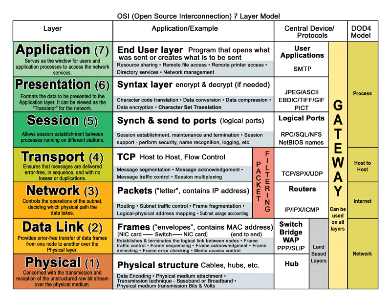

## IP, Port, Socket, Hostname, and DNS in Computer Network
1. IP Address:
The IP (Internet Protocol) address is the unique address of a machine on a network.
Example analogy: If we think of a building, the IP address is like the street address of that building.

2. Port Number:
A port number represents the address of a specific process or service running on a machine.
Continuing the analogy, the port number is like the room number inside the building (machine) that we want to reach.

3. Socket:
A socket is the combination of an IP address and a port number.
It uniquely identifies a network endpoint (e.g., 192.168.1.10:8080).

4. Hostname:
A hostname is a human-readable name assigned to a device.
Examples:
example.com
api.google.com

5. DNS (Domain Name System):
A DNS server translates (resolves) a hostname into its corresponding IP address.
This allows users to access devices or services using easy-to-remember names instead of numerical IP addresses.

### 7 layers OSI-model


### Create userAccount in Harvester and running cluster in the VM
1. **Browse Harvester:** IP: https://10.2.0.38
2. click virtual machines 
   - select create ( upper right corner)
   - provide namesapce, name (vm name), CPU (how many cores), memory (RAM), volume (disk), SSH key (my pc is connected with my github using a ssh key. this ssh should be placed in ssh key field. my pc can access the vm till the ssh key of my pc and the github ssh key same.)
   - To see the ssh public key of my pc: 
    ```bash
   cat ~/.ssh/id_rsa.pub #this key and my github ssh key same
    ``` 
3. Switch to vm using secure shell command
```bash
ssh ubuntu@<my_vm_account_ip> #give access to my vm 
```
4. Switch to root user and install k3s cluster inside the VM(for single node)
```bash
sudo su
[ "$(id -u)" -ne 0 ] && echo "Switching to root..." && sudo su - || true

echo 'fs.inotify.max_user_instances=100000' | sudo tee -a /etc/sysctl.conf
echo 'fs.inotify.max_user_watches=100000' | sudo tee -a /etc/sysctl.conf
sudo sysctl -p

# Create Private Registry Configuration for K3s
mkdir -p /etc/rancher/k3s

cat <<'EOF' > /etc/rancher/k3s/reg-ca.crt
-----BEGIN CERTIFICATE-----
MIIFdTCCA12gAwIBAgIUaijJzh7/YXch+cp8Fm6DYboBYoUwDQYJKoZIhvcNAQEN
BQAwSjELMAkGA1UEBhMCVVMxETAPBgNVBAoMCGFwcHNjb2RlMREwDwYDVQQLDAhQ
ZXJzb25hbDEVMBMGA1UEAwwMYXBwc2NvZGUuY29tMB4XDTI1MDExMTA0MzMyOFoX
DTM1MDEwOTA0MzMyOFowSjELMAkGA1UEBhMCVVMxETAPBgNVBAoMCGFwcHNjb2Rl
MREwDwYDVQQLDAhQZXJzb25hbDEVMBMGA1UEAwwMYXBwc2NvZGUuY29tMIICIjAN
BgkqhkiG9w0BAQEFAAOCAg8AMIICCgKCAgEAxZsZsi4FfK5hutO99APlmws3vvdG
yI9QpMUvKCMPyWivJeg9lkgsddOAEjDsIdM76hAof8g7z488hHRH2/qeha2t3esf
vZLoU2ewawcR24zis0pPc78mDoQX8SE/MxPsjSIbTuqzFWtE70Mry3+xTlXSKjX5
szU13BJ9vXN2qifKcwkFq2A3qLENZqOjeYOznRbqpkLMfU2zmqWenaxr8JHwiuJl
Rfdl8X2IhGyy/yG3yHtmTePWcMwnaU9WgvROtC5vglWvumf2XPi+PQn7zF4D4ybg
R6dsNLm12RTGV9daOGzQ5h8W8iNd4tydYzoELVQmPGNoYm4QqT3pwLweduUD4jOe
/tL5C/znAUYG/Md4LFm+6Bm8ktqORdc1sX0RdziKs5Xbnb/VKPUfMVAr6K6ShKJD
5BLWoRJe9e4FRviJk5Tis29/qxj81jOEd+romhf5Di9DWfmAMx5SicJmV2Ag4mAu
GK7Rrvlqza09zc/ITMz1NCL0GWQ9u/bPoYJWw+xFxVrAjgrow8KhsyKEIgL311MQ
MPODZVbfd00eOpnd0SPzaPaJdKbYxABoGZlF2tdpGQRSNUpOjYQ6xC5dRadoVY2g
NhGAV+BDYcpmCVK4i3QR1093ACl8868KAHnRfeZOYOfo2LJcHPCjCMzVVRsXHxHv
VwiMsPDHQVxUJvkCAwEAAaNTMFEwHQYDVR0OBBYEFKFvJ8xHpfrvymY5wwmLn/2l
m1MyMB8GA1UdIwQYMBaAFKFvJ8xHpfrvymY5wwmLn/2lm1MyMA8GA1UdEwEB/wQF
MAMBAf8wDQYJKoZIhvcNAQENBQADggIBAA68oplyuHziv86lADoqVGaXwHxjhZ5S
ALSJks1D/19yvY0t52Fq0KIxuirZtfCdu/BYW8RxmeLFcRbvtdLMMFP3tlAzzppj
PlEgH4t6awUczKM9CBp08aXSNWeBErWPqB1J1UqkPiCC8Hs0E8LelmPSzDkoAjvC
H+S7jHcTOZVrtAUzhdOFUrA5ryTmat+THcAxYaOC/91QCYcCAujhgrzABZAeKcjx
4K+VgvpRbBsb4kvxb/S3jNIzFBZQoS6/OJAuOU4rkWyRFJwDCaXd45pu4nHqa6JV
ZGXi2DuTgrvyb2itYpFruFJBvBUzrUYY+w9hnqn9cIvBrgnN7lVldff1gbKoKl7i
gyRJXTaYIAUFWEgmnIBHsvj6tzAzlfP4Xp5be/pBRjnmU7wLU5vfM0tzspCUrlon
BrCAaC4vxknck8tAZDiYFhejTfVPMNWBMFoloquPToYbZest5TO6CNiRJd2lWTRX
gIC23XGEUl+N0lpRZpbd/ZmPxqoTJTtgXHKFLg6AogWfTvjCDdeZkZMFIJARS/cq
lrhrdyYB/Yd1YzPQRU88GbqC/Bkof1aIoFJrD3/2q8HB352erzQvvVeUr1AibtVn
fAEYssuxg4/fYX4KNbNTnqGd0Cezy/kIYwY5sn2FIiUIit+e4Lh33gXq6ReCX3Hb
lcI02rEEYenJ
-----END CERTIFICATE-----
EOF

cat <<'EOF' > /etc/rancher/k3s/registries.yaml
configs:
  0.1.acdc.appscode.ninja:
    tls:
      ca_file: /etc/rancher/k3s/reg-ca.crt
EOF

# Create k3s cluster
export SERVER_IP=$(curl -4 ifconfig.me)
curl -sfL https://get.k3s.io | INSTALL_K3S_EXEC="--disable=traefik --disable=metrics-server" sh -s - --tls-san "$SERVER_IP"

echo 'alias k=kubectl' >> ~/.bashrc
echo 'export KUBECONFIG=/etc/rancher/k3s/k3s.yaml' >> ~/.bashrc
source ~/.bashrc

# wait for dns to become running
kubectl wait --for=create -n kube-system deploy/coredns --timeout=10s

# Install helm
curl https://raw.githubusercontent.com/helm/helm/main/scripts/get-helm-3 | bash

```
4. exit
5. exit
6. From my pc bash terminal open k3s.yaml
```bash
vim ~/k3s.yaml # now replace the server IP with my vm IP address. If writing access denied give access using-> chmod 600 k3s.yaml
```
7. Each time when running a new terminal export kubeconfig using the value k3s.yaml
```bash
export KUBECONFIG=$HOME/k3s.yaml // if we want to run cluster in my pc instead of vm just set the KUBECONFIG value empty. like-> export KUBECONFIG=
```

