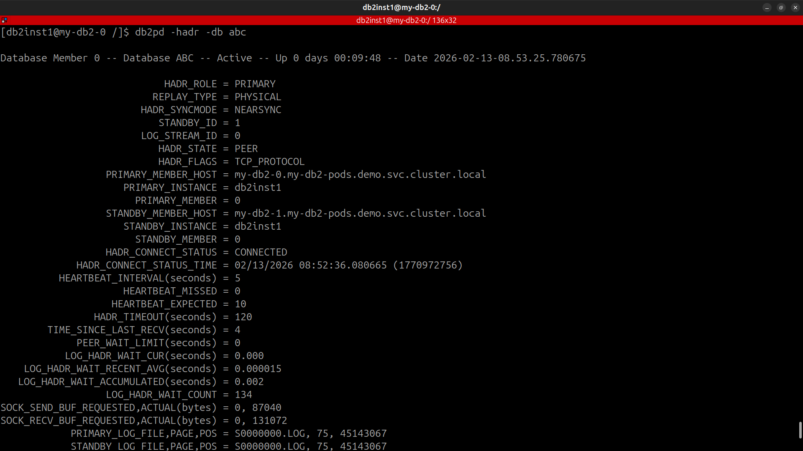
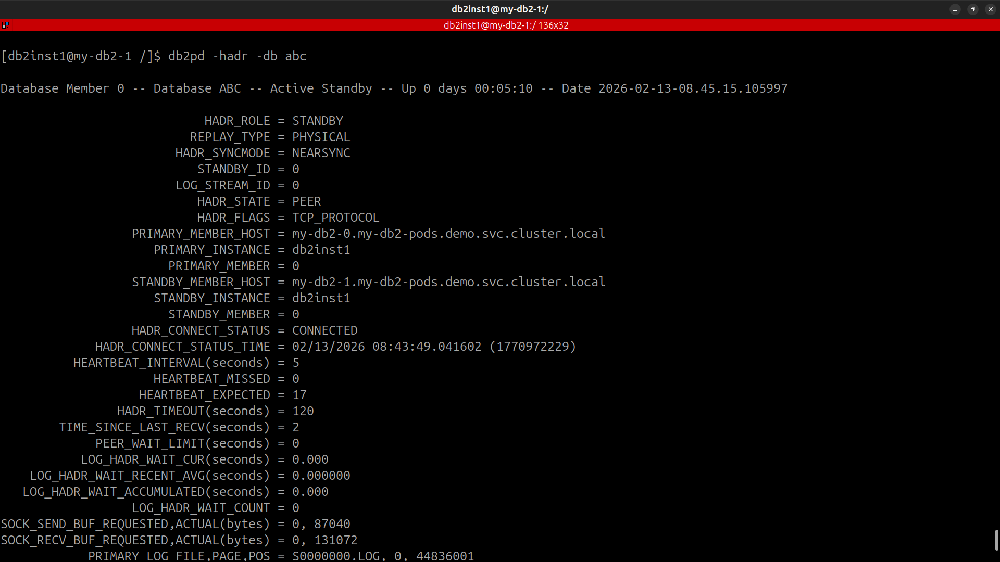
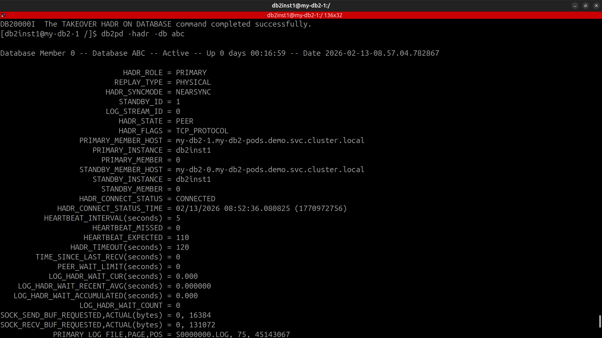
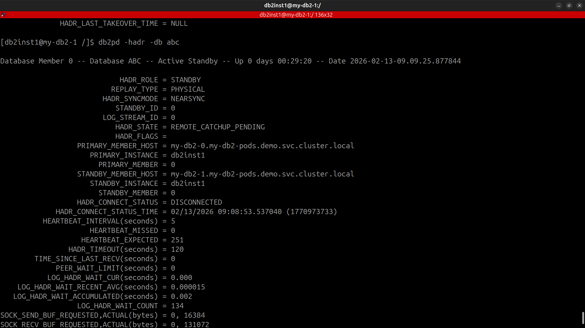
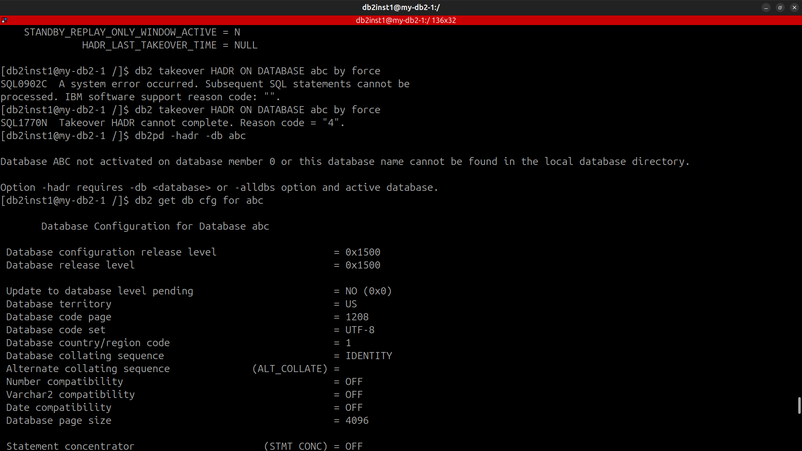
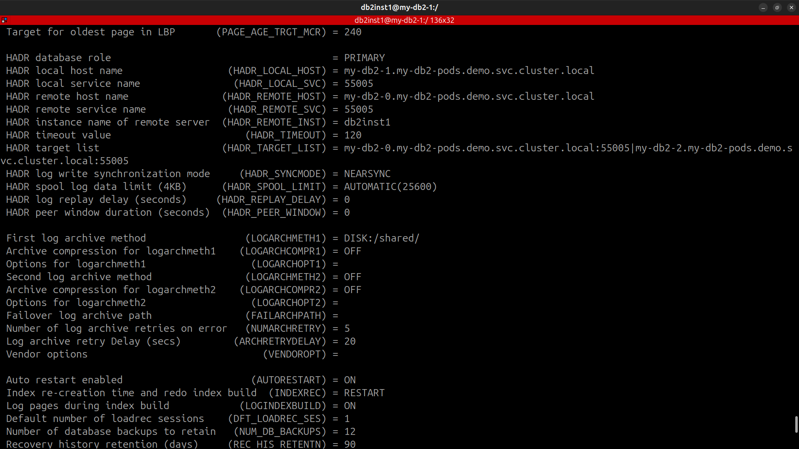

## All pod are running perfectly

### Primary working fine

### Standby working fine

### After Switchover

### Trying to failover
After that I have deleted primary pod. and tried to failover in standby by force

***After Deleting the primary pod hadr config in standby Pod***

Now I am trying to failover in standby by force 
***command:***
bash
db2 takeover HADR ON DATABASE $db_name by force

Error I got:

An incomplete failover happened. HADR is not not. A database connection cannot be established. and no command is successful on the new primary.

here is the new primary configuration:
