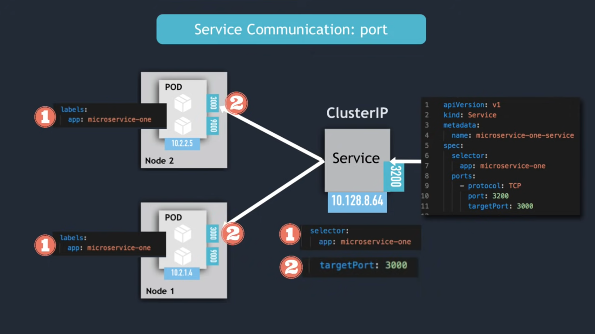

## etcd (etcd = persistent + distributed + strongly consistent key-value store)
In Kubernetes, etcd is the central database (key-value store) that stores all cluster data. It is distributed, consistent key-value store. It used by keubernetes to store c luster con
figuration and state data in a reliable way, It used the Raft consensus algorithm to ensure consistency across multiple etcd nodes (in HA setup).

etcd stores in kubernetes:
- API objects: Pods, Deployments, Services, ConfigMaps, Secrets, etc.
- Cluster configuration: Nodes, namespaces, roles, bindings.
- Status info: Events, resource versions, leader election info, etc.

when "kubectl get pods" command is run:
the kube-apiserver fetches the pod data from etcd (via the kubernetes api)

How It Works in the Control Plane
- An object (like a Deployment) is created or updated via kubectl or the API.
- The kube-apiserver validates the request.
- The apiserver writes the new object’s data into etcd.
- The controllers and schedulers read from etcd to take action (like creating Pods).
- The cluster’s current state is always synced with the desired state stored in etcd.

## Pod anti-Affinity:
- Pod anti-affinity is a Kubernetes scheduling rule that tells the scheduler not to place certain Pods together on the same node (or even in the same zone or rack).
- Its primary purpose is to ensure that certain pods are not co-located on the same node or within the same failure domain (like an availability zone or region), thereby enhancing fault tolerance and resilience.
- Let's assume, we have three replica(web-0, web-1, web-2) of our web app. Without anti-affinity, kubernetes might schedule all three on the same node- it there's enough CPU and memory. In that case, it the node fails -> all three Pods fo down.
- Anti-affinity is done by using level-selector

## Sidecar container
A sidecar container is a helper container that runs alongside the main container in the same Pod in Kubernetes.
Both share:
- The same IP address and port space
- The same volumes
- The same start and stop lifecycle

## Service
In Kubernetes, a Service is an abstraction that defines a stable network endpoint (IP address and DNS name) to access a group of Pods running the same application. Expose Pods (your applicaiton) to other parts of the cluster or to the outside world. Provides a fixed IP and DNS name, even if underlying Pods change. 
``` yaml
apiVersion: v1
kind: Service
metadata:
  name: my-app-service
spec:
  selector:
    app: my-app           # Selects Pods with label "app=my-app"
  ports:
    - protocol: TCP
      port: 80            # Service port
      targetPort: 8080    # Container port
  type: ClusterIP         # Service type

```
This Service sends traffic to all Pods labeled app=my-app on port 8080, and exposes them inside the cluster on port 80.
Types of Service:
1. ClusterIP: Default; exposes the Service only within the cluster - Inside cluster
2. NodePort: Expose the Service on each node's IP at a static port - Inside and ouside cluster (via Node Ip:Port)
3. LoadBalancer: Integrates with cloud provider load balancers - Outside cluster
4. ExternalName: Maps the Service to an external DNS name - Outside service (DNS only)

### 1. Cluster Ip Service:
#### Kubernetes Example: Ingress + Service + Deployment
- Service port is arbitrary 
- Target Port must match the port, the container is listening at

Below is a complete YAML example showing how Ingress, Service, and Deployment work together in Kubernetes:

```yaml
# ---------------------------------------------
# 1️⃣ Deployment: Runs the application Pods
# ---------------------------------------------
apiVersion: apps/v1
kind: Deployment
metadata:
  name: myapp-deployment
  labels:
    app: myapp
spec:
  replicas: 3
  selector:
    matchLabels:
      app: myapp               # Matches Pod label
  template:
    metadata:
      labels:
        app: myapp             # Pod label
    spec:
      containers:
        - name: myapp-container
          image: nginx           # Example application
          ports:
            - containerPort: 8080  # Application listens on 8080 inside the Pod

---
# ---------------------------------------------
# 2️⃣ Service: Exposes the Pods inside cluster
# ---------------------------------------------
apiVersion: v1
kind: Service
metadata:
  name: myapp-service
  labels:
    app: myapp
spec:
  selector:
    app: myapp                 # Matches Deployment's Pod label
  ports:
    - name: http
      port: 80                   # Service exposed port (ClusterIP port)
      targetPort: 8080           # Pod's container port
  type: ClusterIP              # Internal cluster access only

---
# ---------------------------------------------
# 3️⃣ Ingress: Exposes the Service externally
# ---------------------------------------------
apiVersion: networking.k8s.io/v1
kind: Ingress
metadata:
  name: myapp-ingress
  annotations:
    nginx.ingress.kubernetes.io/rewrite-target: /
spec:
  rules:
    - host: myapp.example.com     # Replace with your domain
      http:
        paths:
          - path: /
            pathType: Prefix
            backend:
              service:
                name: myapp-service # Connects to Service name
                port:
                  number: 80        # Matches Service's port (not Pod port)

```
Flow Diagram:
```
Client (browser)
   ↓
Ingress (port 80)
   ↓
Service (port 80 → targetPort 8080)
   ↓
Pod (containerPort 8080)

```

Let's assume we have three replica of a pod and they are deploy in three different node. Then each pod will have different IP but the same port number. When client try to access the application, the service will choose a pod randomly using the label selector. In the pod it will select exact container using the port. <br>
Here is the diagram how it works:


### 2. Headless Service
- Client wants to communicate with 1 specific pod directly
- Pods want to talk directly with specific Pod
- So, not randomly selected
- Use Case: Statefulset application, like database (mysql, mongodb, elasticsearch)
    - Pod replicas are not identical
    - Master and worker node are different. (Only master is allowed to write)
- Client needs to figure out IP address of each Pod
     - DNS lookup is used to do this
         - Set ClusterIP to "None" - return Pod IP address instead of Cluster IP
Example:
```yaml

apiVersion: v1
kind: Service
metadata:
  name: my-headless-service
spec:
  clusterIP: None # This field makes it headless service
  selector:
    app: my-app
  ports:
    - port: 80
      targetPort: 8080
```
- Each pod gets its own DNS Name
```
pod-ip-1.my-headless-service.default.svc.cluster.local
pod-ip-2.my-headless-service.default.svc.cluster.local
pod-ip-3.my-headless-service.default.svc.cluster.local
```
- There is no load balancing; the client can resolve each pod individually.
- Useful for stateful applications like databases, where you need to talk to each pod separately.

### 3. NodePort Service
A NodePort service in Kubernetes is a type of Service that exposes your application to external traffic (outside the cluster) by opening a specific port on every Node in the cluster.

Key points:
1. External access: Each node in the cluster gets a static port (the NodePort) in the range 30000–32767.
2. Routing to pods: Traffic sent to any node’s IP on that NodePort is forwarded to the pods selected by the service (using the selector).
3. ClusterIP included: Behind the scenes, a NodePort service also creates a ClusterIP service to handle pod routing inside the cluster.

Simple example:
```yaml
apiVersion: v1
kind: Service
metadata:
  name: my-nodeport-service
spec:
  type: NodePort
  selector:
    app: my-app
  ports:
    - port: 80         # Service port inside cluster
      targetPort: 8080 # Container port
      nodePort: 31000  # Port exposed on every node
```
How it works:
```
Client
  |
  |--- NodeIP:31000 ---> Service ---> Pod (port 8080)
  |
NodeIP2:31000 ---> Service ---> Pod (port 8080)

```
***Note:*** Useful for testing or small clusters, but in production, people usually use LoadBalancer or Ingress for external access.

### 4. LoadBalancer Service
A LoadBalancer service in Kubernetes is a type of Service that exposes your application to external traffic by automatically provisioning a cloud provider’s load balancer (if supported) to distribute traffic to your pods.

Key Points:
1. Automatic external access:
   - When you create a LoadBalancer service, Kubernetes asks the cloud provider (AWS, GCP, Azure, etc.) to create a public load balancer.
   - The load balancer gets a public IP or DNS name that clients can access.
2. Traffic routing:
   - Incoming requests to the load balancer are forwarded to the Service, which then distributes them to pods selected by the service selector.
   - Uses ClusterIP internally for pod routing.
3. Port mapping:
   - port → service port inside the cluster
   - targetPort → container port
   - externalPort → port exposed by the cloud load balancer (usually matches port if not specified)
Example:
```yaml
apiVersion: v1
kind: Service
metadata:
  name: my-loadbalancer-service
spec:
  type: LoadBalancer
  selector:
    app: my-app
  ports:
    - port: 80         # Service port
      targetPort: 8080 # Container port 
   ```
How it works:
```
Client
  |
  v
Cloud Load Balancer (public IP)
  |
  v
Kubernetes Service (ClusterIP)
  |
  v
Pods (port 8080)

```
***Note:*** LoadBalancer service Only works in cloud environments that support external load balancers.<br>
** NodePort Service is an extension of ClusterIP service
** LoadBalancer Service is an extension of NodePort Service


