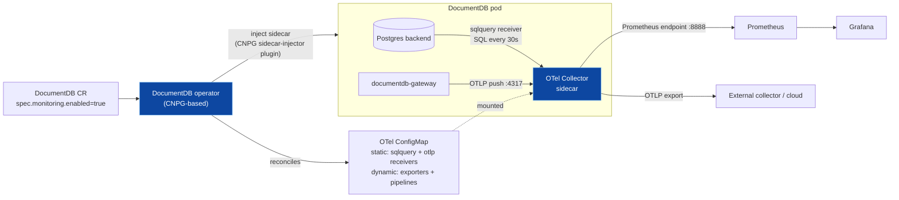
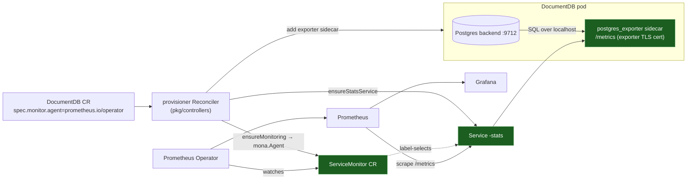
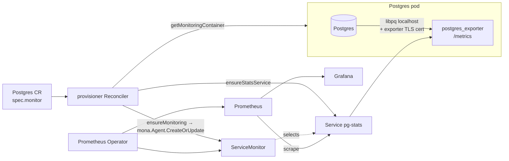

# Monitoring — DocumentDB (Microsoft/CNPG) operator, and how to adopt it KubeDB/postgres-style

Theory-level notes (no code). Three parts:

1. How the upstream **DocumentDB Kubernetes operator** ([documentdb/documentdb-kubernetes-operator](https://github.com/documentdb/documentdb-kubernetes-operator)) does monitoring.
2. How I can **adopt monitoring in my KubeDB DocumentDB operator**, following the postgres structure.
3. How **KubeDB postgres** (`kubedb.dev/postgres`) does monitoring — the pattern to copy.

---

## 1. DocumentDB Kubernetes operator (Microsoft) — OpenTelemetry-based

That operator is a **thin controller on top of [CloudNativePG (CNPG)](https://cloudnative-pg.io/)** — it
translates a `DocumentDB` CR into a CNPG `Cluster`. Monitoring is therefore **not** a classic
Prometheus-exporter sidecar; it is an **OpenTelemetry (OTel) Collector sidecar** driven by
`spec.monitoring`.

### How it works (theory)

- The CR carries a **`spec.monitoring`** block (`enabled`, a `prometheus` port, and OTel sidecar
  resource requests/limits).
- When `monitoring.enabled = true`, the operator reconcile loop does two things:
  1. **Reconciles an OTel Collector `ConfigMap`** (`<cluster>-otel-config`). The config is split in two:
     - **static** part (embedded in the operator): the collector *receivers* and static processors —
       most importantly a `sqlquery` receiver (runs SQL against the local Postgres to turn rows into
       metrics) and an `otlp` receiver (gRPC on `127.0.0.1:4317`).
     - **dynamic** part (generated per cluster): resource attributes (cluster/namespace labels), the
       *exporters*, and the *pipeline* wiring. A hash of this config is used to trigger a rolling
       restart when it changes.
  2. **Injects an OTel Collector sidecar** into every database pod. Injection is done through CNPG's
     **sidecar-injector plugin** (a CNPG-I plugin) — the operator just passes it the collector image,
     the ConfigMap name, the Prometheus port, and resource settings.
- Inside each DB pod the OTel Collector then:
  - **collects** from two sources: the `sqlquery` receiver (Postgres health/SQL metrics, e.g.
    `documentdb.postgres.up`, every 30 s) and the `otlp` receiver (metrics **pushed** by the
    co-located `documentdb-gateway`, which sends OTLP to `localhost:4317`).
  - **processes** (memory limiter, batching).
  - **exports**: a **Prometheus scrape endpoint** (default `:8888`) that Prometheus pulls, and/or an
    **OTLP exporter** that pushes to an external collector / cloud backend.
- A separate observability stack (in the repo's `documentdb-playground/telemetry/`) wires
  **OTel Collector → Prometheus → Grafana** (and optionally OTLP → cloud).

**One-line summary:** *config-driven OTel Collector sidecar* — SQL-query metrics + gateway-pushed
OTLP, exposed as a Prometheus endpoint and/or forwarded via OTLP. New metrics are added by editing
SQL in the collector config, not by changing operator code.

---

## 2. Adopting monitoring in **my** KubeDB DocumentDB operator (postgres structure)

My operator is **not** CNPG-based, so I will **not** copy the OTel-sidecar design. I'll follow the
**KubeDB postgres** pattern instead (Part 3): a **metrics-exporter sidecar + a stats Service + a
ServiceMonitor**, all driven by `spec.monitor`. This fits my existing structure (provisioner builds
the PetSet; ops-manager owns TLS) and reuses the shared `kmodules.xyz/monitoring-agent-api`.

### The pieces to add (mirroring postgres, theory)

1. **apimachinery** — add a **`spec.monitor` (`*mona.AgentSpec`)** field to `DocumentDBSpec`, plus a
   **`StatsService()`** helper (returns the `<db>-stats` service identity) and a metrics port name.
   *(My `DocumentDBSpec` has no `Monitor` field today — this is the first step.)* Regenerate CRD +
   deepcopy, same as I did for the TLS field.
2. **DocumentDBVersion catalog** — add an **`Exporter.Image`** (the `postgres_exporter` image), so the
   operator knows which exporter to run for a given version.
3. **Exporter sidecar** (provisioner, in the PetSet builder) — a `getMonitoringContainer` that adds a
   **`postgres_exporter`** container to the pod. It connects to the **backend Postgres over localhost**
   and exposes `/metrics`. **Reuse my TLS work:** when TLS is on, point the exporter at an
   **exporter certificate** with `sslmode`/`sslrootcert`. *(I already mount `/tls/certs/exporter/*` —
   today it just reuses the server cert to satisfy the init image; for real monitoring I'd add a
   dedicated `exporter` cert alias in `pkg/ops/certificates.go`, exactly like postgres's
   `metrics-exporter` cert.)*
4. **StatsService** (provisioner) — an `ensureStatsService` that creates the **`<db>-stats` Service**
   exposing the exporter's metrics port.
5. **Monitor controller** (provisioner) — a `monitor.go` with `ensureMonitoring` / `manageMonitor`
   that uses the shared **`mona.Agent`** (`agents.New(spec.monitor.Agent, kubeClient, promClient)`) to
   **create/patch a `ServiceMonitor`** (for `agent = prometheus.io/operator`) targeting `<db>-stats`.
6. **Wiring** — give the provisioner `Reconciler` a **Prometheus-Operator client** (`PromClient`,
   `monitoringv1` typed clientset) and call `ensureMonitoring(db)` from the reconcile loop (right
   after services/petset), gated on `spec.monitor != nil`.

### Which layer owns it?

Following postgres, **the provisioner owns monitoring** (it builds the PetSet, the StatsService, and
the ServiceMonitor in the same reconcile). This is different from TLS, where the **ops-manager**
creates the certs — monitoring has no such split in postgres, so keep it in `pkg/controllers`.

> Optional DocumentDB-specific extra: I also have a **MongoDB-wire gateway**. Postgres has no such
> component, so for a first cut just export the **Postgres backend** metrics (above). A gateway
> exporter can be added later as a second sidecar + port on the same StatsService.

---

## 3. How **KubeDB postgres** does monitoring (`kubedb.dev/postgres`)

The reference implementation I'm copying. Pull-based Prometheus, three moving parts.

### Components (theory + where they live)

- **API**: `spec.monitor` is a **`*mona.AgentSpec`** (`kmodules.xyz/monitoring-agent-api`) —
  `apimachinery/apis/kubedb/v1/postgres_types.go`. It selects the **agent** (`prometheus.io/operator`
  or `prometheus.io/builtin`) and holds the **exporter** config (`Prometheus.Exporter`: port, args,
  resources).
- **Exporter sidecar** — `getMonitoringContainer` in `pkg/controller/petset.go`. Runs
  **`/bin/postgres_exporter --web.listen-address=:<port>`** (image from
  `PostgresVersion.Spec.Exporter.Image`). It connects to Postgres on **localhost** with a libpq
  connection string; when TLS is on it appends **`sslrootcert=…/exporter/ca.crt`** and (for cert auth)
  `sslcert/sslkey` from the **`metrics-exporter` cert** mounted at `/tls/certs/exporter/*`. Exposes a
  container port named `mona.PrometheusExporterPortName`.
- **StatsService** — `ensureStatsService` in `pkg/controller/service.go`, identity `db.StatsService()`
  → a **`<db>-stats`** Service that publishes the exporter's metrics port.
- **Monitor controller** — `pkg/controller/monitor.go`:
  - `ensureMonitoring` (gate: `spec.Monitor != nil && Agent.Vendor()==VendorPrometheus`) → ensures the
    StatsService, then
  - `manageMonitor` / `addOrUpdateMonitor` → `newMonitorController` builds a **`mona.Agent`**
    (`agents.New(agent, kubeClient, PromClient)`) and calls **`agent.CreateOrUpdate(db.StatsService(), db.Spec.Monitor)`**, which for the operator agent **creates/patches a `ServiceMonitor`** selecting
    `<db>-stats`. (`prometheus.io/builtin` instead annotates the Service for a plain Prometheus.)
- **Wiring** — the provisioner `Reconciler` is constructed with a **`PromClient pcm.MonitoringV1Interface`** (`pkg/controller/reconciler.go`); the reconcile loop calls
  `ensureMonitoring(db)`. (`monitor_distributed.go` handles the sharded/distributed case with a
  hub StatsService + `ServiceExport`.)

### The flow

### DocumentDB (Microsoft) vs postgres (KubeDB) — the contrast

|               | DocumentDB operator (Microsoft)             | KubeDB postgres (what I'll adopt)                                    |
| ------------- | ------------------------------------------- | -------------------------------------------------------------------- |
| Base          | CloudNativePG wrapper                       | native KubeDB PetSet                                                 |
| Collector     | **OTel Collector** sidecar            | **postgres_exporter** sidecar                                  |
| Config        | OTel`ConfigMap` (SQL queries + pipelines) | `spec.monitor` (agent + exporter)                                  |
| Metric source | SQL receiver**+** gateway OTLP push   | postgres_exporter (built-in Postgres metrics)                        |
| Delivery      | Prometheus scrape**and/or** OTLP push | Prometheus**scrape** only                                      |
| Discovery     | Prometheus scrapes the collector endpoint   | **ServiceMonitor** → Prometheus Operator                      |
| New metrics   | edit SQL in collector config (no code)      | exporter's built-ins / exporter args                                 |
| Owned by      | operator reconcile (sidecar injection)      | **provisioner** reconcile (sidecar + Service + ServiceMonitor) |

**Takeaway for my operator:** adopt the postgres three-piece model — **exporter sidecar → `<db>-stats`
Service → ServiceMonitor** via `monitoring-agent-api`, driven by a new **`spec.monitor`** field and a
**`PromClient`** on the provisioner — reusing my existing TLS plumbing for the exporter's certificate.
