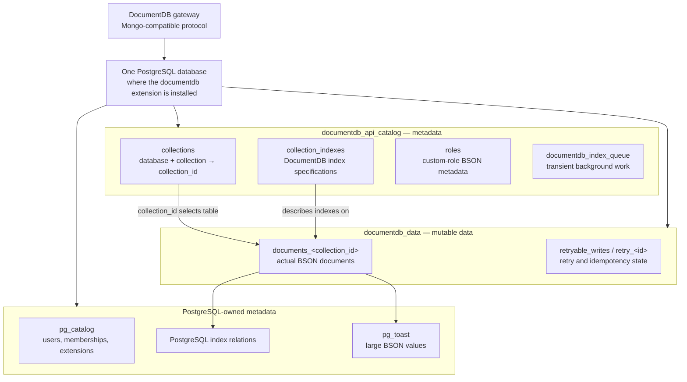

# DocumentDB Storage and Backup Map

> Research basis: [`documentdb/documentdb`](https://github.com/documentdb/documentdb) at commit
> [`9babc381e2c848024a9541667b64fd3405e97961`](https://github.com/documentdb/documentdb/commit/9babc381e2c848024a9541667b64fd3405e97961),
> the official [`documentdb/docs`](https://github.com/documentdb/docs) repository, and PostgreSQL's
> backup and extension documentation. The upstream schema changes over time, so confirm the installed
> extension version before building backup or restore automation.

## 1. Main finding

DocumentDB does **not** keep user documents and catalog metadata in separate storage systems. Both
are ordinary PostgreSQL relations inside the PostgreSQL database where `CREATE EXTENSION documentdb`
was run. In the standard standalone installation this is commonly the PostgreSQL `postgres` database,
but the authoritative value is the database in the gateway's PostgreSQL connection URL.

A Mongo-style DocumentDB database is not a PostgreSQL database, schema, or directory. It is a logical
name stored in `documentdb_api_catalog.collections.database_name`. DocumentDB's `listDatabases`
implementation obtains the database list by selecting distinct database names from that table.

There is therefore no independent catalog server, catalog pod, or catalog volume to copy. The
documents, DocumentDB catalog, PostgreSQL catalog, physical indexes, and TOAST data all ultimately
live under the PostgreSQL `PGDATA` directory and normally share the primary PostgreSQL PVC.



## 2. Schema names

The extension build assigns these names in
[`pg_documentdb/Makefile`](https://github.com/documentdb/documentdb/blob/9babc381e2c848024a9541667b64fd3405e97961/pg_documentdb/Makefile#L22-L29):

| Schema | Purpose |
| --- | --- |
| `documentdb_data` | Physical collection tables and retry state |
| `documentdb_api_catalog` | DocumentDB collection, index, and role metadata |
| `documentdb_api` / `documentdb_api_v2` | Public PostgreSQL functions used by the gateway |
| `documentdb_api_internal` | Internal functions and views |
| `documentdb_core` | BSON types, casts, functions, and operators |
| `pg_catalog` | Native PostgreSQL roles, extensions, relations, indexes, and dependencies |

The API, internal, and core schemas mainly contain extension code and type definitions. A logical
restore should recreate those objects by installing the same DocumentDB extension version; they are
not application data to export row by row.

## 3. Where user documents are stored

Every real collection receives a numeric `collection_id`. DocumentDB then creates:

```text
documentdb_data.documents_<collection_id>
```

The table is created in
[`create_collection_core.c`](https://github.com/documentdb/documentdb/blob/9babc381e2c848024a9541667b64fd3405e97961/pg_documentdb/src/commands/create_collection_core.c#L207-L305)
with these columns:

| Column | Type | Meaning |
| --- | --- | --- |
| `shard_key_value` | `bigint` | Derived distribution/shard key |
| `object_id` | `documentdb_core.bson` | The document `_id` in a searchable form |
| `document` | `documentdb_core.bson` | The complete BSON document |
| `creation_time` | `timestamptz` | Optional, depending on extension configuration/version |

DocumentDB creates the `_id` index, creates additional PostgreSQL indexes for DocumentDB index
definitions, and may distribute the relation when the distributed/Citus layer is enabled.

Large BSON values can be moved into a PostgreSQL `pg_toast` relation. A PostgreSQL table backup or
physical backup includes the associated TOAST data automatically. Copying only a relation file from
`PGDATA` does not produce a valid backup.

In distributed mode, worker relations may appear with names such as
`documents_<collection_id>_<shard_id>`. Backup tooling must operate through the coordinator or back up
the complete distributed PostgreSQL topology; it must not copy individual worker shard files.

## 4. Where databases and collection metadata are stored

The durable mapping is:

```text
documentdb_api_catalog.collections

(database_name, collection_name)
              ↓
         collection_id
              ↓
documentdb_data.documents_<collection_id>
```

The current table contains:

| Column | Purpose |
| --- | --- |
| `database_name` | Logical Mongo-style database name |
| `collection_name` | Logical collection or view name |
| `collection_id` | Numeric identifier used in the physical table name |
| `shard_key` | Collection sharding definition |
| `collection_uuid` | Collection identity |
| `view_definition` | View pipeline/options; `NULL` for a real collection |
| `validator` | Collection validation expression |
| `validation_level` | `off`, `strict`, or `moderate` |
| `validation_action` | `warn` or `error` |
| `options` | Other collection options stored as BSON |

There is no separate `databases` table. The implementation in
[`db_stats.c`](https://github.com/documentdb/documentdb/blob/9babc381e2c848024a9541667b64fd3405e97961/pg_documentdb/src/commands/db_stats.c#L192-L201)
uses distinct `database_name` values from `documentdb_api_catalog.collections` when answering
`listDatabases`.

Some installations create a hidden `system.dbSentinel` collection to coordinate database-level
colocation. It is still a normal catalog entry with an associated physical collection table and must
remain consistent with the rest of the database.

## 5. Index, role, and operational metadata

The current generated schema can be inspected in
[`public_api_schema.out`](https://github.com/documentdb/documentdb/blob/9babc381e2c848024a9541667b64fd3405e97961/pg_documentdb/src/test/regress/expected/public_api_schema.out#L634-L781).

### 5.1 Indexes

Index state has two parts:

1. `documentdb_api_catalog.collection_indexes` stores the DocumentDB index name, keys, partial filter,
   wildcard projection, uniqueness, sparsity, TTL, vector/search options, and validity.
2. PostgreSQL index relations store the actual searchable index pages attached to
   `documentdb_data.documents_<collection_id>`.

A physical backup captures both. A complete logical dump should capture the index specification and
the PostgreSQL index definition. A data-only export such as JSON does not preserve indexes.

### 5.2 Users and roles

DocumentDB users are PostgreSQL login roles. The user-management implementation executes
`CREATE ROLE ... WITH LOGIN PASSWORD ...` in
[`users.c`](https://github.com/documentdb/documentdb/blob/9babc381e2c848024a9541667b64fd3405e97961/pg_documentdb/src/commands/users.c#L522-L531).

Consequently:

- Login names, password hashes, and memberships live in PostgreSQL's global catalogs.
- `documentdb_api_catalog.roles` stores DocumentDB custom-role metadata.
- `pg_dump` of one database does not save PostgreSQL global roles; use `pg_dumpall --globals-only`.

### 5.3 Operational state

| Relation | Classification | Restore guidance |
| --- | --- | --- |
| `documentdb_api_catalog.documentdb_index_queue` | Transient background-index queue | Normally start empty after restore |
| `documentdb_data.retryable_writes` | Retry/idempotency history in newer versions | Include for exact recovery; optional for portable document export |
| `documentdb_data.retry_<collection_id>` | Older per-collection retry history | Same treatment as `retryable_writes` |

The installed version determines which retry-table design is present.

## 6. Inspecting a running installation

Use the PostgreSQL backend connection, not the Mongo-compatible gateway connection.

### 6.1 Find the PostgreSQL database and data directory

```sql
SELECT
    current_database() AS postgres_database,
    current_setting('data_directory') AS pgdata;
```

Also record the extension versions:

```sql
SELECT extname, extversion
FROM pg_extension
ORDER BY extname;
```

### 6.2 Map logical collections to physical tables

```sql
SELECT
    database_name,
    collection_name,
    collection_id,
    CASE
        WHEN view_definition IS NULL THEN 'collection'
        ELSE 'view'
    END AS object_type,
    to_regclass(
        format('documentdb_data.documents_%s', collection_id)
    ) AS physical_table
FROM documentdb_api_catalog.collections
ORDER BY database_name, collection_name;
```

A view has a catalog row and a `view_definition`, but does not necessarily have a physical document
table. `to_regclass` therefore returns `NULL` for objects without a corresponding relation.

### 6.3 Show collection sizes

```sql
SELECT
    c.database_name,
    c.collection_name,
    c.collection_id,
    to_regclass(
        format('documentdb_data.documents_%s', c.collection_id)
    ) AS physical_table,
    pg_size_pretty(
        pg_total_relation_size(
            to_regclass(
                format('documentdb_data.documents_%s', c.collection_id)
            )
        )
    ) AS total_size
FROM documentdb_api_catalog.collections AS c
WHERE c.view_definition IS NULL
ORDER BY c.database_name, c.collection_name;
```

### 6.4 Show catalog tables

```sql
SELECT table_schema, table_name
FROM information_schema.tables
WHERE table_schema IN ('documentdb_api_catalog', 'documentdb_data')
ORDER BY table_schema, table_name;
```

### 6.5 Locate a relation inside PGDATA

```sql
SELECT pg_relation_filepath(
    'documentdb_api_catalog.collections'::regclass
);
```

This is useful for understanding storage, not for backup. PostgreSQL relfilenodes can change after
operations such as `VACUUM FULL`, `CLUSTER`, `REINDEX`, or some table rewrites. An individual relation
file is not independently restorable.

## 7. Backup strategy by element

| Element | Storage | Preferred backup |
| --- | --- | --- |
| User BSON documents | `documentdb_data.documents_<id>` plus TOAST | Whole PostgreSQL physical backup |
| Database/collection map | `documentdb_api_catalog.collections` | Same physical backup; explicit catalog export for logical backup |
| DocumentDB index definitions | `documentdb_api_catalog.collection_indexes` | Same physical backup; explicit catalog export for logical backup |
| Actual indexes | PostgreSQL index relations | Physical backup or recreate through logical schema restore |
| Validators, views, collection options | Columns in `collections` | Same physical backup or explicit catalog export |
| Custom role metadata | `documentdb_api_catalog.roles` | Same physical backup or explicit catalog export |
| Users/passwords/memberships | PostgreSQL global catalogs | Physical backup or `pg_dumpall --globals-only` |
| Retry state | `retryable_writes` or `retry_<id>` | Physical backup for exact recovery; optional in portable export |
| Background index queue | `documentdb_index_queue` | Usually do not restore |
| Extension binaries and definitions | Installed packages plus extension schemas | Record versions and install the same version before logical restore |
| PostgreSQL configuration | `postgresql.conf`, included fragments, environment/config maps | Back up separately if outside PGDATA |
| Kubernetes resources and credentials | CRs, Secrets, ConfigMaps | Back up separately; not contained in a PostgreSQL logical dump |

## 8. Recommended production backup

The safe default is to back up the complete PostgreSQL storage unit, not the catalog and document
tables independently:

```text
PostgreSQL base backup or primary-PVC snapshot
    = user documents
    + DocumentDB catalog
    + PostgreSQL system catalog
    + indexes
    + TOAST data
    + transaction state
```

Suitable mechanisms include:

- `pg_basebackup`
- pgBackRest, Barman, or WAL-G
- A CSI `VolumeSnapshot` of the primary PostgreSQL PVC
- KubeStash physical backup or volume snapshot
- Periodic base backups plus continuous WAL archiving for PITR

PostgreSQL documents SQL dumps, filesystem-level backups, and continuous archiving as its three
fundamental approaches in the
[`Backup and Restore`](https://www.postgresql.org/docs/current/backup.html) chapter.

An example base backup is:

```bash
pg_basebackup \
  --dbname="$REPLICATION_PGURL" \
  --pgdata=/backup/documentdb-base \
  --format=tar \
  --wal-method=stream \
  --checkpoint=fast \
  --progress
```

For PITR, retain a continuous WAL archive in addition to base backups. A standalone base backup or
VolumeSnapshot only restores to the instant represented by that backup.

The upstream DocumentDB Kubernetes operator currently documents a primary-PVC, CSI
VolumeSnapshot-based backup. The documented implementation does not provide PITR and restores by
bootstrapping a new cluster from the snapshot. See the official
[`Backup and Restore`](https://documentdb.io/documentdb-kubernetes-operator/latest/preview/operations/backup-and-restore/)
guide.

## 9. The `pg_dump` catalog trap

A plain full `pg_dump` should **not** currently be treated as a verified, complete DocumentDB backup.

The durable catalog tables are created inside the `documentdb` extension. PostgreSQL normally omits
both the definition and contents of an extension-member table from `pg_dump`. An extension must call
`pg_extension_config_dump` for a mutable configuration table or sequence whose contents must survive
logical dump and restore. See PostgreSQL's
[`Extension Configuration Tables`](https://www.postgresql.org/docs/current/extend-extensions.html#EXTEND-EXTENSIONS-CONFIG-TABLES)
documentation.

At the researched upstream commit, the DocumentDB repository contains no
`pg_extension_config_dump` registration. This creates a dangerous possible result:

```text
pg_dump archive
├── documentdb_data.documents_<id>          present
└── documentdb_api_catalog.collections      table contents absent

Result: physical BSON rows exist, but DocumentDB has no logical name → table mapping.
```

Always inspect a logical archive:

```bash
pg_restore --list documentdb.dump |
  rg 'TABLE DATA documentdb_api_catalog.*(collections|collection_indexes|roles)'
```

If those `TABLE DATA` records are missing, the archive is not a complete DocumentDB recovery
artifact.

### Logical-backup implementation fix

For reliable generic `pg_dump` support, a DocumentDB extension install/update script should register
at least these durable catalog relations:

```text
documentdb_api_catalog.collections
documentdb_api_catalog.collection_indexes
documentdb_api_catalog.roles
documentdb_api_catalog.collections_collection_id_seq
documentdb_api_catalog.collection_indexes_index_id_seq
```

The extension SQL would use calls of this form while the extension script is executing:

```sql
SELECT pg_catalog.pg_extension_config_dump(
    'documentdb_api_catalog.collections',
    ''
);
```

The same registration is needed for every other durable table and sequence. Do not automatically
register the transient background-index queue without first defining the intended restore semantics.
After adding registration, validate a complete dump/restore against an empty cluster of the same
PostgreSQL and DocumentDB versions.

## 10. Separate experimental backups

These steps are useful for understanding the boundary between data, DocumentDB metadata, and
PostgreSQL globals. They are not preferable to one physical backup for production recovery.

Pause application and gateway writes before taking independently generated backups. Otherwise a
collection can be added, dropped, renamed, or indexed between the catalog export and data dump.

### 10.1 Back up generated document tables

```bash
pg_dump "$PGURL" \
  --format=directory \
  --jobs=4 \
  --table='documentdb_data.documents_*' \
  --file=documentdb-data.dump
```

Include exact retry state when required:

```bash
pg_dump "$PGURL" \
  --format=directory \
  --jobs=4 \
  --table='documentdb_data.documents_*' \
  --table='documentdb_data.retryable_writes' \
  --table='documentdb_data.retry_*' \
  --file=documentdb-data-and-retries.dump
```

Patterns that match no tables may cause warnings depending on the installed schema. Select the retry
pattern appropriate to that version.

### 10.2 Back up durable DocumentDB catalog rows

Use `psql`'s `\copy`, which writes on the client machine and does not depend on ordinary `pg_dump`
extension-table discovery:

```sql
BEGIN ISOLATION LEVEL REPEATABLE READ READ ONLY;

\copy documentdb_api_catalog.collections TO 'collections.csv' CSV HEADER
\copy documentdb_api_catalog.collection_indexes TO 'collection-indexes.csv' CSV HEADER
\copy documentdb_api_catalog.roles TO 'documentdb-roles.csv' CSV HEADER

\copy (
    SELECT last_value, is_called
    FROM documentdb_api_catalog.collections_collection_id_seq
) TO 'collection-id-sequence.csv' CSV HEADER

\copy (
    SELECT last_value, is_called
    FROM documentdb_api_catalog.collection_indexes_index_id_seq
) TO 'index-id-sequence.csv' CSV HEADER

COMMIT;
```

The commands assume the current upstream schema. Inspect the installed tables and sequences before
running them against an older release.

### 10.3 Back up PostgreSQL users and memberships

```bash
pg_dumpall \
  --dbname="$PGURL" \
  --globals-only \
  --file=documentdb-globals.sql
```

`pg_dumpall` saves cluster-global roles and tablespaces that a one-database `pg_dump` does not save.
A sufficiently privileged user is required for a complete result. See the official
[`pg_dumpall`](https://www.postgresql.org/docs/current/app-pg-dumpall.html) documentation.

### 10.4 Save an extension manifest

```bash
psql "$PGURL" -X -At -c \
  "SELECT extname || '=' || extversion FROM pg_extension ORDER BY extname" \
  > documentdb-extensions.txt
```

Also record the PostgreSQL major version, DocumentDB image/package version, relevant `documentdb.*`
settings, enabled preload libraries, and whether Citus/distributed mode is active.

## 11. Split logical restore outline

A split restore is version-sensitive and should be treated as an implementation project, not as a
generic PostgreSQL restore recipe. At minimum:

1. Provision the same PostgreSQL major version.
2. Restore required PostgreSQL login roles and memberships.
3. Install exactly the same DocumentDB extension binaries.
4. Run `CREATE EXTENSION documentdb` in the intended PostgreSQL database.
5. Restore generated `documentdb_data.documents_<id>` tables using their original numeric IDs.
6. Restore matching `collections` rows without changing `collection_id` values.
7. Restore `collection_indexes` and custom-role metadata.
8. Reset catalog sequences beyond the highest restored IDs.
9. Leave the background index queue empty unless a tested restore design requires otherwise.
10. Verify every catalog entry has a physical table and every physical table has a catalog entry.
11. Verify logical database, collection, view, validator, index, and user behavior through the gateway.

The mapping IDs are the critical invariant. Restoring documents into `documents_1200` while the
catalog assigns that collection ID `1300` leaves the collection invisible or points it at the wrong
table.

## 12. Recommended KubeDB design

Implement the first production version as:

```text
Periodic physical PostgreSQL backup or primary-PVC snapshot
                         +
                  continuous WAL
                         +
      backup of Kubernetes CRs, Secrets, and ConfigMaps
```

This captures data and both catalogs in one consistent recovery unit and provides a straightforward
path to PITR. It does not require a DocumentDB-specific catalog-copy sidecar.

If portable logical backup is added later:

1. Fix or explicitly compensate for the extension catalog-dump issue.
2. Back up PostgreSQL global roles separately.
3. Keep document tables and catalog rows on one synchronized PostgreSQL snapshot.
4. Treat collection IDs as immutable restore keys.
5. Validate full, per-database, and per-collection restore behavior with automated tests.
6. Verify the dump archive contents before reporting a backup as successful.

The physical path should be the default disaster-recovery mechanism. Per-database and per-collection
exports are better treated as portability or migration features because a logical DocumentDB database
does not correspond to an independently dumpable PostgreSQL database.
