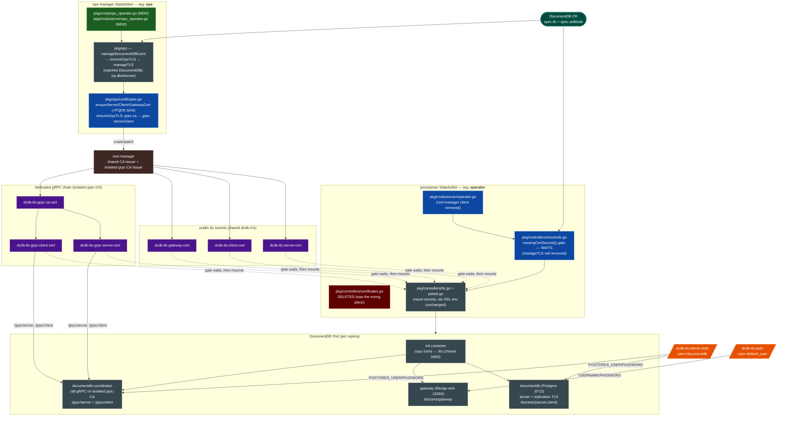

# DocumentDB TLS — architecture of the updated operator

This mirrors the **KubeDB postgres** operator: the **ops controller creates** the cert-manager
`Certificate` CRs, and the **provisioner only consumes** the resulting secrets. The two run as two
subcommands of the same `documentdb-operator` binary, deployed as two StatefulSets.



Legend — 🟩 new file · 🟦 edited · 🟥 deleted · ⬛ unchanged · 🟪 tls secret · 🟧 auth secret.

## Files changed (documentdb operator repo)

| File                                                                | Change                    | Why                                                                                                                                                                                                                                                                                                                                                             |
| ------------------------------------------------------------------- | ------------------------- | --------------------------------------------------------------------------------------------------------------------------------------------------------------------------------------------------------------------------------------------------------------------------------------------------------------------------------------------------------------- |
| `pkg/ops/certificates.go`                                         | **edit**            | Creates the server/client/gateway Certificates (+FQDN SAN).**Added `ensureGrpcTLS`** (ported from postgres): a self-signed bootstrap Issuer → `grpc-ca` (isCA) → grpc-CA Issuer → `grpc-server` + `grpc-client` leaf certs. Issuers are created via the cert-manager typed clientset (the ops manager's scheme doesn't register cert-manager). |
| `pkg/ops/postgres.go`                                             | **edit**            | `manageDocumentDBEvent` now calls `ensureGrpcTLS` **before** `manageTLS` (postgres order); `NotFound` → 2s requeue.                                                                                                                                                                                                                              |
| `pkg/cmds/server/ops_operator.go`                                 | **new**             | Runs the`pkg/ops` controller (builds clients + informers, `ops.New(...)`, `Init()`, `RunControllers`). Mirrors postgres `pkg/cmds/server/ops_operator.go`.                                                                                                                                                                                            |
| `pkg/cmds/ops_operator.go`                                        | **new**             | `NewCmdOpsOperator` — the `ops` cobra subcommand.                                                                                                                                                                                                                                                                                                          |
| `pkg/cmds/root.go`                                                | **edit (+1)**       | Registers the`ops` subcommand.                                                                                                                                                                                                                                                                                                                                |
| `apimachinery .../v1alpha2/documentdb_types.go` + `_helpers.go` | **edit**            | +`grpc-ca`/`grpc-server`/`grpc-client` cert aliases + `GetGRPCIssuerName`/`GetGRPCSelfSignedIssuerName`.                                                                                                                                                                                                                                              |
| `pkg/controllers/tls.go`                                          | **edit**            | +`upsertGRPCVolumes` (grpc-server/grpc-client secret volumes, keys remapped to `server.crt`/`client.crt`/`ca.crt`); `coordinatorTLSVolumeMounts` now mounts the **dedicated** grpc volumes at `/grpc/server` + `/grpc/client` (was reusing server/client); grpc secrets added to the `requiredCertSecretNames` wait-gate.                 |
| `pkg/controllers/petset.go`                                       | **edit**            | `getVolumes` also calls `upsertGRPCVolumes`.                                                                                                                                                                                                                                                                                                                |
| `pkg/controllers/certificates.go`                                 | **deleted (−300)** | Earlier divergence: cert creation duplicated into the**provisioner**. Postgres never does this.                                                                                                                                                                                                                                                           |
| `pkg/controllers/reconcile.go`, `pkg/cmds/server/operator.go`   | **edit**            | Provisioner no longer creates certs / needs a cert-manager client; keeps only the`missingCertSecrets()` wait-gate.                                                                                                                                                                                                                                            |
| `pkg/ops/workqueue.go`, `controller.go`                         | unchanged                 | Already the faithful`dbInformer`/`dbQueue`/`RunControllers` structure.                                                                                                                                                                                                                                                                                    |

## Deployment

| StatefulSet                   | Command                          | Role                                                            |
| ----------------------------- | -------------------------------- | --------------------------------------------------------------- |
| `kubedb-kubedb-ops-manager` | `documentdb-operator ops`      | Creates the cert-manager Certificates (`pkg/ops`).            |
| `kubedb-kubedb-provisioner` | `documentdb-operator operator` | Waits for the secrets, builds the PetSet (`pkg/controllers`). |

Both run image `sabnaj/documentdb-operator:dcdb-tls12`. The `ops-manager` ServiceAccount already has
the cert-manager `Certificate`/`Issuer` create/patch RBAC.

## Dedicated gRPC CA chain (coordinator raft gRPC)

The coordinator's internal raft gRPC gets its **own isolated CA**, so it is not signed by the public
Postgres/gateway CA — full postgres parity:

```
grpc-selfsigned Issuer ──▶ grpc-ca (isCA) ──▶ grpc-issuer (CA Issuer)
                                                  ├──▶ grpc-server  (CN=<govsvc>, ServerAuth)
                                                  └──▶ grpc-client  (CN=documentdb-coordinator, ClientAuth)
```

The coordinator binary reads hardcoded `/grpc/server/{server.crt,server.key,ca.crt}`, so the
operator mounts the `grpc-server` secret there (keys remapped to those filenames) and the
`grpc-client` secret at `/grpc/client` — **no coordinator image change**. Verified isolated: the
grpc-CA fingerprint differs from the main `dcdb-CA` (see [`evidence.txt`](./evidence.txt) §4).

> Scope: this delivers the dedicated cert **chain** (postgres structure). The coordinator gRPC
> server currently sets `ClientAuth: tls.NoClientCert`, so it does not yet *enforce* mutual TLS;
> enabling `RequireAndVerifyClientCert` (and presenting `/grpc/client`) is a separate
> `documentdb-coordinator` image change. The `grpc-client` cert is already provisioned for it.

## Two auth secrets (unchanged code — the operator already does this right)

| Secret                  | User             | Consumed by                                     | Env                                       |
| ----------------------- | ---------------- | ----------------------------------------------- | ----------------------------------------- |
| `dcdb-tls-admin-auth` | `documentdb`   | Postgres backend (main container + coordinator) | `POSTGRES_USER` / `POSTGRES_PASSWORD` |
| `dcdb-tls-auth`       | `default_user` | MongoDB-wire gateway                            | `USERNAME` / `PASSWORD`               |
