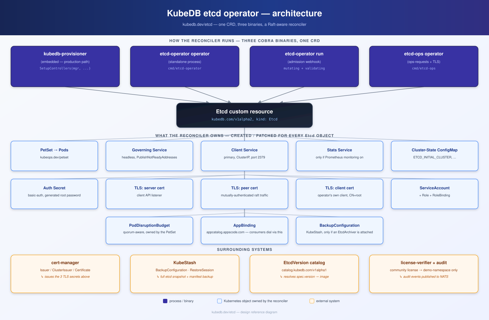
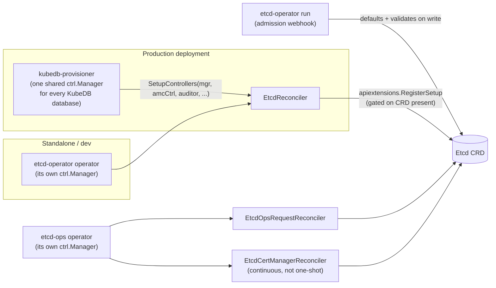
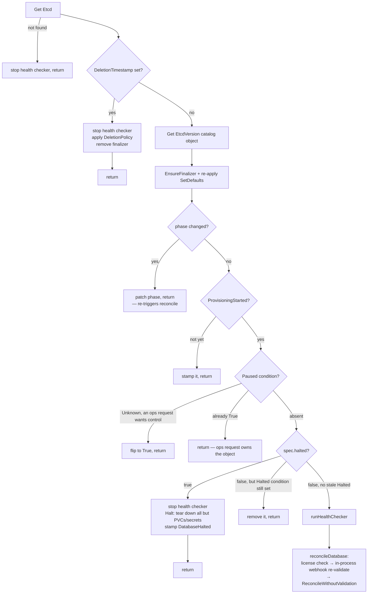
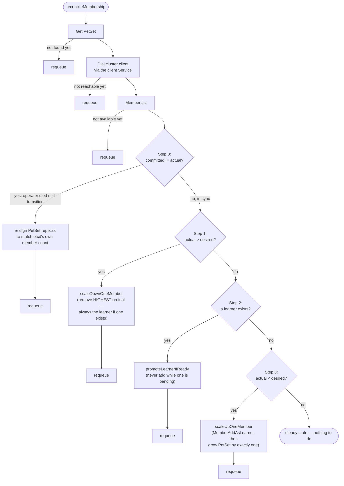
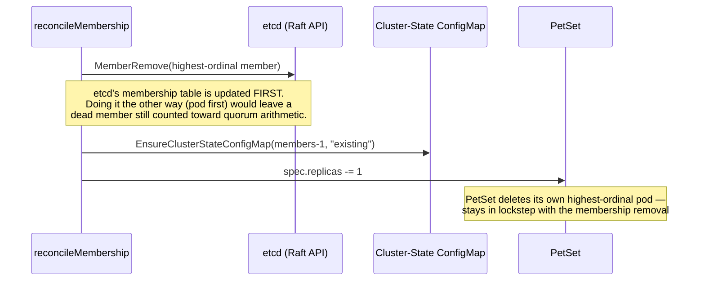
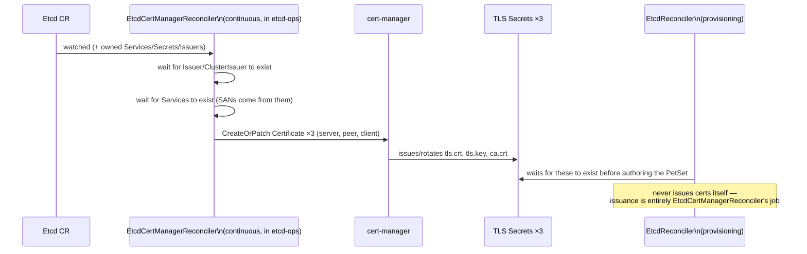
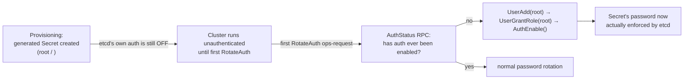

# KubeDB `etcd` operator — design

Repo: `kubedb.dev/etcd` (`/home/sabnaj/go/src/kubedb.dev/etcd`). It also has its own 930-line `DESIGN.md` in-repo — this document reorganizes and cross-checks that against the actual current code (as of the `fix-provisioning-issue` branch, commit `5cb73db9` + the two membership fixes made in this session), and adds diagrams.



## 1. Overview — what it is, what it can do

It's a Kubernetes operator that turns an `Etcd` custom resource (`kubedb.com/v1alpha2`) into a running, self-healing etcd cluster: it provisions the pods, TLS certs, auth secret, and supporting Kubernetes objects; drives etcd's own Raft membership API to grow/shrink the cluster one member at a time; continuously checks quorum health; and exposes day-2 operations (upgrade, scale, defrag, compact, TLS rotation, auth rotation, backup/restore, quorum-loss recovery) as their own CRD (`EtcdOpsRequest`).

Concretely, it can:
- Provision a durable or ephemeral N-member etcd cluster (odd N recommended), with optional TLS (server/peer/client certs via cert-manager) and always-present basic-auth credentials.
- Grow or shrink that cluster safely, one member at a time, without ever dropping below quorum (learner-based scale-up, highest-ordinal-first scale-down).
- Detect and report quorum loss as a condition, and offer a human-triggered, explicit recovery path (`RecoverFromQuorumLoss`, `--force-new-cluster`-based) — it never rebuilds automatically.
- Back up (`etcdctl snapshot save`, via KubeStash) and restore (both at bootstrap time and via an in-place ops-request) a cluster's keyspace, plus its own manifests (auth/config secrets).
- Run either **embedded** inside the shared, multi-database `kubedb-provisioner` binary (the production path) or as its **own standalone process** — the exact same reconciler code, just wired into a different manager.
- Gate itself to a single namespace (`demo`) under a community license, or every namespace under an enterprise one; shard reconciliation load across multiple operator replicas when `--shard-config` is set; and optionally lock down network access per-namespace with generated `NetworkPolicy` objects.

## 2. Process model

Three cobra command trees, two binaries:

| Binary | Subcommand | Role |
|---|---|---|
| `etcd-operator` | `operator` | The provisioning reconciler (`EtcdReconciler`) — either standalone or, via `SetupControllers`, embedded in `kubedb-provisioner` |
| `etcd-operator` | `run` (alias `webhook`) | The mutating/validating admission webhook for `Etcd` |
| `etcd-ops` | `operator` | A separate, always-on manager hosting **both** the `EtcdOpsRequest` reconciler **and** the continuous cert-manager `Certificate` reconciler for TLS |

This is unusual among KubeDB databases: every other database's ops-request engine runs inside the shared `kubedb-ops-manager` binary; etcd's runs as its own dedicated `etcd-ops` process (a comment in the sibling `ops-manager` repo confirms this explicitly — only the `EtcdOpsRequest` admission *webhook* is still registered from the shared `kubedb-ops-manager`).



Both `SetupControllers` (embedded path) and the standalone `Run()` funnel through the same `registerEtcdReconciler(ctx, mgr, r, auditor)` — the only difference is who owns the `ctrl.Manager` and who starts the shared informer factories / PetSet→Pods watcher (only the standalone binary calls `StartAndRunControllers`; the embedded path relies on the provisioner having already started those once, centrally, for every database it hosts).

Every controller — the provisioning reconciler, the ops-request reconciler, the cert-manager reconciler — registers itself lazily through `apiextensions.RegisterSetup(GroupKind, fn)`, a generic watcher (vendored from `kmodules.xyz/client-go/apiextensions`) that only invokes `fn` once it observes the relevant CRD actually established in the cluster. Nothing tries to reconcile a CRD that doesn't exist yet.

## 3. The `Etcd` CRD

### `EtcdSpec`

| Field | Type | What it does |
|---|---|---|
| `version` | `string` (required) | Name of the `EtcdVersion` catalog object to deploy |
| `replicas` | `*int32` | Member count (odd numbers recommended for Raft quorum math) |
| `storageType` | `Durable` \| `Ephemeral` | PVC-backed vs `emptyDir` data volume |
| `storage` | `*PersistentVolumeClaimSpec` | The data-volume PVC template (ignored if `Ephemeral`) |
| `authSecret` | `*SecretReference` | Root-user credential secret (generated, BYO, or virtual/externally-managed) |
| `init` | `*InitSpec` | Bootstrap-time behavior, e.g. `init.archiver` for restore-from-backup |
| `monitor` | `*mona.AgentSpec` | Monitoring agent config (Prometheus) |
| `configuration` | `*EtcdConfiguration` | Shared config spec + etcd-specific `Tuning` (`quotaBackendBytes`, `autoCompactionMode`, `autoCompactionRetention`, `snapshotCount`) |
| `podTemplate` | `ofst.PodTemplateSpec` | Full pod customization — sidecars, volumes, scheduling, security context |
| `serviceTemplates` | `[]NamedServiceTemplateSpec` | Per-alias (`primary`, `stats`) Service customization |
| `tls` | `*kmapi.TLSConfig` | Opt-in TLS; requires `issuerRef` when set |
| `halted` | `bool` | Tears down everything except PVCs when true |
| `deletionPolicy` | `Halt` \| `Delete` \| `WipeOut` \| `DoNotTerminate` | Cleanup behavior on CR delete (default `Delete`) |
| `healthChecker` | `kmapi.HealthCheckSpec` | `periodSeconds`/`timeoutSeconds`/`failureThreshold` (defaults `10`/`10`/`1`) |
| `allowedSchemas` | `*AllowedConsumers` | Which namespaces may reference this DB via schema resources |
| `archiver` | `*Archiver` | Backup archiver double-opt-in reference |

### `EtcdStatus`

| Field | Description |
|---|---|
| `phase` | Derived from `status.conditions` via `phase.PhaseFromCondition` |
| `observedGeneration` | Last `metadata.generation` this status reflects |
| `conditions` | Shared conditions (`DatabaseProvisioningStarted/Provisioned/ReplicaReady/Paused/Halted/AcceptingConnection/Ready/HealthCheckPaused`) plus the etcd-local `QuorumLost` |
| `authSecret` | Age/generation bookkeeping for auth-secret rotation |

### Versioning

`spec.version` is just a name; every consumer resolves it by looking up the cluster-scoped `EtcdVersion` catalog object (`catalog.kubedb.com/v1alpha1`) by that name:

```go
etcdVersion, err := r.DBClient.CatalogV1alpha1().EtcdVersions().Get(ctx, db.Spec.Version, metav1.GetOptions{})
```

`EtcdVersion.spec.db.image` is what actually lands in the PetSet's container. It also carries `deprecated`/`endOfLife` flags (the `UpdateVersion` ops-request refuses a deprecated target) and an `updateConstraints.allowlist` of semver ranges gating valid upgrade paths. These catalog objects are generated and shipped by the sibling `installer` repo's `kubedb-catalog` Helm chart, not hand-edited.

## 4. Reconcile lifecycle



`ReconcileWithoutValidation` — the actual provisioning sequence:

```mermaid
flowchart LR
    a[setArchiverIfExist] --> b[EnsureNetworkPolicy\nif enabled]
    b --> c[ensureArchiveRecovery\nbootstrap restore gate]
    c -->|restore pending| stop1[return, requeue]
    c -->|clear| d[ensureGoverningService\nensureService]
    d --> e[ensureDatabaseRBAC]
    e --> f[wait for TLS cert Secrets\n+ externally-managed auth Secret]
    f --> g[ensureAuthSecret]
    g --> h[ensureBootstrapClusterState\nConfigMap]
    h --> i[EnsurePetSet]
    i --> j[updateReplicaReadyCondition]
    j --> k[reconcileMembership]
    k --> l[ensureAppBinding]
    l --> m[ensureArchiver\nBackupConfiguration]
    m --> n[ensureMonitoring]
    n --> o[stamp DatabaseProvisioned\nflip spec.init.initialized]
```



Ordering rationale straight from the code comments: the restore gate runs before anything else is authored (a member's data dir must be empty-or-restored before any process starts); the governing Service must exist before any pod (ordinal peer/client URLs are DNS names off it); TLS Secrets are waited-for before the PetSet is authored (a pod mounting a missing Secret never starts); `DatabaseReplicaReady` must be set *before* `reconcileMembership` runs, or the health checker (gated on that condition) would never start.

### Deletion policy semantics

| `deletionPolicy` | PVCs | Secrets (incl. cert/auth) |
|---|---|---|
| `Halt` / `DoNotTerminate` | owner ref **removed** — survive | owner ref **removed** — survive (`DoNotTerminate` is also blocked outright by the webhook; this is the safety net if that's bypassed) |
| `Delete` (default) | owner ref **added** — deleted | owner ref **removed** — survive |
| `WipeOut` | owner ref **added** — deleted | owner ref **added** (only if no sibling `Etcd` still references them) — deleted |

## 5. What gets provisioned

| Object | Notes |
|---|---|
| PetSet `<db>` (`kubeops.dev/petset`, not native StatefulSet) | `UpdateStrategy: OnDelete` — no automatic rolling restart on template change; `spec.replicas` seeded to `1` only on create, owned thereafter by `reconcileMembership` |
| Governing Service `<db>-pods` | Headless, **`PublishNotReadyAddresses: true`** — required, not cosmetic: a learner is never kubelet-Ready (it can't serve the readiness probe's linearizable read), so this Service must still publish its address for peer discovery |
| Client Service `<db>` | ClusterIP, port 2379; only routes to **Ready** pods, i.e. never a learner |
| Stats Service `<db>-stats` | Only when Prometheus monitoring is configured |
| ServiceAccount / Role / RoleBinding | Skipped entirely if the user already supplied a non-KubeDB-managed ServiceAccount (pure BYO path) |
| Cluster-state ConfigMap `<db>-cluster-state` | `ETCD_INITIAL_CLUSTER`, `ETCD_INITIAL_CLUSTER_STATE`, `ETCD_INITIAL_CLUSTER_TOKEN` — see §6 |
| Auth Secret | Basic-auth, generated 16-char password, username forced to `root` |
| TLS Secrets ×3 | `server`, `peer`, `client` aliases — issued by cert-manager (§7), not by this reconciler directly |
| PodDisruptionBudget | Quorum-aware, owned by the PetSet |
| AppBinding | `appcatalog.appscode.com` — how other apps discover how to connect |
| BackupConfiguration | Only if an `EtcdArchiver` is attached (§9) |
| ServiceMonitor | Only if `spec.monitor.agent == prometheus.io` |
| NetworkPolicy ×3 | Only with `--enable-network-policy` (§10) |

The etcd container itself: image resolved via `authn.ImageWithDigest` against the catalog's `spec.db.image`; ports `client`=2379, `peer`=2380, `metrics`=2381; **liveness** = plain TCP dial on the peer port; **readiness** = plain-HTTP `GET /health` on the metrics port (deliberately plain HTTP even with TLS enabled elsewhere, so kubelet — which presents no client cert — can still reach it).

## 6. Clustering — how membership and quorum are ensured

This is the operator's core value: turning a handful of pods into one etcd cluster, without a human ever calling `etcdctl member add`.

### 6.1 The bootstrap trick — an `envFrom`-snapshotted ConfigMap

etcd requires every member of a fresh cluster to start with **identical** `--initial-cluster`, `--initial-cluster-state`, and `--initial-cluster-token` values. The operator writes these into a ConfigMap and wires it into the etcd container via `envFrom`:

```go
container.EnvFrom = []core.EnvFromSource{
    {ConfigMapRef: &core.ConfigMapEnvSource{
        LocalObjectReference: core.LocalObjectReference{Name: clusterStateConfigMapName(db)},
    }},
}
```

The key mechanism: Kubernetes materializes `envFrom` into a Pod's environment **once, at pod creation** — a later edit to the ConfigMap never touches an already-running pod, only the *next* pod created reads the new value. That's exactly the semantics needed: pod-0 must see a 1-member `new` cluster; pod-1, created later, must see a 2-member `existing` cluster.

`EnsureClusterStateConfigMap(db, members, state)` writes `ETCD_INITIAL_CLUSTER` as a dense `name=peerURL,...` list for ordinals `0..members-1`, plus a **stable** token derived from the `Etcd` object's UID (`"etcd-" + uid`) — stable across operator restarts, so a redeployed operator never invents a fresh token and accidentally orphans a running cluster.

### 6.2 Bootstrap sequencing

1. `ensureBootstrapClusterState` seeds the ConfigMap once, before the PetSet exists: `EnsureClusterStateConfigMap(db, 1, "new")` — always exactly one member.
2. `EnsurePetSet` creates the PetSet with `spec.replicas` hard-seeded to `1`. Pod-0 boots with `--initial-cluster-state=new` and forms a brand-new one-member Raft cluster.
3. From here on, `reconcileMembership` (§6.3) owns `spec.replicas` and grows the cluster one member at a time.

### 6.3 `reconcileMembership` — the state machine



**Why this exact order:**
- **Step 0** trusts etcd's own `MemberList` as ground truth over the PetSet's `spec.replicas`, because a membership change and the PetSet resize are two independent writes — if the operator process dies between them, they can disagree, and every later step's arithmetic depends on `actual` being correct.
- **Step 1 — scale-down beats a pending promotion.** A learner that can never catch up (bad pod, broken network, or — as this session found — a client bug) must never be able to wedge the cluster above `desired` forever. `MemberRemove` is served for a learner target exactly like a voting one (it's issued through the already-authenticated cluster client, never through the learner itself), so removing it to shrink is always safe. Because `scaleDownOneMember` always targets the **highest-ordinal** member, and a learner is — by construction of Step 3 — always the most-recently-added (so highest-ordinal) member, this naturally removes a stuck learner first without any special-case code.
- **Step 2 — finish an in-flight scale-up before starting another.** A learner doesn't vote, so it must be promoted before the next member is added; the function never promotes and adds in the same pass.
- **Step 3** only adds a genuinely new member once nothing above triggered.

Exactly **one mutation per call** (one add, one promote, one remove, or one realignment), then requeue — the next pass observes the outcome before deciding what's next. `membershipCallTimeout` = 15s bounds any single membership RPC.

### 6.4 Scale-up: learner-add-then-promote

```mermaid
sequenceDiagram
    participant R as reconcileMembership
    participant CM as Cluster-State ConfigMap
    participant E as etcd (Raft API, via cluster client)
    participant PS as PetSet
    participant Pod as new Pod

    R->>CM: EnsureClusterStateConfigMap(members+1, "existing")
    R->>E: MemberAddAsLearner(peerURL)
    Note over E: registered as non-voting —<br/>cannot endanger existing quorum
    R->>PS: spec.replicas += 1
    PS->>Pod: create pod-N
    Pod->>CM: envFrom snapshot (initial-cluster now includes pod-N)
    Pod->>E: join as learner, start streaming snapshot/log

    loop every reconcile pass
        R->>E: Status() across all endpoints (find leader revision)
        R->>E: EndpointStatus(learner's own endpoint)
        Note over R: reuses the ALREADY-authenticated cluster client<br/>to query the learner — etcd refuses the<br/>Authenticate RPC on a learner outright,<br/>so a fresh learner-scoped client can never work
        R->>R: ratio = learner rev / leader rev
    end
    R->>E: MemberPromote(learner) — once ratio >= 0.9
    Note over E: etcd itself still rejects a premature<br/>promotion; that's treated as "wait", not an error
```

The `0.9` ratio (`learnerPromotionRatio`) mirrors etcd's own `IsLearnerReady` heuristic — it's a pre-check to avoid hammering etcd with promotion calls that are almost certainly going to fail while the learner is still catching up, not the actual gate (etcd server-side still has final say).

Pod readiness is **deliberately never** used as the promotion gate: etcd's `/health` endpoint does a linearizable read a learner cannot serve, so a learner pod never turns kubelet-Ready — gating promotion on that would deadlock the scale-up forever.

### 6.5 Scale-down: highest-ordinal first, membership before pod



### 6.6 Health checking and quorum

A **separate, per-database goroutine** (started/stopped by `runHealthChecker`, independent of the controller-runtime reconcile loop) ticks every `healthChecker.periodSeconds` (default 10s, 10s timeout, failure-threshold 1):

1. Dial a client; if not even one endpoint answers `Status`, mark not-accepting-connections and stop.
2. Recompute the endpoint list restricted to **voting members only** (drop learners) — scoped to what etcd *actually has*, not `spec.replicas`, so a check taken mid scale-up doesn't pessimistically fail quorum math against a target not yet reached.
3. `IsQuorumHealthy`: dial every (voting) endpoint concurrently, check each one actually knows a Raft leader (not just that it answered — a partitioned member still answers `Status` from local state), then `healthy = answering_voters >= voters/2 + 1`.
4. Feed the result into the `QuorumLost` condition (only ever written **once the cluster has been unhealthy at least once** — a cluster that's never lost quorum carries no such condition at all, to avoid noise) and into `DatabaseReady`/`DatabaseAcceptingConnection` (debounced by `failureThreshold` consecutive bad checks).

`QuorumLost` is purely a *signal* — nothing acts on it automatically. The only remediation is the human-triggered `RecoverFromQuorumLoss` `EtcdOpsRequest` (`--force-new-cluster`-style rebuild around one surviving, explicitly-confirmed member) — deliberately never automatic, since it's destructive.

## 7. Security

### 7.1 TLS — three certificates, cert-manager-issued

Entirely opt-in (`spec.tls != nil`). Three aliases, each its own Secret and its own cert-manager `Certificate`:

| Alias | Used for |
|---|---|
| `server` | The client (gRPC/HTTP) API listener — `--cert-file`/`--key-file`/`--trusted-ca-file`, with `--client-cert-auth=true` |
| `peer` | Member-to-member Raft traffic — `--peer-*`, mutually authenticated |
| `client` | **The operator's own client**, dialed with `CommonName=root` — etcd maps a client cert's CN onto an etcd user when RBAC is on, so the operator's own cert has to be issued for the `root` user to have admin rights |

There's deliberately **no** fourth `metrics-exporter` cert: the metrics port has no TLS flags of its own (an `https://` scheme there would just reuse the client listener's cert), and keeping it plain HTTP is also what lets the readiness probe (no client cert) reach it.



This same issuance path is also what the `ReconfigureTLS` ops-request drives when a user adds/rotates/removes TLS after the fact — it additionally rolls pods **leader-last** (peer TLS is mutually authenticated, so a member restarted onto a new CA must rejoin quorum before the next one goes down).

### 7.2 Basic-auth — a non-obvious timing gotcha

A generated Secret (`root` / random 16-char password) is created **at provisioning time, unconditionally** — but creating that Secret does **not** turn on etcd's own RBAC. Grepping the whole repo, `AuthEnable`/`UserAdd`/`UserGrantRole` are called **only** from the `RotateAuth` `EtcdOpsRequest` handler, and only the *first* time it ever runs against a given cluster:



The Secret's password can't itself signal whether auth is live — the operator asks etcd directly (`AuthStatus`) rather than trusting the Secret's contents. Bottom line: **a freshly-provisioned cluster has a real-looking auth Secret, but etcd RBAC is off until the first `RotateAuth`.**

## 8. Day-2 operations (`EtcdOpsRequest`)

Hosted by the standalone `etcd-ops operator` binary — a persistent controller-runtime manager, **not a Job**: *"there is no work queue, no informer, and no background goroutine of its own... a multi-step operation makes progress one step per Reconcile call... that is what makes an operation resumable when the process dies half way through it."* One ops-request at a time per database is enforced (`lib.SkipOpsReq`).

| `EtcdOpsRequestType` | What it does |
|---|---|
| `UpdateVersion` | Validates against the catalog's deprecation/upgrade-path rules, patches the image, restarts |
| `HorizontalScaling` | Same learner-add/promote/remove primitives as steady-state reconciliation, just human-triggered to a new target |
| `VerticalScaling` | Resource changes, in-place or via restart |
| `VolumeExpansion` | PVC + PetSet handling |
| `Restart`, `Reconfigure`, `ReconfigureTLS`, `RotateAuth`, `StorageMigration` | Standard KubeDB day-2 vocabulary |
| `MoveLeader`, `Defragment`, `Compact` | etcd-specific maintenance (Raft leadership transfer, backend defrag, keyspace compaction) |
| `RecoverFromQuorumLoss` | Destructive, explicitly human-confirmed rebuild via etcd's `--force-new-cluster`; largest handler in the codebase (~900 lines) |
| `Restore` | In-place restore of an existing database's keyspace from a snapshot |

## 9. Backup and restore (KubeStash)

Built entirely on **KubeStash** (`BackupConfiguration`/`RestoreSession`/`Repository`), not the older Stash project. Genuinely operator-authored orchestration, not just catalog YAML.

An `Etcd` object opts into backup via an `EtcdArchiver` CR — either explicitly (`spec.archiver.ref`) or implicitly (the reconciler auto-attaches the best-matching one cluster-wide: same namespace > same "project" namespace > anything else).

Because etcd has no WAL-shipping/continuous-archiving primitive to stream, `EtcdArchiverSpec` only ever carries two session types:
- **`full`** — `etcd-backup` (an `etcdctl snapshot save` streamed into a Restic repository) plus the shared `manifest-backup` task, so a full backup captures both the etcd snapshot and KubeDB's own manifests (auth/config secrets) together.
- **`manifest`** — manifest-only, no etcd snapshot.

**Restore has two distinct paths:**
1. **Bootstrap-time** (`spec.init.archiver`, before the PetSet ever exists): restore the manifest component first (if configured), then pre-create the ordinal-0 PVC by hand and restore the full snapshot directly into it — pod-0 then boots onto already-restored data as a genuinely new single-member cluster. No replay phase needed (no WAL to replay on top of a snapshot).
2. **In-place** (`Restore` `EtcdOpsRequest`): restores into an *existing* database's volume, using its own distinct `RestoreSession` name so it never collides with the bootstrap session.

No VolumeSnapshotter-based backup path exists (there's nothing to stream that way for etcd), and no legacy-Stash wiring — `Makefile.stash` is dev-only convenience tooling, unrelated to etcd's actual backup code.

## 10. Deployment, sharding, network policy, licensing

- **Deployment**: production installs deploy `kubedb-provisioner` (one shared binary/StatefulSet for *every* KubeDB database, via the `installer` repo's `charts/kubedb-provisioner`), which calls etcd's `SetupControllers`. The standalone `etcd-operator`/`etcd-ops` binaries exist for dev/testing — no chart in `installer` was found wiring either as its own standalone Deployment.
- **Sharding** (`--shard-config`, naming a `ShardConfiguration` CR): when a provisioner Deployment has more than one replica, each replica reconciles only the subset of objects assigned to its shard (`operator-shard-manager`) — this splits *reconciliation load across many databases*, not etcd cluster members.
- **Network policy** (`--enable-network-policy`, `--network-policy-flavor` = `kubernetes`|`cilium`): three generated policies per namespace — allow the KubeDB operator's own namespace in for health checks, restrict DB-internal traffic to same-namespace peers, and allow KubeStash backup movers to egress.
- **Licensing**: community license restricts the reconciler to the `demo` namespace only (`RestrictToNamespace`); an enterprise-featured license lifts that to all namespaces. Every `Etcd` create/update/delete is also published as a CloudEvents-style audit event over NATS, tagged with license ID and product name, for usage/billing telemetry — separate from, and in addition to, the hard namespace gate.

## 11. Known operational notes (this session)

Two real bugs were found and fixed in `pkg/controller/reconcile_membership.go` while testing this operator against Milvus's `milvus-etcd` branch (full narrative and diff already recorded in the sibling [`result.md`](./result.md) and [`reconcile_membership.patch`](./reconcile_membership.patch) in this folder):

1. **Learner promotion was permanently stuck**: `isLearnerCaughtUp` used to dial a brand-new client scoped to the learner pod to check its catch-up status; etcd refuses the `Authenticate` RPC on any learner outright, so that client construction always failed before ever reaching the actual status check — the learner could never be reported "ready," so it could never be promoted. Fixed by reusing the already-authenticated cluster client (`cl.EndpointStatus`) instead of dialing a new one — this is the mechanism described in §6.4 above.
2. **Scale-down could get wedged behind a stuck learner**: `reconcileMembership` checked for a pending learner *before* checking scale direction, so a learner that couldn't be promoted (for any reason) also blocked shrinking the cluster back down. Fixed by reordering the state machine (§6.3) so scale-down is honored first — this is the current, documented behavior in this design.
