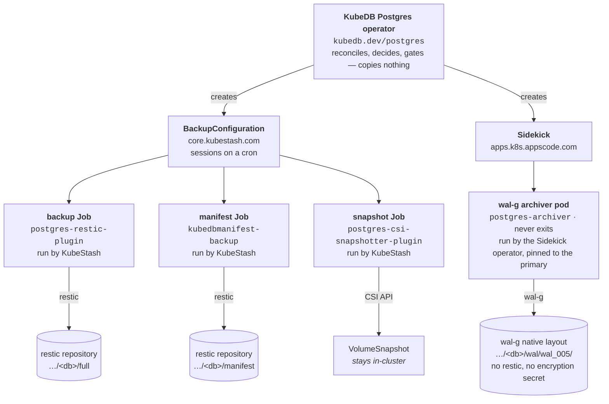
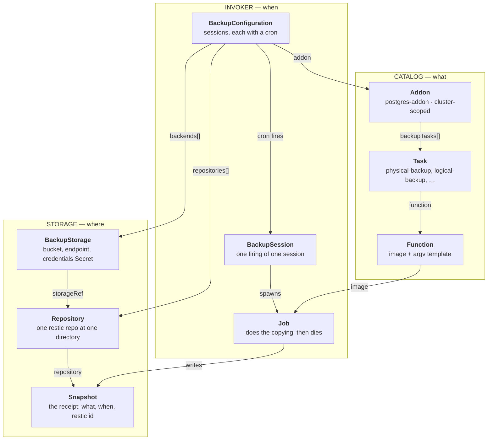
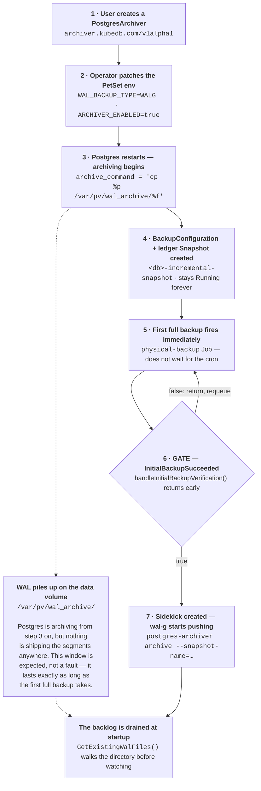
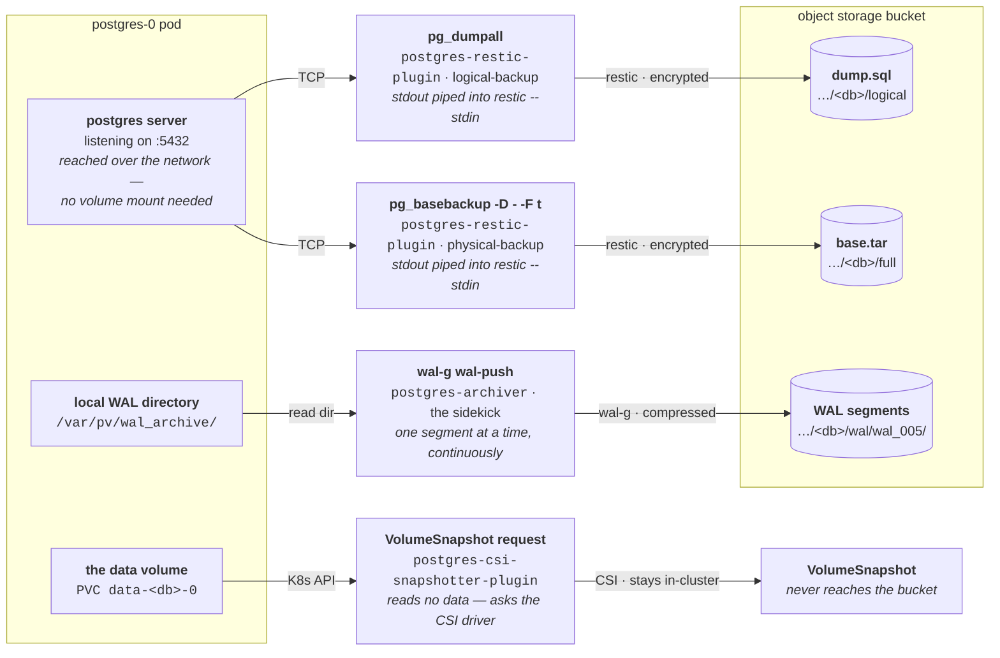
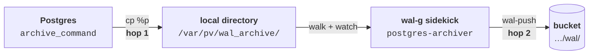
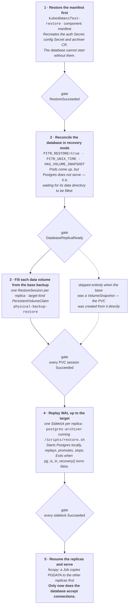
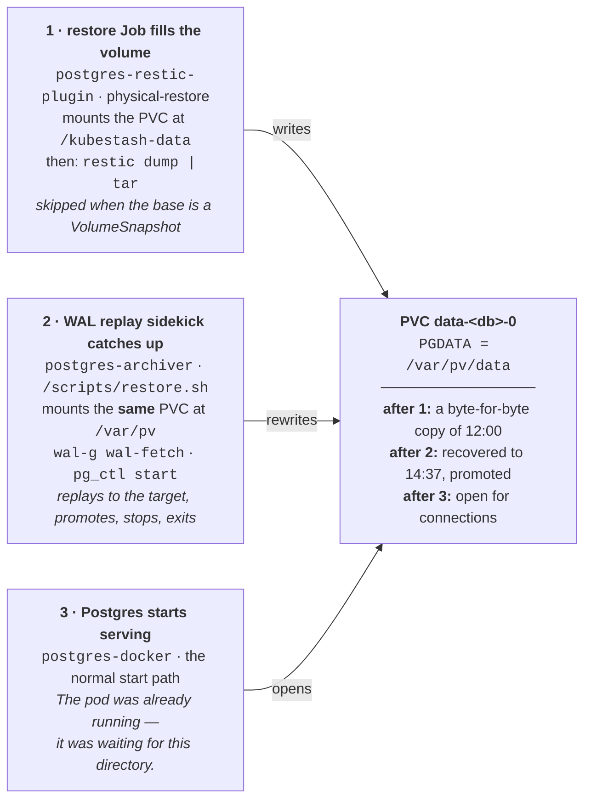

# KubeDB Postgres Backup & Restore — The Full Flow

> Companion to `postgres-backup.md` (which explains the four repos conceptually). This file is the
> **flow**: which component does what, how bytes reach the bucket, and how a restore lands in the
> user's pod. All diagrams are mermaid and render on GitHub.
>
> A standalone HTML version with hand-drawn SVG figures sits next to this file:
> `postgres-backup-flow.html` — open it in a browser.

---

## Table of contents

1. [The one idea to hold onto](#1-the-one-idea-to-hold-onto)
2. [Who owns what](#2-who-owns-what)
3. [Where KubeStash plugs in](#3-where-kubestash-plugs-in)
4. [Which backup is taken when](#4-which-backup-is-taken-when)
5. [How the bytes reach the bucket](#5-how-the-bytes-reach-the-bucket)
6. [Why WAL takes two hops](#6-why-wal-takes-two-hops)
7. [How a point in time is resolved](#7-how-a-point-in-time-is-resolved)
8. [Restore, stage by stage](#8-restore-stage-by-stage)
9. [How the data lands in the pod](#9-how-the-data-lands-in-the-pod)
10. [Reference tables](#10-reference-tables)

---

## 1. The one idea to hold onto

KubeDB runs **two cadences at once**:

| | Scheduled | Continuous |
| --- | --- | --- |
| Driven by | a cron inside `BackupConfiguration` | nothing — it never stops |
| Runs as | a Job that wakes, copies, dies | a Sidekick pod that never exits |
| Produces | `base.tar`, `dump.sql`, manifests | WAL segments |
| Owned by | KubeStash | the Sidekick operator |
| Granularity | whole database, every N hours | every transaction |

Almost every confusing behaviour in this system comes from the **seam between them** — the gate, the
WAL backlog, the two separate retention policies. Keep the two cadences separate in your head and the
rest follows.

---

## 2. Who owns what

**The Postgres operator never moves a byte of backup data.** Its entire job is to translate user
intent into resources that *other* components act on — then wait, and gate.



**Four producers, four destinations.** Three of the four end in the same bucket under different
prefixes — but only two of them are restic repositories. The WAL prefix is written by wal-g in its own
format and is *not* encrypted by the KubeStash encryption secret. The CSI route never leaves the
cluster at all.

| Repository | Ships | Runs as | Lifetime |
| --- | --- | --- | --- |
| `kubedb.dev/postgres` | the operator binary | Deployment in `kubedb` | always |
| `kubedb.dev/postgres-restic-plugin` | `backup`, `physical-backup`, `restore`, `physical-restore` | Job, one per session | minutes |
| `kubedb.dev/postgres-csi-snapshotter-plugin` | the VolumeSnapshotter driver | Job | seconds |
| `kubedb.dev/postgres-archiver` | `archive` — the wal-g pusher | Sidekick pod, and again as the WAL-replay pod on restore | forever / one-shot |
| `kubedb.dev/postgres-init-docker` | `start.sh`, `restore.sh`, `copy-data.sh` | init container; its scripts are executed by *other* pods | seconds |

> **Worth noticing.** The archiver image appears **twice** in the lifecycle — once as the long-lived
> WAL pusher during backup, once as a short-lived pod during restore that runs `/scripts/restore.sh`
> and replays WAL. Same image, opposite direction. It is the only component that both writes to and
> reads from the bucket.

---

## 3. Where KubeStash plugs in

KubeStash is not one graph, it is **three**, and they only touch at the moment a Job is built. One
chain says *where the bytes go*, one says *when to run*, one says *what binary to run*.



**Only the `BackupConfiguration` knows all three chains.** It is the join: it names a backend,
declares the repositories that backend should hold, and picks the addon task whose Function supplies
the image. Everything else is one chain minding its own business — which is why a broken backup is
almost always traceable to exactly one of the three.

The Function image is a **template**, not a literal:

```
ghcr.io/kubedb/postgres-restic-plugin:v0.29.0_${DB_VERSION}
availableVersions: [12.17, 14.10, 16.4, 17.2, 18.2]
```

`${DB_VERSION}` is substituted from the backup target's version. A target whose version isn't on that
list produces an image tag that doesn't exist, and the failure surfaces as `ImagePullBackOff` rather
than as anything that mentions versions.

---

## 4. Which backup is taken when

Adding `spec.archiver` flips two environment variables with different jobs:

* `WAL_BACKUP_TYPE=WALG` → the init scripts write a **real** `archive_command`
  (`petset.go:886`)
* `ARCHIVER_ENABLED=true` → creates the archive directories

So Postgres begins archiving **early** — but the process that ships those segments off the node does
not start until a full backup has already succeeded.



**The gap between step 3 and step 7 is the design, not a bug.** Because WAL starts before the pusher
does, the archiver cannot simply watch for new files — it walks the whole directory on startup and
pushes what it finds. That is why a restart of the sidekick is safe, and why a slow first backup shows
up as disk pressure rather than as a backup failure.

> **The failure this prevents.** If the sidekick started first and the full backup later failed, you
> would hold a pile of WAL with no base to replay it onto — useless bytes that still cost money. The
> gate guarantees the invariant every PITR system depends on: *there is always a base backup older
> than the oldest WAL segment you kept.*

**Size the data volume for the backlog, not for the steady state.**

---

## 5. How the bytes reach the bucket

Four routes that share **nothing** — not a tool, not a format, not a credential.



Nothing is staged on local disk on the way out. The two restic routes pipe their producer's stdout
straight into `restic backup --stdin`, so a 400 GB base backup never needs 400 GB of scratch space.

**The WAL prefix is not a restic repository.** It is written by wal-g in wal-g's own layout,
compressed but not encrypted with the KubeStash encryption secret, and it is the one place in the
bucket that restic cannot read. Losing the encryption secret costs you the base backups; it does not
cost you the WAL.

> **A consequence worth planning for.** Because the two chains are independent, retention is too. The
> archiver runs its *own* retention cron over the WAL prefix (`logBackup.retentionPeriod`), separate
> from the KubeStash `RetentionPolicy` that prunes restic snapshots. Set one without the other and you
> get either WAL you can't replay or base backups with nothing to replay onto them.

---

## 6. Why WAL takes two hops

Postgres never talks to object storage. That is the point.



| | Hop 1 — `cp` to local dir | Hop 2 — `wal-g wal-push` |
| --- | --- | --- |
| Must it succeed? | **Always** | No |
| Latency | ~milliseconds | seconds, network-bound |
| If it fails | Postgres stops recycling WAL and **fills the volume** | the sidekick retries; the database is unaffected |
| Who runs it | the Postgres backend itself | a separate pod that may crash freely |

**The split exists to isolate a failure mode.** Any design that puts a network call inside
`archive_command` makes object-storage availability a hard dependency of database uptime. Splitting it
means the worst a bucket outage can do is grow a directory.

---

## 7. How a point in time is resolved

Choosing the base is a **sort, not a search**.

```
                                        recoveryTimestamp T
                                                │
   ┌────────────────────────────────────────────┼─────────────────────────┐
   │  continuous WAL — every segment, in order, no gaps                   │
   └──────────────────────────────────────────▲─┼─────────────────────────┘
                                              │ │
                                    replay ───┘ │
                                    forward     │
   ▌            ▌            ▌                  │            ▌
   │            │            │                  │            │
───┴────────────┴────────────┴──────────────────┴────────────┴────────────►  time
 base 00:00   base 06:00   base 12:00       T = 14:37     base 18:00
                            SELECTED                      newer than T
                                                          — discarded
```

The rule, in full:

1. List every `Snapshot` in the **full** repository.
2. Sort by time.
3. Take the newest one **at or before** T.

**Any older base would also be correct.** Choosing the newest one that still precedes the target is
purely an optimisation: it minimises how much WAL has to be replayed, and therefore how long the
restore takes. Correctness never depends on picking the closest — only on picking one that is *not
newer*.

Once the base is chosen, the target is handed to Postgres as a recovery parameter —
`recovery_target_lsn` when an LSN is known, `recovery_target_time` otherwise. Postgres replays until
it reaches the first commit past the target, stops **before** it, and promotes onto a new timeline.
The stopping point is a transaction boundary, never a partial write.

---

## 8. Restore, stage by stage

A restore is not one job. It is a sequence the operator drives from the outside, re-entering its
reconcile loop after every stage and refusing to advance until the previous stage reports success.



**Stage 3 is the one with a branch.** A restic base needs a Job per replica to unpack it; a
VolumeSnapshot base needs no Job at all, because the PVC was already provisioned from the snapshot
when stage 2 reconciled the PetSet. Everything downstream is identical.

---

## 9. How the data lands in the pod

This is the part that surprises people: **the restore never goes through the database.** No `psql`,
no network protocol, no import. Two separate pods mount the database's own PVC and write into it
directly, at different mount paths, before Postgres is allowed to open it.



**The same volume, mounted at two different paths by two different images.** The restic plugin writes
under `/kubestash-data`; the archiver mounts it at `/var/pv` because that is where its hardcoded paths
expect PGDATA to be. Getting either mount path wrong produces a restore that reports success and
leaves an empty directory.

> **Why the base must be physical.** WAL can only be replayed onto a byte-level copy — the LSNs in a
> segment refer to physical page positions. That is why the archiver's full backup is always
> `pg_basebackup` or a VolumeSnapshot and never `pg_dumpall`: a logical dump produces a *different*
> physical layout, and there is nothing for the WAL to attach to.

---

## 10. Reference tables

### 10.1 Tasks and what they actually run

| Task | Function | Command | Produces |
| --- | --- | --- | --- |
| `logical-backup` | `postgres-backup` | `pg_dumpall` → restic stdin | `dump.sql` |
| `physical-backup` | `postgres-physical-backup` | `pg_basebackup -D - -F t` → restic stdin | `base.tar` |
| `volume-snapshot` | `postgres-csi-snapshotter` | CSI VolumeSnapshot request | a snapshot object |
| `manifest-backup` | `kubedbmanifest-backup` | serialises the CR and Secrets | YAML in restic |
| `physical-backup-restore` | `postgres-physical-backup-restore` | `restic dump` → `tar -C` | a filled PVC |
| *(archiver only)* | *(no Function)* | `wal-g wal-push` / `wal-fetch` | WAL objects |

The last row is the one people miss: **the WAL path has no Addon, no Task and no Function.** It is not
a KubeStash job at all. KubeStash only learns about it through the ledger Snapshot the archiver writes
its bookkeeping into — which is why that Snapshot sits in `Running` forever and never completes.

### 10.2 Paths and environment

| Name | Value | Set by / meaning |
| --- | --- | --- |
| `PGDATA` | `/var/pv/data` | the data directory, on the PVC |
| WAL staging | `/var/pv/wal_archive/` | hardcoded in the archiver — hop 1's destination |
| restore mount | `/kubestash-data` | where the restic plugin mounts the target PVC |
| `WAL_BACKUP_TYPE` | `WALG` or empty | decides whether `archive_command` is real or `/bin/true` |
| `ARCHIVER_ENABLED` | `true` / `false` | creates the archive directories |
| `WALG_S3_PREFIX` | `s3://…/<db>/wal` | where wal-g writes; independent of the restic repos |
| `PITR_TIME` / `PITR_LSN` | a timestamp or LSN | becomes `recovery_target_*` during replay |

### 10.3 Two retention systems, not one

| | Base backups & manifests | WAL |
| --- | --- | --- |
| Governed by | KubeStash `RetentionPolicy` | `logBackup.retentionPeriod` on the archiver |
| Enforced by | KubeStash, after each session | a cron inside the archiver pod |
| Operates on | restic snapshots | objects under the wal-g prefix |
| Failure mode | WAL you cannot replay onto anything | bases with a gap after them |

---

*Drawn from `kubedb.dev/postgres`, `postgres-archiver`, `postgres-restic-plugin`,
`postgres-csi-snapshotter-plugin` and `postgres-init-docker`.*
