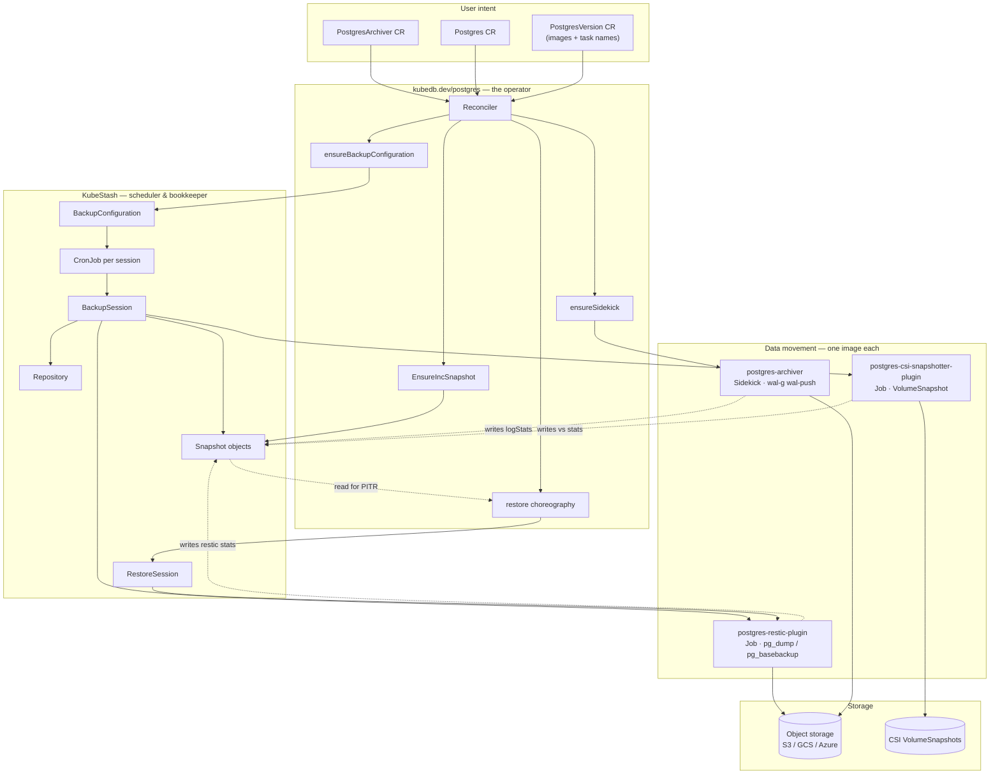
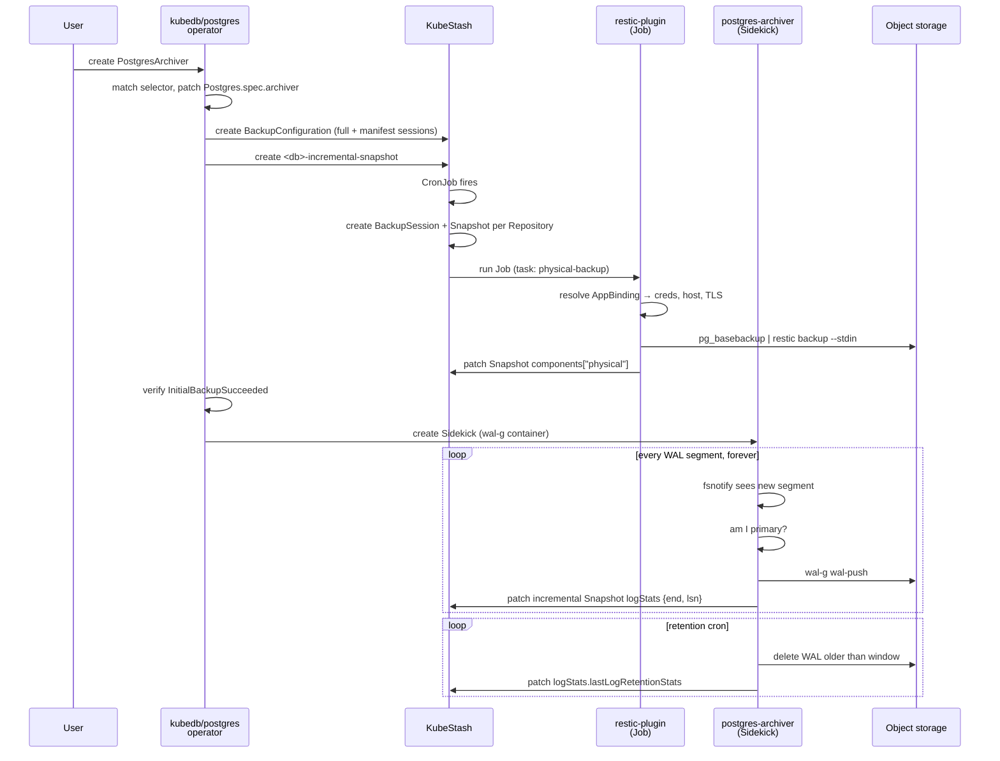
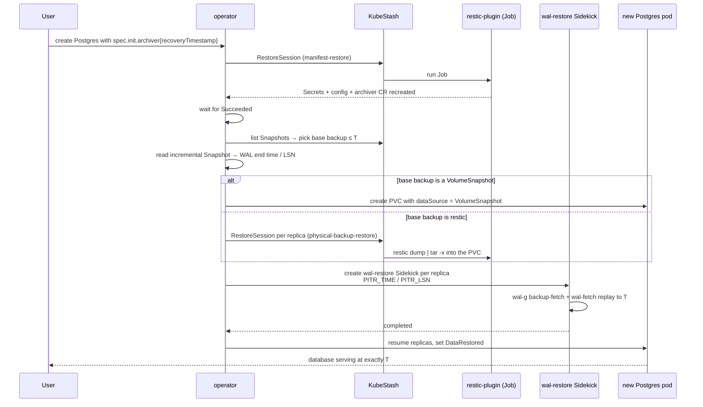

# KubeDB Postgres Backup & Restore — How the Four Repos Fit Together

> **Scope.** Conceptual note on how KubeDB backs up and restores PostgreSQL: which repository owns
> which responsibility, how they hand work to each other, and what the end-to-end flow looks like for
> full backup, continuous WAL archiving, and point-in-time recovery (PITR).
>
> **Not in scope.** Line-by-line code. This is theory, roles, and flow.
>
> **Date.** 2026-08-18

---

## Table of contents

1. [The one-paragraph summary](#1-the-one-paragraph-summary)
2. [The cast — who does what](#2-the-cast--who-does-what)
3. [The layer model](#3-the-layer-model)
4. [The CRD graph](#4-the-crd-graph)
5. [Backup flow — full backup](#5-backup-flow--full-backup)
6. [Backup flow — continuous WAL archiving](#6-backup-flow--continuous-wal-archiving)
7. [The Snapshot as a shared ledger](#7-the-snapshot-as-a-shared-ledger)
8. [Restore flow — PITR choreography](#8-restore-flow--pitr-choreography)
9. [Visual diagrams](#9-visual-diagrams)
10. [Design principles worth stealing](#10-design-principles-worth-stealing)

---

## 1. The one-paragraph summary

KubeDB's Postgres backup story is **split across four repositories on purpose**. `kubedb/postgres`
(the database operator) is the *brain*: it never moves a byte of data itself, it only creates
KubeStash objects and Kubernetes workloads and watches their status. The three satellite repos are
the *hands*, each a single-purpose binary shipped as its own container image:
`postgres-restic-plugin` does scheduled dump/base-backup work inside short-lived Jobs,
`postgres-csi-snapshotter-plugin` takes CSI VolumeSnapshots, and `postgres-archiver` is a long-lived
sidekick that continuously ships WAL to object storage. KubeStash is the *scheduler and bookkeeper*
sitting between them. The glue that makes PITR possible is a single long-lived KubeStash `Snapshot`
object that the archiver keeps writing progress into, and that the operator later reads to answer
*"which base backup plus which WAL range covers timestamp T?"*

---

## 2. The cast — who does what

### 2.1 `kubedb.dev/postgres` — the database operator (the brain)

Runs in the KubeDB operator pod. Owns the `Postgres` CR lifecycle: provisioning PetSets, services,
secrets, TLS, HA/failover, ops-requests. For backup it owns the **orchestration**, not the data path.

Its backup-related responsibilities:

| Responsibility                                                              | Where                                                |
| --------------------------------------------------------------------------- | ---------------------------------------------------- |
| Discover which archiver applies to a DB and stamp`spec.archiver` on it    | `pkg/controller/archiver.go`                       |
| Translate a`PostgresArchiver` CR into a KubeStash `BackupConfiguration` | `pkg/controller/backup_configuration.go`           |
| Create and maintain the long-lived incremental`Snapshot` (the WAL ledger) | `pkg/controller/snapshot.go`                       |
| Create the`Sidekick` CR that runs the wal-g archiver container            | `pkg/controller/sidekick.go`                       |
| Turn on WAL archiving in the DB container via env vars                      | `pkg/controller/petset.go`                         |
| Drive the whole restore choreography                                        | `pkg/controller/restore.go`, `restoresession.go` |
| Gate the DB from serving until restore completes                            | `spec.init.waitForInitialRestore`                  |

**Key idea:** the operator is the only component that understands *PostgreSQL semantics* (primary vs
standby, replication strategy, major version). The plugins are deliberately dumb about the cluster.

### 2.2 `kubedb.dev/postgres-restic-plugin` — logical & physical backup (KubeStash addon)

A CLI binary (`kubestash-postgres`) shipped as a container image, invoked by KubeStash inside a
backup or restore **Job**. Four subcommands, which map 1:1 to KubeStash task names:

| Subcommand           | Tool                                                    | KubeStash component |
| -------------------- | ------------------------------------------------------- | ------------------- |
| `backup`           | `pg_dumpall` (default) or `pg_dump`                 | `dump`            |
| `restore`          | `psql`                                                | `dump`            |
| `physical-backup`  | `pg_basebackup` (or `pg_tde_basebackup` if present) | `physical`        |
| `physical-restore` | `tar -x`                                              | `physical`        |

**The streaming model.** Nothing is staged on disk. The plugin builds a shell command and hands it to
restic as a stdin pipe — effectively `pg_dumpall | restic backup --stdin`. Restore is the mirror:
`restic dump | psql`. The Job therefore never needs a volume sized for the dump, only a small scratch
dir for restic's cache.

**How it gets credentials.** It is given only `--namespace` and `--backupsession`. From there it
walks: `BackupSession` → `BackupConfiguration` → `.spec.target` → the **AppBinding** of the same
name, which yields the service host/port/scheme, the auth Secret, and the TLS material. This
indirection is why the AppBinding must be complete for any addon to work.

**Version pinning.** The image bundles a PostgreSQL client matching the server major version
(`12.17`, `14.10`, `16.4`, `17.2`, `18.2`), selected through the `${DB_VERSION}` substitution in the
KubeStash `Function` definition.

### 2.3 `kubedb.dev/postgres-csi-snapshotter-plugin` — block-level snapshot (KubeStash addon)

A much smaller binary with a single `backup` subcommand. Invoked by KubeStash as the
`volume-snapshot` task. What it does:

1. Reads the target `Postgres` CR.
2. **If replicas > 1**: finds a *secondary* pod and calls `pg_wal_replay_pause()` on it, so the
   snapshot is taken from a quiesced replica rather than disturbing the primary.
3. Creates a `VolumeSnapshot` on that pod's data PVC and polls until `readyToUse`.
4. Records the VolumeSnapshot name and time into the KubeStash `Snapshot` status.
5. On exit (including SIGTERM) runs cleanup: `pg_wal_replay_resume()`.

There is **no restore subcommand** — restore from a VolumeSnapshot is done by the operator
pre-creating PVCs with `dataSource` pointing at the snapshot, not by a plugin.

### 2.4 `kubedb.dev/postgres-archiver` — the WAL sidekick (continuous, not scheduled)

This is the component that makes PITR possible, and it is architecturally different from the other
two: **it is not a KubeStash Job**. It is a long-running container inside a `Sidekick` CR
(`kubeops.dev/sidekick`), which leader-elects onto exactly one pod of the database and shares the
data PVC with it.

Its loop:

1. **Watch** `/var/pv/wal_archive` with fsnotify for newly created 24-character WAL filenames
   (plus `.history` files).
2. **Queue** them, preserving creation order.
3. **Check role** — query the local Postgres to decide primary vs standby. Only the primary pushes;
   a standby just waits until the file is confirmed present in the bucket, then deletes it locally.
4. **Push** via `wal-g wal-push`.
5. **Decode** the pushed segment to extract the last commit LSN and timestamp.
6. **Report** that LSN/timestamp into the long-lived `Snapshot`'s `status.components["wal"].logStats`.
7. **Retain** — a separate cron goroutine deletes WAL objects older than the configured window
   directly from the bucket, and records deletion stats back into the same `Snapshot`.

The image bundles both the archiver binary and `wal-g` itself.

> **Note on the data path.** Postgres's own `archive_command` writes WAL into the shared
> `/var/pv/wal_archive` directory; the archiver picks it up from there. The operator enables this by
> setting `ARCHIVER_ENABLED=true` plus `ARCHIVE_PATH` / `ARCHIVE_STATUS_PATH` /
> `LAST_ARCHIVED_FILE_INFO_DIR` on the DB container whenever `spec.archiver` is set.

---

## 3. The layer model

```
┌─────────────────────────────────────────────────────────────────────┐
│  USER INTENT                                                        │
│  PostgresArchiver CR  ·  Postgres CR (spec.archiver / spec.init)     │
└─────────────────────────────────────────────────────────────────────┘
                                 │  declares
                                 ▼
┌─────────────────────────────────────────────────────────────────────┐
│  ORCHESTRATION      kubedb.dev/postgres  (the operator)              │
│  translates intent → KubeStash objects + Sidekick + env vars         │
└─────────────────────────────────────────────────────────────────────┘
                                 │  creates
                                 ▼
┌─────────────────────────────────────────────────────────────────────┐
│  SCHEDULING & BOOKKEEPING     KubeStash                              │
│  BackupConfiguration → CronJob → BackupSession → Job                 │
│  Repository · Snapshot · RetentionPolicy · BackupStorage             │
└─────────────────────────────────────────────────────────────────────┘
                                 │  runs
                                 ▼
┌──────────────────────┬──────────────────────┬───────────────────────┐
│  DATA MOVEMENT       │                      │                       │
│  restic-plugin       │  csi-snapshotter     │  postgres-archiver    │
│  (Job, scheduled)    │  (Job, scheduled)    │  (Sidekick, always-on)│
│  pg_dump/basebackup  │  VolumeSnapshot      │  wal-g wal-push       │
└──────────────────────┴──────────────────────┴───────────────────────┘
                                 │  writes to
                                 ▼
┌─────────────────────────────────────────────────────────────────────┐
│  STORAGE      S3 / GCS / Azure Blob / NFS  ·  CSI VolumeSnapshots    │
└─────────────────────────────────────────────────────────────────────┘
```

The important structural fact: **the three data-movement components never talk to each other.** They
coordinate only through KubeStash `Snapshot` objects.

---

## 4. The CRD graph

Four API groups are in play.

| Group                     | Kinds                                                                | Owned by  |
| ------------------------- | -------------------------------------------------------------------- | --------- |
| `kubedb.com`            | `Postgres`                                                         | KubeDB    |
| `catalog.kubedb.com`    | `PostgresVersion`                                                  | KubeDB    |
| `archiver.kubedb.com`   | `PostgresArchiver`                                                 | KubeDB    |
| `core.kubestash.com`    | `BackupConfiguration`, `BackupSession`, `RestoreSession`       | KubeStash |
| `storage.kubestash.com` | `BackupStorage`, `Repository`, `Snapshot`, `RetentionPolicy` | KubeStash |
| `addons.kubestash.com`  | `Addon`, `Function` (cluster-scoped)                             | KubeStash |
| `apps.k8s.appscode.com` | `Sidekick`                                                         | kubeops   |

### 4.1 `PostgresArchiver` — the user-facing PITR knob

One archiver can serve many databases. Its fields:

- `databases` — an allowed-consumers selector deciding *which* Postgres CRs it applies to
- `fullBackup` — schedule + driver for the base backup (restic *or* VolumeSnapshotter)
- `logBackup` — runtime settings for the wal-g sidekick, plus WAL retention schedule
- `manifestBackup` — schedule for backing up the CR and its Secrets
- `backupStorage`, `encryptionSecret`, `retentionPolicy`, `deletionPolicy`, `pause`

### 4.2 `PostgresVersion.spec.archiver` — the image and task registry

This is how the operator knows *what to run* without hardcoding anything:

```yaml
archiver:
  walg:
    image: <postgres-archiver image>       # the sidekick container image
  addon:
    name: postgres-addon
    tasks:
      fullBackup:        { name: physical-backup }
      fullBackupRestore: { name: physical-backup-restore }
      volumeSnapshot:    { name: volume-snapshot }
      manifestBackup:    { name: manifest-backup }
      manifestRestore:   { name: manifest-restore }
```

The operator reads task *names* from here and puts them into the `BackupConfiguration` /
`RestoreSession` it generates. Swapping the addon or the archiver image is therefore a catalog edit,
not a code change.

### 4.3 Naming conventions the whole system relies on

| Object                 | Name                          |
| ---------------------- | ----------------------------- |
| BackupConfiguration    | `<db>-archiver`             |
| Full backup session    | `full-backup`               |
| Manifest session       | `manifest-backup`           |
| Full backup repository | `<db>-full`                 |
| Manifest repository    | `<db>-manifest`             |
| WAL ledger Snapshot    | `<db>-incremental-snapshot` |
| Sidekick               | `<db>-sidekick`             |
| wal-g container        | `wal-g`                     |

---

## 5. Backup flow — full backup

```
PostgresArchiver created
        │
        ▼
operator.setArchiverIfExist()
   lists all PostgresArchivers, matches by selector,
   patches Postgres.spec.archiver = { ref }
        │
        ▼
operator reconcile — gated on:
   • not paused          • not distributed
   • DB is Ready         • DB is initialized
        │
        ├─► ensureBackupConfiguration()
        │      builds one BackupConfiguration with up to 2 sessions:
        │        • "full-backup"     → task = physical-backup OR volume-snapshot
        │                              (chosen by archiver.fullBackup.driver)
        │                              + manifest-backup task in the same session
        │        • "manifest-backup" → task = manifest-backup
        │      each session gets its own Repository + directory + encryptionSecret
        │
        ├─► EnsureIncSnapshot()
        │      creates <db>-incremental-snapshot, type=Incremental
        │
        ├─► handleInitialBackupVerification()
        │      BLOCKS until at least one "full-backup" BackupSession succeeds
        │      sets condition InitialBackupSucceeded
        │
        ├─► ensureSidekick()          ← only after the base backup exists
        │
        └─► UpdateIncrementalSnapshotStartTime()
```

**Why the ordering matters.** WAL is worthless without a base backup to replay onto. The operator
enforces this by refusing to start the wal-g sidekick until `InitialBackupSucceeded` is true. This is
the single most important sequencing decision in the whole design.

From there KubeStash takes over: the `BackupConfiguration` produces a CronJob per session, each
firing creates a `BackupSession`, which creates one `Snapshot` per `Repository` and resolves
Addon → Task → Function into a Job running the appropriate plugin image.

---

## 6. Backup flow — continuous WAL archiving

Two cooperating halves, running in the same pod but different containers, sharing the data PVC.

```
┌────────────────────────── database pod ──────────────────────────┐
│                                                                  │
│  postgres container                    wal-g sidekick container  │
│  ───────────────────                   ────────────────────────  │
│  ARCHIVER_ENABLED=true                 args: archive             │
│  archive_mode = always                       --snapshot-name=... │
│  archive_command writes to  ─────┐           --snapshot-namespace│
│  /var/pv/wal_archive/            │                               │
│                                  │     1. fsnotify CREATE event  │
│                                  └───► 2. filename is 24 chars?  │
│                                        3. am I the primary?      │
│                                           yes → wal-g wal-push   │
│                                           no  → wait for it to   │
│                                                 appear, then rm  │
│                                        4. decode segment →       │
│                                           last commit LSN + time │
│                                        5. PATCH Snapshot status  │
│                                        6. rm local WAL file      │
│                                                                  │
│                          (parallel goroutine)                    │
│                          cron → delete bucket objects older      │
│                                 than the retention window        │
└──────────────────────────────────────────────────────────────────┘
```

**The primary/standby dance** is what makes this HA-safe. The sidekick leader-elects onto one pod, but
after a failover that pod may no longer be primary. So the archiver re-checks its role on *every*
file rather than assuming it once at startup. A standby never pushes — it only garbage-collects local
files it can prove are already in the bucket.

---

## 7. The Snapshot as a shared ledger

This is the conceptual centerpiece and the least obvious part of the design.

KubeStash `Snapshot` objects normally represent *one backup run*. KubeDB adds a second, unusual use:
a **single long-lived Snapshot named `<db>-incremental-snapshot`**, of type `Incremental`, that is
never "completed". It acts as a durable, continuously-updated index of how far WAL archiving has
progressed.

```
Snapshot: <db>-incremental-snapshot          type: Incremental
  status.components["wal"].logStats:
      start                    ← set by the operator when archiving begins
      end                      ← last archived commit timestamp  (archiver writes)
      lsn                      ← last archived commit LSN        (archiver writes)
      lastLogRetentionStats    ← what the retention cron deleted (archiver writes)
```

Meanwhile each *scheduled* backup produces an ordinary Snapshot of type `Full`, whose components
record either:

- `physical` → restic stats, including the backup's end time, **or**
- a volume-snapshotter component → the VolumeSnapshot name and time

**Why this matters:** PITR is answered entirely by reading these objects. Given a target timestamp T,
the operator lists all Snapshots for the repository, sorts the Full ones by time, picks the newest one
at-or-before T, and reads the incremental Snapshot to learn how far WAL coverage extends. No bucket
listing, no wal-g catalog query — Kubernetes objects are the source of truth.

Writer/reader split:

| Field                                     | Written by                             | Read by                          |
| ----------------------------------------- | -------------------------------------- | -------------------------------- |
| Full snapshot restic/volumesnapshot stats | restic-plugin / csi-snapshotter-plugin | operator (base backup selection) |
| Incremental`logStats.end` / `.lsn`    | postgres-archiver                      | operator (PITR bound check)      |
| `logStats.lastLogRetentionStats`        | postgres-archiver retention cron       | operator / user                  |

---

## 8. Restore flow — PITR choreography

Triggered by creating a `Postgres` CR with `spec.init.archiver` set (recovery timestamp, full DB
repository, manifest repository, encryption secret) and `waitForInitialRestore: true`.

```
Postgres CR created with spec.init.archiver
        │
        ▼
operator sees Init.Archiver != nil && !Init.Initialized
   → diverts into ensureArchiveRecovery(), skipping normal reconcile
        │
  ┌─────┴──────────────────────────────────────────────────────────┐
  │ STEP 1 — MANIFEST RESTORE                                      │
  │   RestoreSession "<db>-manifest-restorer"                      │
  │   task: manifest-restore                                       │
  │   recreates auth Secret, config Secret, init script,           │
  │   and optionally the PostgresArchiver CR itself                │
  │   → operator BLOCKS until phase == Succeeded                   │
  └─────┬──────────────────────────────────────────────────────────┘
        │
  ┌─────┴──────────────────────────────────────────────────────────┐
  │ STEP 2 — CHOOSE THE BASE BACKUP                                │
  │   getSnapshotFromRepo():                                       │
  │     • list Snapshots for the full repo                         │
  │     • from the incremental Snapshot, read WAL end time + LSN   │
  │     • sort Full snapshots by time; pick newest ≤ target T      │
  │     • if T is beyond the last base backup but within WAL       │
  │       coverage, clamp T to the WAL end time                    │
  │     • error if T predates the earliest snapshot                │
  └─────┬──────────────────────────────────────────────────────────┘
        │
  ┌─────┴──────────────────────────────────────────────────────────┐
  │ STEP 3 — MATERIALIZE THE DATA VOLUMES                          │
  │   two mutually exclusive paths:                                │
  │                                                                │
  │   (a) base backup was a VolumeSnapshot                         │
  │       → PVCs are created with dataSource → VolumeSnapshot      │
  │         during normal reconcile. No Job needed.                │
  │                                                                │
  │   (b) base backup was restic/pg_basebackup                     │
  │       → one RestoreSession per replica, targeting the PVC      │
  │         task: physical-backup-restore → restic dump | tar -x   │
  │         node-pinned so the PVC binds on the right node         │
  └─────┬──────────────────────────────────────────────────────────┘
        │
  ┌─────┴──────────────────────────────────────────────────────────┐
  │ STEP 4 — REPLAY WAL TO THE TARGET TIME                         │
  │   one *restore* Sidekick per replica (<db>-wal-restorer-N)     │
  │   runs the archiver image but executes /scripts/restore.sh     │
  │   env: PITR_TIME, PITR_LSN, PGDATA, STANDALONE=true            │
  │   internally: wal-g backup-fetch + restore_command =           │
  │               'wal-g wal-fetch %f %p' + recovery_target_time   │
  │   → operator polls sidekick completion                         │
  └─────┬──────────────────────────────────────────────────────────┘
        │
  ┌─────┴──────────────────────────────────────────────────────────┐
  │ STEP 5 — RECONSTITUTE THE CLUSTER                              │
  │   replication strategy decides how replicas are rebuilt:       │
  │     • None    → every replica restored independently           │
  │     • Sync    → restore 1 replica, others stream from it       │
  │     • FSCopy  → restore 1 replica, filesystem-copy to others   │
  │                 via a copy Job                                 │
  │   then resumeDatabaseReplicas() scales back up                 │
  │   sets DataRestored condition → waitForInitialRestore releases │
  │   the DB to start serving                                      │
  └────────────────────────────────────────────────────────────────┘
```

**The elegant part:** step 4 reuses the *archiver image* rather than a KubeStash plugin, because the
image already ships wal-g plus the restore script. Restore is not a KubeStash concern once the base
volume exists — it becomes a plain Kubernetes workload the operator drives.

---

## 9. Visual diagrams

### 9.1 Repository responsibility map



### 9.2 Backup timeline — how base backups and WAL interlock

```
time ──────────────────────────────────────────────────────────────────►

full-backup session   ●─────────────●─────────────●─────────────●
(cron, e.g. hourly)   B1            B2            B3            B4
                      │             │             │             │
                      │  Snapshot   │  Snapshot   │  Snapshot   │
                      │  type=Full  │  type=Full  │  type=Full  │
                      ▼             ▼             ▼             ▼

WAL archiving         ▓▓▓▓▓▓▓▓▓▓▓▓▓▓▓▓▓▓▓▓▓▓▓▓▓▓▓▓▓▓▓▓▓▓▓▓▓▓▓▓▓▓▓▓▓▓▓▓
(continuous)          └── one long-lived Snapshot, type=Incremental ──┘
                          status.components["wal"].logStats.end
                          advances with every pushed segment

recover to T ────────────────────────────────► T
                                    ▲          ▲
                                    │          │
                          pick B3 (newest ≤ T) │
                                    └── replay WAL from B3 to exactly T
```

### 9.3 Component interaction sequence — one full backup cycle



### 9.4 Restore sequence



---

## 10. Design principles worth stealing

These are the transferable ideas — the reasons this architecture works, independent of PostgreSQL.

1. **Separate orchestration from data movement.** The operator understands the database; the plugins
   understand one tool each. Neither needs to change when the other does.
2. **One binary, one image, one job per concern.** Logical backup, block snapshot, and log shipping
   have wildly different lifetimes (short Job / short Job / forever). Forcing them into one component
   would compromise all three.
3. **Scheduled work is a Job; continuous work is a Sidekick.** KubeStash's CronJob model is a poor fit
   for something that must run constantly and follow the primary through failovers. That is why the
   archiver lives outside KubeStash's Job machinery while still reporting into its objects.
4. **Use a Kubernetes object as the coordination ledger.** The long-lived incremental `Snapshot`
   removes any need for the operator to query object storage or the backup tool's catalog. Everything
   PITR needs is answerable with a `list` and a `get`.
5. **Never start log shipping before a base backup exists.** `InitialBackupSucceeded` is a hard gate.
   WAL without a base is unusable, and silently archiving it would create a false sense of safety.
6. **Re-derive role on every operation, not once at startup.** The primary can change under you. The
   archiver checks before every push.
7. **Push image and task names into the catalog CR.** `PostgresVersion.spec.archiver` means adding a
   new engine version, or switching addon implementations, is a YAML change rather than a release.
8. **Resolve all connection details from the AppBinding.** Plugins receive only a namespace and a
   BackupSession name. Everything else — host, port, credentials, TLS, topology — comes from one
   indirection, so plugins stay identical across managed and external databases.
9. **Restore is choreography, not a single job.** Manifest → base volume → log replay → cluster
   reconstitution are four distinct phases with explicit gates between them, each individually
   observable and retryable.

---

## Appendix — repo-to-concern index

| Repo                                           | Runs as             | Lifetime         | Tools it wraps                                                                | Writes to Snapshot                 |
| ---------------------------------------------- | ------------------- | ---------------- | ----------------------------------------------------------------------------- | ---------------------------------- |
| `kubedb.dev/postgres`                        | Operator deployment | Always           | — (creates objects only)                                                     | creates the incremental Snapshot   |
| `kubedb.dev/postgres-restic-plugin`          | KubeStash Job       | Seconds–minutes | `pg_dump`, `pg_dumpall`, `psql`, `pg_basebackup`, `tar`, `restic` | `dump` / `physical` components |
| `kubedb.dev/postgres-csi-snapshotter-plugin` | KubeStash Job       | Seconds          | Kubernetes`VolumeSnapshot` API, `pg_wal_replay_pause/resume`              | volume-snapshotter component       |
| `kubedb.dev/postgres-archiver`               | Sidekick container  | Forever          | `wal-g wal-push`, WAL decoding, bucket deletes                              | `wal` component `logStats`     |
