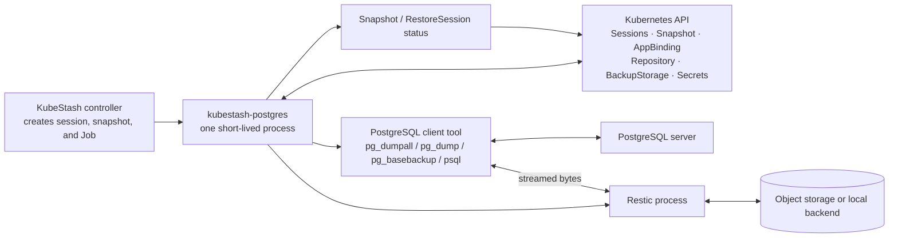
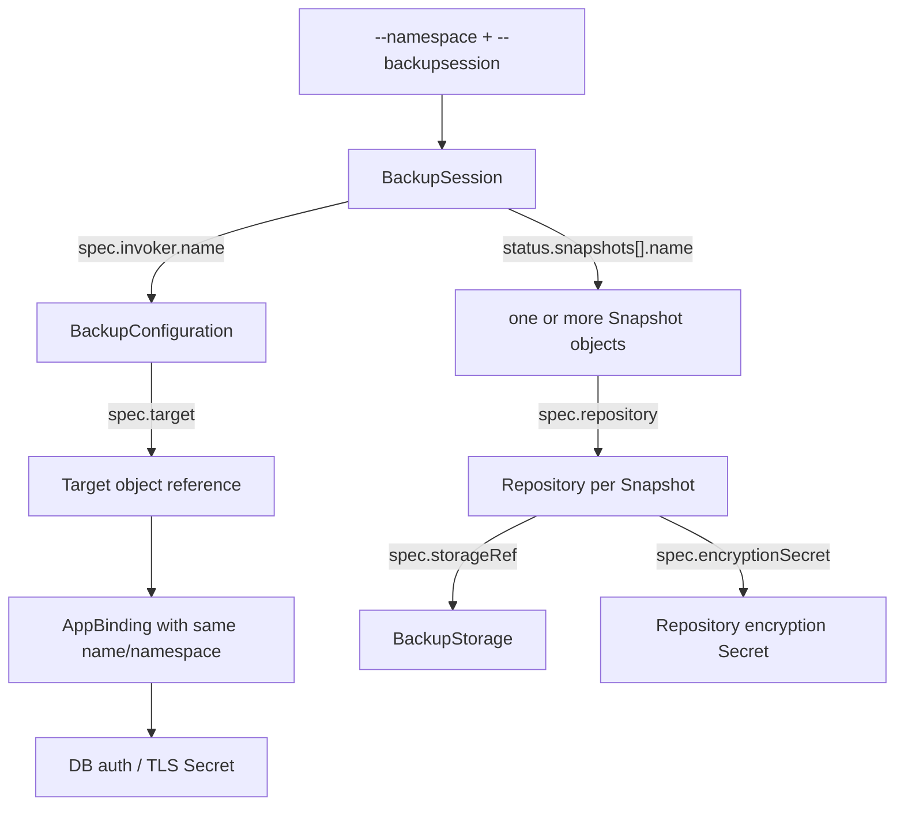
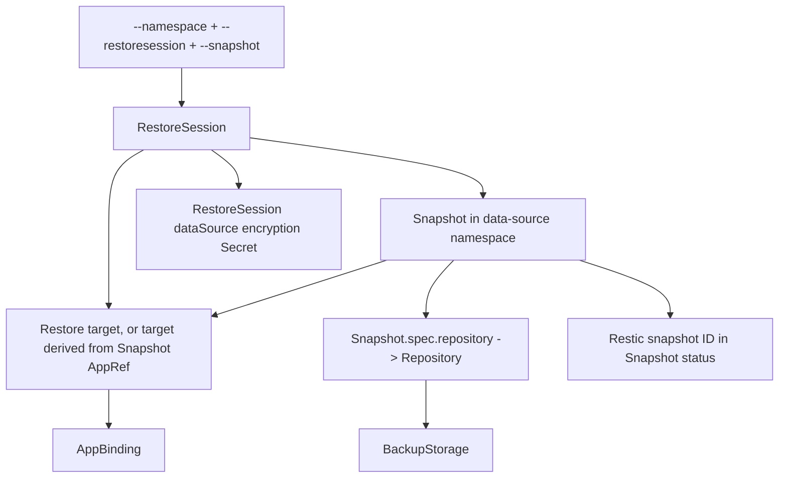
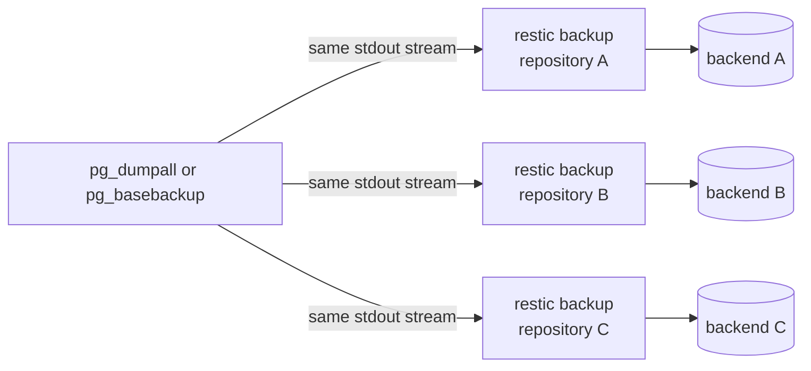

# `postgres-restic-plugin` — Codebase and Design, from Zero to Deep Understanding

> **Repository analyzed:** `kubedb.dev/postgres-restic-plugin`
>
> **Revision:** `b546216f` on `master` (release preparation for `v0.30.0-rc.0`)
>
> **Analysis date:** 2026-08-27
>
> **Scope:** This note explains this repository itself: how the binary starts, how every command
> discovers its inputs, how bytes move between PostgreSQL and Restic, how Kubernetes status is
> updated, how the images are built, and which design assumptions or rough edges matter when changing
> the code. It intentionally starts with beginner concepts and then goes into implementation detail.

---

## Table of contents

1. [The shortest useful explanation](#1-the-shortest-useful-explanation)
2. [The basic ideas you need first](#2-the-basic-ideas-you-need-first)
3. [What this repository owns—and what it does not](#3-what-this-repository-ownsand-what-it-does-not)
4. [The architecture in one picture](#4-the-architecture-in-one-picture)
5. [Repository tour](#5-repository-tour)
6. [How the program starts](#6-how-the-program-starts)
7. [The central state object: `Options`](#7-the-central-state-object-options)
8. [The Kubernetes object graph](#8-the-kubernetes-object-graph)
9. [The common preparation flow](#9-the-common-preparation-flow)
10. [Logical backup: `backup`](#10-logical-backup-backup)
11. [Physical backup: `physical-backup`](#11-physical-backup-physical-backup)
12. [Logical restore: `restore`](#12-logical-restore-restore)
13. [Physical restore: `physical-restore`](#13-physical-restore-physical-restore)
14. [How Restic storage is resolved](#14-how-restic-storage-is-resolved)
15. [How multiple backup destinations work](#15-how-multiple-backup-destinations-work)
16. [Credentials, TLS, and connection readiness](#16-credentials-tls-and-connection-readiness)
17. [Status reporting and error semantics](#17-status-reporting-and-error-semantics)
18. [The Percona TDE protections](#18-the-percona-tde-protections)
19. [Command-line flags and argument handling](#19-command-line-flags-and-argument-handling)
20. [Build, images, releases, and tests](#20-build-images-releases-and-tests)
21. [Important design decisions](#21-important-design-decisions)
22. [Rough edges and likely bugs](#22-rough-edges-and-likely-bugs)
23. [How to debug a failed run](#23-how-to-debug-a-failed-run)
24. [A productive code-reading order](#24-a-productive-code-reading-order)
25. [Function-by-function source map](#25-function-by-function-source-map)
26. [Questions you should now be able to answer](#26-questions-you-should-now-be-able-to-answer)
27. [Final mental model](#27-final-mental-model)

---

## 1. The shortest useful explanation

This repository builds a small command-line program named `kubestash-postgres`. KubeStash runs that
program inside short-lived Kubernetes Jobs.

The program connects two worlds:

- PostgreSQL's own tools know how to turn a database into bytes, or turn bytes back into a database.
- Restic knows how to encrypt, deduplicate, and store those bytes in a backup destination.

The plugin joins them with Unix-style pipelines:

```text
logical backup:   pg_dumpall  | restic backup --stdin
physical backup:  pg_basebackup -D - -F t | restic backup --stdin

logical restore:  restic dump | sed | optional TDE guard | psql
physical restore: restic dump | tar ...
```

It does not normally save a full dump or base backup to the Job's local disk. The data is streamed
from one process to the next.

Everything around that byte stream is Kubernetes integration:

1. Read a `BackupSession` or `RestoreSession`.
2. Find the target database and its `AppBinding`.
3. Load database, TLS, storage, and encryption Secrets.
4. Wait until the database is usable when the operation needs a running server.
5. Build and run the PostgreSQL-to-Restic pipeline.
6. Write the result and Restic snapshot ID into KubeStash status objects.

If you remember only one sentence, remember this:

> **This plugin is a streaming data-plane adapter between PostgreSQL tools and Restic, with
> KubeStash custom resources acting as its configuration and status API.**

---

## 2. The basic ideas you need first

### 2.1 What is a PostgreSQL logical backup?

A logical backup describes database objects as SQL-level information:

- create this database;
- create this table;
- insert these rows;
- create these roles and permissions.

The tools used here are:

- `pg_dump`: dumps one database;
- `pg_dumpall`: dumps all databases and global objects such as roles;
- `psql`: reads SQL and executes it against a target PostgreSQL server.

A logical backup is relatively portable. It is useful when the target server is running and you want
PostgreSQL to recreate objects through SQL. It is not a byte-for-byte copy of the database data
directory.

### 2.2 What is a PostgreSQL physical backup?

A physical backup copies PostgreSQL's actual cluster files in a consistent form. This repository uses
`pg_basebackup` to produce that copy as a tar stream.

On restore, the tar stream is extracted into the future PostgreSQL data directory. This is much closer
to cloning the server's storage than replaying SQL.

Physical backups are more tightly tied to PostgreSQL version and server layout. That is why the
container images bundle PostgreSQL client tools that match the intended database version.

### 2.3 What is Restic?

Restic is the storage engine in this design. It takes input data and writes encrypted snapshots to a
repository. A repository can live in S3-compatible storage, GCS, Azure Blob Storage, or a mounted
local path through KubeStash's storage resolver.

Restic gives the plugin:

- encryption through a repository password;
- content-defined chunking and deduplication;
- snapshot IDs;
- integrity checking;
- a common interface over several storage providers.

There are two meanings of “snapshot” in this system:

| Name | What it is |
| --- | --- |
| KubeStash `Snapshot` | A Kubernetes custom resource that records backup metadata and status. |
| Restic snapshot | Restic's internal immutable backup record, identified by a Restic snapshot ID. |

The Restic ID is saved inside the status of the KubeStash `Snapshot`.

### 2.4 What are KubeDB and KubeStash?

- **KubeDB** manages the PostgreSQL database lifecycle in Kubernetes.
- **KubeStash** schedules backup/restore work, creates Jobs, describes storage, and keeps status.
- **This plugin** is the short-lived worker that moves the PostgreSQL bytes when KubeStash asks it to.

KubeStash does not pass every password, endpoint, and path directly as flags. It mostly passes the
names of Kubernetes objects. The plugin reads those objects and follows their references.

### 2.5 What is an `AppBinding`?

An `AppBinding` is a Kubernetes object describing how a client connects to an application. For this
plugin it acts like a connection card containing references to:

- hostname and port;
- username/password Secret;
- optional client certificate Secret;
- optional CA bundle;
- optional `sslmode` information.

The plugin assumes the target application's `AppBinding` has the same name and namespace as the
resolved target object.

### 2.6 What is a pipeline?

In a shell, this:

```text
producer | consumer
```

means “send the producer's standard output directly to the consumer's standard input.” That is the
core data movement technique in this repository. The Go program builds pipelines using
`gomodules.xyz/go-sh`; it does not invoke a shell string such as `sh -c "..."`.

That distinction is useful:

- values become argument-array entries rather than shell text;
- normal shell metacharacters are not automatically interpreted;
- the processes still stream data through pipes;
- pipeline failure is enabled so a failed stage can fail the operation.

---

## 3. What this repository owns—and what it does not

### 3.1 It owns

- The `kubestash-postgres` CLI and its four data commands.
- Discovery of KubeStash sessions, snapshots, repositories, and storage objects.
- Discovery of the target `AppBinding` and database connection material.
- Construction of PostgreSQL and Restic pipelines.
- Logical and physical backup/restore execution.
- Per-component `Snapshot` and `RestoreSession` status updates.
- Restic repository initialization, lock checks, integrity checks, and progress reporting through the
  Restic/KubeStash libraries.
- Special handling for Druid metadata PostgreSQL and Percona `pg_tde`.
- Container images containing this binary, Restic, and normally the matching PostgreSQL client.

### 3.2 It does not own

- Backup schedules or CronJobs.
- Creation of `BackupSession`, `RestoreSession`, `Repository`, or `Snapshot` objects.
- Addon/Task/Function definitions that decide which image and arguments a Job uses.
- PostgreSQL provisioning, failover, or replication management.
- Continuous WAL archiving or point-in-time recovery orchestration.
- Retention-policy decisions and old-snapshot cleanup.
- Stopping PostgreSQL or mounting the destination data volume for a physical restore.
- Restoring Kubernetes manifests.

Those responsibilities live in KubeStash, the KubeDB Postgres operator, addon catalogs, or other
backup plugins. This repository assumes the surrounding system has already built a correctly
configured Job.

This boundary explains why the repository can look surprisingly small: the program is not a
controller with a long-running reconcile loop. It performs one requested operation and exits.

---

## 4. The architecture in one picture



It helps to divide the work into two planes:

| Plane | Purpose | Examples |
| --- | --- | --- |
| Control plane | Learn what to do and report what happened. | Kubernetes API reads, Secret resolution, readiness checks, status patches. |
| Data plane | Move the actual database bytes. | `pg_dumpall | restic`, or `restic | psql`. |

Most of `pkg/common/helpers.go` is control-plane code. The four command files assemble the data plane.

---

## 5. Repository tour

The non-vendored runtime code is only about 1,900 lines. The important files are:

```text
cmd/postgres-restic-plugin/
  main.go                 process entry point
  version.go              build metadata populated by linker flags

pkg/
  root.go                 Cobra root command and subcommand registration
  mapper.go               package-global Options and shared flag variables
  options.go              command validation and pg_basebackup flag policy
  options_test.go         the only current unit test
  backup.go               logical backup command
  restore.go              logical restore command, password filter, TDE guard
  physical_backup.go      physical/base backup command
  physical_restore.go     physical restore into a mounted data path

  common/
    types.go              Options, command names, env names, file names, defaults
    helpers.go            Kubernetes discovery, connection setup, Restic backends
    status.go             Snapshot and RestoreSession status mutation
    druid.go              Druid target -> metadata PostgreSQL redirection
    interface.go          currently empty versioned-addon marker

  v15.3/
    types.go              placeholder version-specific wrapper; no behavior yet

Makefile                  build/test/image/release orchestration
Dockerfile.in             production image template
Dockerfile.dbg            debug image template
Dockerfile.ubi            UBI image template
hack/build.sh             actual Go build and linker flags
hack/test.sh              race-enabled unit tests
hack/e2e.sh               Ginkgo entry point
.github/workflows/        CI and release automation
vendor/                   pinned dependency source used by builds
```

The `README.md` contains almost no implementation documentation, so the source files are the real
documentation.

### A naming detail

The compiled file is named `postgres-restic-plugin`, but the Cobra command advertises itself as
`kubestash-postgres`. Thus logs and usage output say:

```text
kubestash-postgres backup ...
```

even though the container entrypoint is the file `/postgres-restic-plugin`.

---

## 6. How the program starts

### 6.1 `main.go`

`cmd/postgres-restic-plugin/main.go` does four things:

1. Calls `pkg.NewRootCmd()` to construct the Cobra command tree.
2. Adds the shared AppsCode/klog logging flags through `logs.Init`.
3. Sets `GOMAXPROCS` to the machine CPU count if the environment did not set it.
4. Executes the selected command and fatally logs any returned error.

`klog.Fatalln` terminates the process after an error. Successful completion simply returns from
`main`.

### 6.2 `root.go`

`pkg.NewRootCmd()` creates this command tree:

```text
kubestash-postgres
├── version
├── backup
├── restore
├── physical-backup
└── physical-restore
```

The four data commands use Cobra's `RunE` convention: a handler performs the operation and may return
an error.

### 6.3 `version.go`

The build script injects version, branch, tag, commit, timestamp, Go version, compiler, and platform
into package variables with `-ldflags -X`. The file copies those fields into
`gomodules.xyz/x/version`, whose standard `version` command is registered under the root.

### 6.4 The repeated command shape

Each data command follows approximately this structure:

```text
NewCmdX()
  ├── define Cobra command
  ├── require the session-name flag
  ├── build Kubernetes clients
  ├── load session and related objects
  ├── mark component Running
  ├── setupXOptions()
  │     ├── prepare command + env
  │     ├── prepare connection
  │     └── select Restic snapshot where needed
  ├── performX()
  │     ├── prepare Restic backend(s)
  │     └── execute pipeline
  └── patch Succeeded/Failed status
```

That repetition is deliberate and makes each command independently readable, although it also leads
to some duplicated orchestration code.

---

## 7. The central state object: `Options`

`pkg/common/types.go` defines `common.Options`. Nearly every helper is a method on this object.

Think of it as the operation's mutable work bag.

### 7.1 Fields grouped by responsibility

| Group | Fields | Meaning |
| --- | --- | --- |
| Kubernetes clients | `KubeClient`, `Client` | Typed core client plus controller-runtime client. |
| General execution | `Namespace`, `WaitTimeout` | Session namespace and readiness timeout. |
| Target database | private `db`, `AppBinding`, `User` | KubeDB Postgres object and connection description. |
| KubeStash input | `BackupConfiguration`, `BackupSession`, `RestoreSession`, `Snapshots`, `Snapshot` | Objects that describe the operation. |
| Restic input | `SetupOptions`, `BackupOptions`, `DumpOptions` | Configuration consumed by the Restic Go wrapper. |
| Process pipeline | `Session`, `PostgresArgs`, `BackupCMD`, `RestoreCMD`, `RestorePath` | Environment, executable names, and arguments. |

There are two Kubernetes clients because their libraries have different strengths:

- `KubeClient` is the generated `client-go` interface. The code uses it for core Secrets and for
  `AppBinding.TransformSecret`.
- `Client` is a controller-runtime client with a custom runtime scheme. It reads KubeStash, KubeDB,
  AppBinding, core, and virtual-secret objects and patches status.

### 7.2 Defaults from `NewOptions()`

```text
WaitTimeout                  = 300 seconds
Restic scratch directory     = /tmp
Restic cache                 = disabled
Backup component/host        = dump
Logical virtual input name   = dumpfile.sql
Restore virtual file name    = dumpfile.sql
```

“Virtual file name” is important. In a stdin backup, no `dumpfile.sql` is created on disk. Restic
records its stdin stream under that name so `restic dump <snapshot> dumpfile.sql` can retrieve it.

Physical backup setup later changes the component to `physical` and the virtual name to `base.tar`.

### 7.3 The package-global wrapper

`pkg/options.go` defines a private wrapper:

```go
type options struct {
    *common.Options
}
```

`pkg/mapper.go` creates one package-global instance named `opt`, plus package-global variables for
session names and kubeconfig flags. Cobra flags write directly into those globals.

The design assumes one subcommand runs once in one process, which is true for the CLI Job model. It
is not designed for concurrent in-process operations or for repeatedly invoking different commands
against the same root object in tests.

This global state also causes a real default-value collision discussed in
[Rough edges and likely bugs](#22-rough-edges-and-likely-bugs).

### 7.4 `SessionWrapper`

`SessionWrapper` holds:

- `Sh`: a `go-sh` session, which owns environment variables and executes the pipeline;
- `Cmd`: the PostgreSQL-side `restic.Command`, containing executable name and argument array.

One subtle but useful design choice is that the same shell session is given to the Restic wrapper.
Therefore `PGPASSWORD`, PostgreSQL TLS variables, Restic credentials, timeouts, and pipeline behavior
all meet in one execution context without becoming a shell command string.

---

## 8. The Kubernetes object graph

The plugin receives very few direct facts. It learns the rest by walking Kubernetes references.

### 8.1 Backup-side discovery



Concrete code path:

1. `GetBackupSession(backupSessionName)` reads the `BackupSession` in `opt.Namespace`.
2. `GetBackupConfiguration()` uses `BackupSession.Spec.Invoker.Name` and the same namespace.
3. `GetSnapshots()` iterates `BackupSession.Status.Snapshots` and loads every named `Snapshot`.
4. `getTargetRef()` normally uses `BackupConfiguration.Spec.Target`.
5. `GetAppBindingForTarget()` fetches an `AppBinding` using only that target name and namespace.
6. For each Snapshot, `buildBackend()` follows `Snapshot.Spec.Repository` to a `Repository`, then
   follows `Repository.Spec.StorageRef` to a `BackupStorage`.
7. During backup, the repository's own `Spec.EncryptionSecret` supplies the Restic password.

The list of snapshots is also how one input stream can be copied to more than one storage backend.
Usually KubeStash creates one KubeStash `Snapshot` for each `Repository` involved in the run.

### 8.2 Restore-side discovery



Important differences from backup:

- The Snapshot namespace comes from `RestoreSession.Spec.DataSource.Namespace`, defaulting to the
  RestoreSession namespace.
- The code requires the Snapshot name through `--snapshot`; it does not itself choose
  `RestoreSession.Spec.DataSource.Snapshot`.
- The target comes from `RestoreSession.Spec.Target` when present. Otherwise KubeStash helper logic
  derives it from the Snapshot's `Spec.AppRef`.
- Restore uses the encryption Secret named in
  `RestoreSession.Spec.DataSource.EncryptionSecret`, not the Secret currently referenced by the
  Repository. This lets a restore explicitly provide the key required to decrypt old data.
- The exact Restic snapshot ID comes from
  `Snapshot.Status.Components[component].ResticStats[0].Summary.Id`.

### 8.3 Repository path construction

For a component, the Restic repository directory is:

```text
Repository.spec.path
  + Snapshot.GetComponentPath(component)
```

`GetComponentPath` returns:

```text
repository/<snapshot-version>/<session>/<component>
```

So the effective relative directory has this form:

```text
<repository.spec.path>/repository/<version>/<session>/dump
<repository.spec.path>/repository/<version>/<session>/physical
```

The `dump` and `physical` component names keep logical and physical data in separate Restic
repositories/directories even when they share a `BackupStorage` bucket.

### 8.4 Druid is a special target indirection

Druid stores its metadata in PostgreSQL. If the backup target is a KubeDB `Druid`:

1. `getDruidTargetRef()` loads the Druid object.
2. It reads `Druid.Spec.MetadataStorage.ObjectReference`.
3. The rest of the plugin treats that referenced PostgreSQL as the real target.

For backup, Druid detection uses `BackupConfiguration.Spec.Target`. For restore, it checks the
Snapshot's application kind and maps the restore target to its metadata-storage PostgreSQL.

This is a good example of reuse: the plugin does not implement a Druid-specific dump format. It only
resolves Druid to the PostgreSQL database that already holds Druid metadata.

---

## 9. The common preparation flow

Logical backup, logical restore, and physical backup repeat much of the same preparation.

### 9.1 Build Kubernetes configuration

`clientcmd.BuildConfigFromFlags(masterURL, kubeconfigPath)` supports either:

- in-cluster configuration when the Job runs in Kubernetes and no explicit path is supplied; or
- explicit API server and kubeconfig flags for development/debugging.

### 9.2 Build both clients

The typed Kubernetes client is created with `kubernetes.NewForConfig`.

`common.NewRuntimeClient` builds a scheme containing:

- KubeStash core API;
- KubeStash storage API;
- KubeDB Postgres v1;
- older KubeDB v1alpha2 types, including Druid;
- core Kubernetes v1;
- AppBinding;
- virtual Secrets.

It creates a dynamic REST mapper and then a controller-runtime client.

### 9.3 Load operation objects

Backup commands load:

```text
BackupSession -> BackupConfiguration -> Snapshot list
```

Restore commands load:

```text
RestoreSession -> one Snapshot
```

### 9.4 Check KubeDB readiness when appropriate

`WaitForDatabaseReadyCondition` polls every five seconds until the timeout. It:

1. resolves the target reference;
2. reads it as a KubeDB `Postgres` object;
3. stores that object in `opt.db`;
4. checks whether its `DatabaseReady` condition is true.

Read errors and not-ready states are logged and retried rather than returned immediately.

Logical backup and logical restore call this only when `IsTargetManagedByKubeDB()` is true. Physical
backup calls it unconditionally, making physical backup effectively a KubeDB-Postgres-specific path.
Physical restore does not call it because that operation writes an offline data directory and does
not connect to a running database.

### 9.5 Resolve the `AppBinding`

For operations that connect to PostgreSQL, `GetAppBindingForTarget` resolves Druid if necessary and
loads the `AppBinding` at the resulting object key.

### 9.6 Mark the component `Running`

Before preparing credentials or storage, the command marks either:

- `Snapshot.status.components["dump" or "physical"]` as `Running`; or
- `RestoreSession.status.components["dump" or "physical"]` as `Running`.

That early status update lets KubeStash observe that the worker started even if setup later fails.

### 9.7 Prepare the process session

`NewSessionWrapper(command)` creates the command descriptor and an initially clean `go-sh` session.
The following helpers then add credentials, host, port, TLS environment, and user arguments.

### 9.8 Check live database connectivity

`WaitForDBConnection` runs this basic shape every five seconds:

```text
pg_isready <the same host/port/user arguments>
```

The session already contains password and TLS environment variables. This is distinct from the
KubeDB Ready condition:

- Ready condition: Kubernetes believes the database is ready.
- `pg_isready`: this Job can reach a PostgreSQL endpoint using the assembled host/port and transport
  parameters.

Both checks matter because a Ready database may still be unreachable from the backup Job due to DNS,
network policy, port, or TLS problems. `pg_isready` is not a full authentication test: PostgreSQL can
report that it is accepting connections even when the supplied database/user/password would not be
usable by the real command.

---

## 10. Logical backup: `backup`

Source file: `pkg/backup.go`.

### 10.1 Purpose

Create a SQL dump using either:

- `pg_dumpall` by intended default; or
- `pg_dump` when explicitly selected.

The backup is recorded as KubeStash component `dump`.

### 10.2 Command-level flow

`NewCmdBackup()` performs this sequence:

1. Require `--backupsession`.
2. Validate that `BackupCMD` is exactly `pg_dump` or `pg_dumpall`.
3. Build Kubernetes clients.
4. Load `BackupSession`, `BackupConfiguration`, and all referenced Snapshots.
5. If the target is KubeDB-managed, wait for its Ready condition.
6. Load the target `AppBinding`.
7. Mark the `dump` component Running in every Snapshot.
8. Call `setupBackupOptions()`.
9. If setup succeeds, call `performBackup()`; otherwise record failure in component status.
10. Patch every Snapshot's status.
11. Return a status-patch error if one occurred; otherwise the current implementation normally
    returns `nil`, including after a setup/Restic error has been recorded in component status.

### 10.3 `setupBackupOptions()`

This method:

1. Creates a session whose producer command is `pg_dumpall` or `pg_dump`.
2. Loads username/password and optional client certificate.
3. Appends `--username=<user>`.
4. Appends `--host=<hostname>` and `--port=<port>`.
5. Writes an optional CA bundle and sets TLS environment variables.
6. Waits for `pg_isready`.
7. Splits `--pg-args` on whitespace and appends those arguments.
8. Adds the PostgreSQL command as Restic's stdin producer.

The effective pipeline is:

```text
PGPASSWORD=...
PGSSLMODE=...
PGSSLCERT=...
PGSSLKEY=...
PGSSLROOTCERT=...

pg_dumpall \
  --username=<user> \
  --host=<host> \
  --port=<port> \
  <pg-args> \
| restic backup \
    --stdin \
    --json \
    --host dump \
    --stdin-filename dumpfile.sql
```

If `pg_dump` is chosen, the caller normally needs to use `--pg-args` to identify the database and any
desired dump behavior.

### 10.4 `performBackup()`

This method handles Restic and status:

1. Build one Restic backend for each Snapshot.
2. Resolve storage and encryption credentials.
3. Initialize any Restic repository that does not yet exist.
4. Remove stale locks and wait for active exclusive locks to disappear.
5. Start KubeStash progress reporting.
6. Run the backup pipeline.
7. Stop progress reporting.
8. Run repository integrity/stat checks and turn Restic output into Snapshot component status.

The Restic `--host dump` value is component metadata, not the PostgreSQL network hostname.

### 10.5 What is actually stored?

Restic sees one virtual file named `dumpfile.sql`. Its bytes are the stdout of the selected PostgreSQL
dump tool. The Job does not create a normal `dumpfile.sql` in its filesystem.

---

## 11. Physical backup: `physical-backup`

Source file: `pkg/physical_backup.go`, with flag policy in `pkg/options.go`.

### 11.1 Purpose

Create a consistent PostgreSQL base backup as a tar stream, recorded as component `physical`.

### 11.2 Command-level flow

The Kubernetes discovery and status flow closely matches logical backup. The main differences are:

- backup-command validation permits `pg_basebackup` and `pg_tde_basebackup`;
- user flags are checked before Kubernetes setup;
- the KubeDB Ready check is unconditional;
- fixed output/format flags are injected;
- the component is `physical` and the virtual file is `base.tar`.

### 11.3 Why some user flags are forbidden

The plugin owns the output shape because Restic needs a stream. It rejects flags that could redirect
output, change format, select a target directory, manage replication slots, or compress the stream.

The intended ownership is:

```text
plugin owns: -D -, -F t, stream transport, virtual file name
user owns:   compatible tuning and connection-independent pg_basebackup options
```

The fixed arguments are:

```text
-D -     write backup to stdout
-F t     emit tar format
```

If the user did not supply a WAL method or checkpoint mode, the plugin adds:

```text
-X fetch
-c fast
```

`fetch` collects required WAL after the base copy instead of opening a second streaming WAL
connection. `fast` asks PostgreSQL to checkpoint promptly so the backup can start sooner.

### 11.4 Percona TDE command selection

If the requested command is the ordinary `pg_basebackup`, `resolveBaseBackupCmd()` looks for
`pg_tde_basebackup` on `PATH`.

- Ordinary PostgreSQL images do not contain it, so `pg_basebackup` remains selected.
- The Percona TDE image contains it, so the plugin automatically uses it.
- A caller can also explicitly request `pg_tde_basebackup`.

The selected command is changed before the process session is created.

### 11.5 Effective pipeline

```text
pg_basebackup-or-pg_tde_basebackup \
  --username=<user> \
  --host=<host> \
  --port=<port> \
  -D - \
  -F t \
  [-X fetch if no WAL option was detected] \
  [-c fast if no checkpoint option was detected] \
  <pg-args> \
| restic backup \
    --stdin \
    --json \
    --host physical \
    --stdin-filename base.tar
```

Again, `base.tar` is a Restic-visible name for stdin, not a staged local file.

### 11.6 Resource behavior

Because `pg_basebackup` streams directly into Restic, the Job does not need scratch disk equal to the
database size. It still needs:

- memory and network capacity for both processes;
- scratch space for temporary Restic/provider files and optional cache;
- enough time before the BackupSession deadline;
- permission to connect with a user that can run a base backup.

---

## 12. Logical restore: `restore`

Source file: `pkg/restore.go`.

### 12.1 Purpose

Read `dumpfile.sql` from a specific Restic snapshot and feed it to `psql` against a running target.

### 12.2 Command-level flow

`NewCmdRestore()`:

1. Requires `--restoresession`.
2. Builds Kubernetes clients.
3. Loads the `RestoreSession`.
4. Loads the Snapshot named by `--snapshot` from the data-source namespace.
5. If the restore target is KubeDB-managed, waits for its Ready condition.
6. Loads the target `AppBinding`.
7. Marks restore component `dump` as Running.
8. Calls `setupDumpOptions()`.
9. Calls `performDump()` if setup succeeded.
10. Records component success/failure and patches RestoreSession status.

### 12.3 Connection preparation

The consumer command is `psql`. Setup adds username, host, port, password, and TLS in the same way as
logical backup.

Before user restore arguments are appended, the code copies the connection argument slice. That copy
is later used for a side-effect-free `pg_tde` extension probe. This avoids accidentally sending
restore-specific flags to the probe.

### 12.4 Why the `sed` stage exists

A `pg_dumpall` output can contain a statement that changes the `postgres` role's password to the
source cluster's password. The target AppBinding contains the target cluster's current password.

If restore changes the password mid-stream:

- the current connection may continue;
- later connections in the dump can fail;
- the Secret and actual server password no longer agree.

The plugin inserts:

```text
sed '/ALTER ROLE postgres WITH SUPERUSER INHERIT CREATEROLE CREATEDB LOGIN REPLICATION BYPASSRLS PASSWORD/d'
```

That removes the matching password-change line before SQL reaches `psql`.

### 12.5 The optional TDE guard

The plugin queries the target's `postgres` database for the `pg_tde` extension. If the query
conclusively says the extension is absent, an `awk` stage is inserted after `sed`.

That stage:

- forwards ordinary lines unchanged;
- watches for `pg_tde` or `tde_heap`;
- prints a clear error and exits with code 3 before forwarding a matching line.

Its purpose is to prevent a logical dump of an encrypted source from being silently accepted as
ordinary plaintext tables by a target lacking TDE support.

### 12.6 Selecting the exact Restic data

`GetResticSnapshotID("dump")` reads the first Restic status entry in the Snapshot's `dump` component.
That ID is assigned to `DumpOptions.Snapshot`.

The effective pipeline is:

```text
restic dump --quiet <restic-snapshot-id> dumpfile.sql \
| sed '<remove postgres password statement>' \
| [awk '<abort if TDE markers are found and target lacks pg_tde>'] \
| psql \
    --username=<user> \
    --host=<host> \
    --port=<port> \
    <pg-args>
```

`psql` reads SQL from stdin. Despite one source comment mentioning `-f dumpfile.sql`, the actual code
does not pass `-f`; the stream itself is the input.

### 12.7 Why `HideCMD()` is called

Before `w.Dump`, the code disables command display. The stated reason is to avoid printing sensitive
information. Database and storage secrets are mainly carried as environment maps, but hiding the full
restore command is still the safer logging policy.

### 12.8 Restore is streaming too

Restic decrypts and writes the virtual file to stdout. `sed`, optional `awk`, and `psql` consume it as
it arrives. The full SQL dump is not written to scratch storage.

---

## 13. Physical restore: `physical-restore`

Source file: `pkg/physical_restore.go`.

### 13.1 Purpose

Read `base.tar` from Restic and extract it into a path mounted for the future PostgreSQL data
directory.

This command does not connect to PostgreSQL and does not load an `AppBinding`.

### 13.2 Command-level flow

1. Require `--restoresession`.
2. Build Kubernetes clients.
3. Load the RestoreSession and selected Snapshot.
4. Mark the `physical` restore component Running.
5. Create the destination directory.
6. Build the restore consumer command, `tar` by default.
7. Read the Restic snapshot ID from the Snapshot's `physical` component.
8. Run Restic dump into the consumer.
9. Record and patch restore status.

### 13.3 Destination-path convention

The actual destination is made by string concatenation:

```text
/kubestash-data + <restore-path>
```

With the default `--restore-path=/data`, this becomes:

```text
/kubestash-data/data
```

The surrounding KubeStash addon/Job is expected to mount the correct target volume under
`/kubestash-data`. The plugin only writes into that prepared mount.

### 13.4 Effective pipeline

For the default restore command:

```text
mkdir -p /kubestash-data<data-path>

restic dump --quiet <restic-snapshot-id> base.tar \
| tar <pg-args> -C /kubestash-data<data-path>
```

The plugin appends `-C <destination>` but does not itself add `-x`/`--extract`. The addon task or
caller must include the extraction operation in `--pg-args`, normally making the consumer equivalent
to:

```text
tar -x -C /kubestash-data/data
```

### 13.5 Why there is no readiness or credential check

A physical restore writes files into an offline data directory. Connecting to a live database would
be unnecessary and could be actively wrong. The larger KubeDB/KubeStash restore choreography is
responsible for ensuring:

- the correct volume is mounted;
- PostgreSQL is not writing to the destination simultaneously;
- ownership and permissions will be correct;
- the restored server starts only after extraction succeeds.

Those steps are outside this repository.

---

## 14. How Restic storage is resolved

The plugin builds a `restic.Backend` for each selected KubeStash Snapshot.

### 14.1 Backend construction

`buildBackend()` sets:

```text
backend.Repository       = Repository.metadata.name
backend.Directory        = Repository.spec.path + Snapshot component path
backend.EncryptionSecret = repository key for backup, restore data-source key for restore
backend.ConfigResolver   = resolver built from BackupStorage
```

The KubeStash resolver later translates `BackupStorage.Spec.Storage` into Restic configuration.

### 14.2 Supported provider shapes in the pinned resolver

| KubeStash storage | Restic repository form |
| --- | --- |
| Local | `<mount-path>/<directory>` |
| S3 | `s3:<endpoint>/<bucket>/<prefix>/<directory>` |
| GCS | `gs:<bucket>:/<prefix>/<directory>` |
| Azure | `azure:<container>:/<prefix>/<directory>` |

The resolver also loads provider Secrets, endpoints, regions, TLS options, and connection settings.
For S3 it can use a credential manager when no fixed Secret name is configured.

### 14.3 Encryption and storage credentials are different

Two separate credentials are involved:

| Credential | Purpose |
| --- | --- |
| Storage credential | Permission to access S3/GCS/Azure/local storage. |
| Encryption Secret | Supplies `RESTIC_PASSWORD`, which encrypts/decrypts repository content. |

Having bucket access without the Restic password is not enough to restore the data.

### 14.4 Scratch directory usage

Even though database data is streamed, scratch space is still used for:

- PostgreSQL client certificates and keys;
- CA bundles;
- provider credential files such as GCS JSON;
- per-backend Restic temporary directories;
- Restic cache when `--enable-cache` is set.

Cache is disabled by default. A custom scratch directory must already be usable; the plugin does not
consistently create the scratch root before writing TLS files or asking Restic to make child
directories.

### 14.5 Timeout and I/O priority

Before constructing the Restic wrapper, the plugin:

- asks the BackupSession or RestoreSession for its remaining deadline;
- passes that remaining duration into the shell session;
- reads optional `nice` and `ionice` settings from environment variables through the offshoot API.

The Restic library wraps Restic commands with those priority tools when configured. PostgreSQL tools
are not wrapped by this plugin's priority logic.

---

## 15. How multiple backup destinations work

A BackupSession may reference several Snapshot objects, each pointing to a different Repository. The
plugin intentionally runs the PostgreSQL producer only once.

Conceptually:



This is not implemented as a normal linear shell pipeline. A linear pipeline would incorrectly feed
repository A's JSON output into repository B.

The pinned `go-sh`/Restic libraries detect more than one Restic command and create “leaf commands.”
The producer's stdout is copied to multiple pipe writers, and each Restic process consumes its own
copy. Each Restic output is buffered separately for status/progress extraction.

Consequences:

- PostgreSQL does the expensive dump/base-backup work once.
- Every destination receives identical source bytes.
- The producer is back-pressured by slow consumers; one slow backend can slow the shared stream.
- A pipeline-level failure can affect the overall multi-backend result.
- Status still maps results back to Snapshots by Repository name.

Before streaming, `InitializeRepositories()` drops backends whose repository existence/init step
fails and marks their corresponding Snapshot components failed. Other successfully initialized
destinations can continue. An earlier backend-construction or storage-resolution error, however,
prevents the wrapper from reaching this partial-continuation step.

---

## 16. Credentials, TLS, and connection readiness

### 16.1 Authentication Secret types

`SetDatabaseCredentials()` supports:

- ordinary Kubernetes `Secret` objects; and
- `virtual-secrets.dev` virtual Secrets when the AppBinding Secret reference uses that API group.

After reading the data, it calls `AppBinding.TransformSecret`. AppBinding transformations can adapt
provider-specific Secret layouts into the keys expected by clients.

The plugin searches for:

```text
username, falling back to deprecated POSTGRES_USER
password, falling back to deprecated POSTGRES_PASSWORD
```

It then:

- appends `--username=<value>` to the PostgreSQL command;
- sets the password in `PGPASSWORD` rather than a command argument.

### 16.2 Client-certificate authentication

When `AppBinding.Spec.TLSSecret` exists, that Secret must contain:

```text
tls.crt
tls.key
```

The files are written to the scratch directory with mode `0600`, and these variables are set:

```text
PGSSLCERT=<scratch>/tls.crt
PGSSLKEY=<scratch>/tls.key
```

If the loaded KubeDB Postgres object's `Spec.ClientAuthMode` is `cert`, the `--user` flag overrides
the username read from the auth Secret. This relies on `opt.db` having been populated by the KubeDB
Ready check.

### 16.3 Server CA

If the AppBinding contains `ClientConfig.CABundle`, the plugin writes it to the scratch directory and
sets:

```text
PGSSLROOTCERT=<scratch>/ca.crt
```

### 16.4 SSL mode

`PGSSLMODE` is derived from either:

- `AppBinding.Spec.ClientConfig.Service.Query`, expected in the form `sslmode=<mode>`; or
- the `sslmode` query parameter of `ClientConfig.URL`.

The variable is set only when a non-empty value is found.

The plugin does not directly translate `ClientConfig.InsecureSkipTLSVerify` into a PostgreSQL mode.
The AppBinding must provide a PostgreSQL-understandable `sslmode` through the supported query fields.

### 16.5 Two separate waits

| Wait | Checks | Poll interval | Used by |
| --- | --- | --- | --- |
| KubeDB Ready wait | `Postgres.status.conditions[DatabaseReady]` | 5 seconds | KubeDB logical backup/restore; all physical backups |
| Connection wait | `pg_isready` using assembled connection settings | 5 seconds | Logical backup, physical backup, logical restore |

Both use `WaitTimeout`, whose default is 300 seconds. The Restic operation itself uses the remaining
KubeStash session deadline, which is a different timeout source.

---

## 17. Status reporting and error semantics

Status is part of the program's primary output, not an afterthought.

### 17.1 Backup status lifecycle

For every KubeStash Snapshot:

```text
component absent
    -> Running
    -> Succeeded or Failed
```

The component name is `dump` or `physical`.

On success, the component can contain:

- driver `Restic`;
- duration;
- component path;
- Restic snapshot ID;
- virtual input path (`dumpfile.sql` or `base.tar`);
- uploaded byte count;
- total source size;
- start and end timestamps;
- current repository size;
- repository-integrity result.

`SetBackupOutput()` matches Restic backends to Snapshots using Repository name, verifies each
repository, and fills these fields.

The plugin only patches component details. KubeStash's controllers are responsible for deriving the
overall Snapshot and BackupSession phases.

### 17.2 Restore status lifecycle

The selected RestoreSession component moves through:

```text
Running -> Succeeded or Failed
```

The final status stores duration on success and an error string on failure. Again, KubeStash handles
the higher-level RestoreSession phase.

### 17.3 Status patches preserve concurrent API state

`UpdateSnapshotStatus` and `UpdateRestoreSessionStatus` use `kmc.PatchStatus` with a mutation
callback. This fetch/patch style is safer than replacing the entire object status because other
controllers may be updating different fields.

The plugin deep-copies Snapshots and the BackupSession before starting the progress reporter so the
reporter's concurrent status work does not race with the command's mutable objects.

### 17.4 Process exit code is not the whole truth

The commands treat Kubernetes component status as the authoritative result channel.

- A pre-status failure—bad command selection, kubeconfig failure, missing session, or the first
  Running-status patch failing—usually returns an error and makes the process fail.
- Logical/physical backup setup errors are recorded, but each later successful Snapshot status patch
  overwrites the handler's local `err` variable. The command therefore normally returns `nil` after
  recording the setup failure.
- Failures inside `performBackup()` are recorded in Snapshot status, but `performBackup()` returns no
  error. The command can also exit successfully after a Restic failure.
- Logical and physical restore record setup/pipeline failures in RestoreSession status and normally
  return `nil` after the final status patch.

Therefore:

> **Do not diagnose a run from the Kubernetes Job exit code alone. Always inspect the Snapshot or
> RestoreSession component status.**

This may be an intentional controller contract, but it is non-obvious to anyone expecting Unix exit
codes to be the single source of truth.

---

## 18. The Percona TDE protections

TDE means transparent data encryption. This checkout has two separate protections for Percona
`pg_tde`.

### 18.1 Physical backup protection

Percona's image provides `pg_tde_basebackup`, which understands its encrypted cluster requirements.
When that binary exists, an ordinary request for `pg_basebackup` is automatically upgraded to the TDE
variant.

This is capability detection based on `PATH`, not a query against the server. It works because the
Percona-specific plugin image is built from a base image containing that tool.

### 18.2 Logical restore protection

A logical dump can contain statements mentioning:

```text
pg_tde
tde_heap
```

The risk described by the source is subtle:

1. Source database used TDE.
2. Target lacks the `pg_tde` extension.
3. `psql` encounters TDE-specific errors.
4. Because `psql` is not globally run with `ON_ERROR_STOP`, it continues.
5. The restore may appear successful while data ends up in unencrypted heap tables.

The guard first asks the target:

```sql
SELECT count(*)
FROM pg_extension
WHERE extname = 'pg_tde';
```

If the result is exactly `0`, the stream-scanning `awk` stage is enabled. A marker causes the stage
to exit non-zero, and pipeline failure propagation marks the restore component failed.

### 18.3 The guard intentionally fails open on probe uncertainty

If the extension query errors, the plugin logs a warning and does not install the guard. Unexpected
or empty successful output is also treated as “extension present.” The rationale in the code is that
a transient probe problem should not block an otherwise valid restore.

This trades strict encryption safety for restore availability when detection is inconclusive. That
tradeoff should be explicit in any future change.

### 18.4 Limits of the logical guard

- It probes only the target's `postgres` database, while PostgreSQL extensions are installed per
  database.
- The marker regex is case-sensitive.
- It scans the entire SQL/data stream, so marker text inside ordinary data or comments can trigger it.
- When the target has `pg_tde`, the guard is omitted completely.
- Other SQL errors can still be tolerated by `psql` because the code does not set a blanket
  `ON_ERROR_STOP`.

The guard addresses one severe failure mode; it is not a general logical-restore validator.

---

## 19. Command-line flags and argument handling

### 19.1 Common flags

Most commands expose:

| Flag | Meaning |
| --- | --- |
| `--master` | Explicit Kubernetes API server. |
| `--kubeconfig` | Explicit kubeconfig path. |
| `--namespace` | BackupSession or RestoreSession namespace; default `default`. |
| `--scratch-dir` | TLS/Restic temporary directory; default `/tmp`. |
| `--enable-cache` | Enable Restic cache; default false. |
| `--wait-timeout` | Database readiness wait in seconds; default 300. |
| `--pg-args` | Extra arguments appended to the PostgreSQL/tar command. |
| `--user` | User override, mainly useful for certificate authentication. |

Backup commands require `--backupsession`; restore commands require `--restoresession` and also need
a valid `--snapshot` in practice.

### 19.2 Executable-selection flags

- Logical backup exposes `--backup-cmd`, intended default `pg_dumpall`, whitelist `pg_dumpall` or
  `pg_dump`.
- Physical backup also exposes `--backup-cmd`, intended default `pg_basebackup`, whitelist
  `pg_basebackup` or `pg_tde_basebackup`.
- Physical restore exposes `--restore-cmd`, default `tar`; it is not validated against a whitelist.

The arbitrary physical restore command is executed as a direct program with argument-array entries,
not through a shell. This permits alternate extractors available in the image without introducing
normal shell-string injection.

### 19.3 How `--pg-args` is parsed

`SetUserArgs()` uses `strings.Fields`. This is simple whitespace splitting, not shell parsing.

Example:

```text
--pg-args='--dbname=mydb --clean'
```

becomes two arguments as expected.

But quoting inside the value is not preserved as a shell would preserve it:

```text
--pg-args='--some-option="two words"'
```

is split around the space. The quote characters do not protect it. There is also no supported way to
express an empty argument.

This keeps parsing small and avoids shell evaluation, but complex arguments need care.

### 19.4 Physical-backup flag detection

`parseFlagsIntoSlice()` recognizes:

- `--long` and `--long=value` as the long flag name;
- `-x` as one short flag;
- attached forms such as `-xyz` as only `-x`.

It exists to detect options owned by the plugin and to see whether `-X`/`--wal-method` or
`-c`/`--checkpoint` was supplied.

The only unit test in this repository is a table-driven test of this parser.

---

## 20. Build, images, releases, and tests

### 20.1 Go build

The module path is:

```text
kubedb.dev/postgres-restic-plugin
```

`go.mod` currently declares Go `1.25.5`. The Makefile uses the AppsCode `golang-dev:1.25` build
image by default. Builds force:

```text
CGO_ENABLED=0
GOFLAGS=-mod=vendor
```

The result is a static, vendored-dependency binary suitable for the runtime images.

The Makefile runs build, format, lint, and unit tests inside a pinned development container for
reproducibility. A direct host `go test -mod=vendor ./...` also works when the host has the matching Go
toolchain.

### 20.2 PostgreSQL-version images

At the analyzed revision:

```text
18.2
17.2
16.4
14.10
12.17
17.9-percona
```

Architectures:

```text
linux/amd64
linux/arm64
```

Matching the PostgreSQL client to the server is especially important for physical backup and avoids
compatibility surprises in logical tools.

### 20.3 Three image variants

For each database version and architecture, the Makefile builds:

| Variant | Template | Normal base |
| --- | --- | --- |
| Production | `Dockerfile.in` | `postgres:<DB>-alpine` |
| Debug | `Dockerfile.dbg` | `postgres:<DB>` |
| UBI | `Dockerfile.ubi` | `ubi10/ubi-minimal` |

For `17.9-percona`, all three variables point to the same Percona PostgreSQL base image because that
distribution is Debian-based and supplies the TDE-specific tool.

The production and UBI templates set user `65534`; the debug template does not set a final `USER`.

The ordinary UBI base template only copies Restic and the plugin binary—it does not visibly install
PostgreSQL client tools. Unless the base is overridden or another packaging layer supplies those
tools, the resulting non-Percona UBI image cannot find `pg_dump`, `psql`, or `pg_basebackup`. Treat
this as something to verify before relying on that variant.

### 20.4 Restic binary

The images download a KubeStash Restic release, currently pinned as:

```text
0.18.1-20260421
```

This is downloaded from `github.com/kubestash/restic`, not directly from the upstream Restic release
path. It is copied to `/bin/restic` in the final image.

### 20.5 Image-template process

The Dockerfiles contain placeholders such as:

```text
{ARG_FROM}
{ARG_BIN}
{ARG_OS}
{ARG_ARCH}
{RESTIC_VER}
```

The Makefile uses `sed` to generate a concrete Dockerfile under `bin/`, then runs a platform-specific
Docker build. Releases push per-architecture tags and create multi-architecture manifests.

### 20.6 Useful targets

```bash
make build
make fmt
make lint
make unit-tests
make test
make verify-modules
make ci

make container DB=18.2 GOOS=linux GOARCH=amd64
make push DB=18.2 GOOS=linux GOARCH=amd64
make all-container
make all-push
make all-docker-manifest
```

`make verify-modules` runs `go mod tidy` and `go mod vendor`, then fails if those commands changed the
working tree.

### 20.7 Current automated test coverage

At this revision:

- `pkg/options_test.go` tests only `parseFlagsIntoSlice`.
- There are no unit tests for Kubernetes discovery, status transitions, pipelines, credentials, TLS,
  TDE handling, or command defaults.
- `hack/e2e.sh` and Makefile e2e targets exist, but this checkout contains no `test/` source tree.
- The GitHub CI workflow calls `make ci`.
- `make ci` runs license checking, lint, and build; despite its comment, it does not currently list
  `unit-tests` as a dependency.

Verification performed while preparing this note:

```text
go test -mod=vendor ./...
```

passed on Go `1.25.5`. Only the flag-parser package had an actual test to run.

### 20.8 A few stale-looking Makefile targets

The `run`, `install`, and related targets mention `scanner`, `cmd/scanner`, and a neighboring installer
chart, none of which match this repository's current binary layout. They look inherited from another
project template and should not be treated as the normal local execution path without verification.

---

## 21. Important design decisions

### 21.1 Stream instead of staging

The strongest design decision is that large backup artifacts do not land on local disk first.

Benefits:

- scratch storage does not scale with database size;
- data begins uploading immediately;
- fewer filesystem copies;
- the same mechanism works for logical SQL and physical tar data.

Tradeoff:

- the producer and storage consumers are coupled for the duration of the stream;
- a slow destination slows the backup;
- retrying usually means reproducing the stream, not resuming a completed local artifact.

### 21.2 Separate PostgreSQL semantics from storage semantics

PostgreSQL tools handle consistency and database format. Restic handles encryption and storage.
Neither is reimplemented in Go.

This keeps the plugin an orchestrator of proven executables rather than a second database client or
backup engine.

### 21.3 Kubernetes objects are the API

The CLI accepts object names rather than dozens of raw credentials and endpoints. This keeps the Job
contract small and lets KubeStash own policy and object lifecycle.

The cost is indirection: debugging requires walking several CRDs and Secrets.

### 21.4 Component-oriented status

Logical and physical data are separate named components. That matches KubeStash's model in which a
single Snapshot may contain several independently produced components.

The plugin reports detailed Restic metadata without taking ownership of the overall session state
machine.

### 21.5 One producer, several repositories

Fan-out avoids taking the same dump repeatedly. This is efficient for the database but makes all
destinations part of one back-pressured streaming operation.

### 21.6 Database connection information comes from AppBinding

The plugin does not hardcode KubeDB Service naming or Secret naming. This allows logical operations
to work with non-KubeDB targets when a compatible AppBinding exists.

Physical backup is narrower because it unconditionally expects a KubeDB Postgres Ready condition.

### 21.7 Status can outlive the Job

Recording failure in the CR status gives the controller a durable, structured result even after Job
logs disappear. That helps automation but means a zero process exit is not always success.

### 21.8 Version-specific images, mostly version-neutral Go

The Go logic is almost entirely version-independent. Compatibility is pushed into the container base
image that supplies `pg_dump`, `psql`, and `pg_basebackup`.

`pkg/v15.3` shows an intended versioned-addon extension seam, but `VersionedAddon` is currently `any`
and the wrapper adds no behavior. Today it is effectively a placeholder.

---

## 22. Rough edges and likely bugs

This section distinguishes the architecture from the current implementation's sharp edges. These
observations are revision-specific and should be rechecked after code changes.

### 22.1 Logical backup's intended default is overwritten

All subcommands bind flags into the same package-global `opt`. Cobra/pflag's `StringVar` writes the
default into the pointed variable while constructing the command.

Root construction happens in this order:

```text
backup              sets opt.BackupCMD = pg_dumpall
restore
physical-backup     sets opt.BackupCMD = pg_basebackup
physical-restore
```

Therefore the shared value ends as `pg_basebackup`. The `backup` flag's help still displays its own
stored default as `pg_dumpall`, but running `backup` without explicitly passing `--backup-cmd`
reaches validation with `pg_basebackup` and fails.

This was directly reproduced on the analyzed revision:

```text
kubestash-postgres backup --backupsession demo ...

invalid pg backup command: expected pg_dump or pg_dumpall,
but instead got pg_basebackup
```

Passing `--backup-cmd=pg_dumpall` avoids it. The durable fix would be per-command option state rather
than one global field shared by different flag sets. An external KubeStash Function that always
passes the flag can mask the problem in normal Jobs, but the standalone CLI default is still broken.

### 22.2 `-X stream` is described as unsupported but is not reliably rejected

`checkStreamFlagAvailabilityInUserArgs()` can produce the message “use `-Xfetch` or `-Xnone`,” but it
is called only while reporting some other forbidden flag. `-X`/`--wal-method` is not itself on the
forbidden list.

As a result, an argument containing only `-Xstream` passes the plugin's validation and reaches later
setup. That was also reproduced with an invalid kubeconfig: validation advanced to kubeconfig
loading instead of rejecting the stream mode.

With `-D -` stdout output, PostgreSQL itself may reject or mishandle this combination, but the
plugin's promised early validation is not working as written.

### 22.3 The forbidden flag list contains `--zgip`

`NotAllowedFlags()` contains `--zgip`, apparently a typo for `--gzip`. Short `-z`, `--compress`, and
`-Z` are blocked, but the misspelled entry is a sign that the policy needs targeted tests against the
supported PostgreSQL versions.

### 22.4 Missing username/password keys panic

`SetDatabaseCredentials()` uses a helper named `must()` around Secret-key lookup. Missing username or
password keys cause a Go panic instead of returning a normal setup error that can be recorded in
component status.

This is especially important for virtual Secrets and Secret transformations, where unexpected key
layouts are plausible.

### 22.5 TLS certificate auth can dereference an unset `opt.db`

When a TLS Secret exists and `--user` is non-empty, the code reads `opt.db.Spec.ClientAuthMode`.
`opt.db` is populated only by the KubeDB Ready-condition path.

Logical operations deliberately permit non-KubeDB AppBinding targets, so a non-KubeDB target using a
TLS Secret can reach this code with `opt.db == nil` and panic. The default user is non-empty
(`postgres`), which makes the path easy to reach.

### 22.6 `sslmode` service-query parsing is narrow

The service query is split on `=` and must produce exactly two pieces. A query containing more than
one parameter, an encoded value containing `=`, or a different ordering is rejected. URL-based
configuration uses proper URL query parsing and is more robust.

### 22.7 Physical restore path uses string concatenation

The destination is `"/kubestash-data" + RestorePath`, not `filepath.Join`.

- `/data` produces the intended `/kubestash-data/data`.
- `data` produces `/kubestash-datadata`.
- path normalization and traversal behavior are left to the caller and OS.

The addon contract must enforce a leading slash and safe relative target. Code-level path validation
would make that assumption clearer.

### 22.8 Physical restore does not add tar extraction mode

With default values and empty `--pg-args`, the command is approximately:

```text
tar -C /kubestash-data/data
```

GNU/BSD tar normally requires an operation such as `-x`. The external addon is apparently expected
to provide it. That dependency is not obvious from the CLI help.

### 22.9 The password-removal pattern is exact and unanchored

The `sed` expression depends on the exact role attributes and formatting emitted for `postgres`.
PostgreSQL-version formatting changes could make it miss the line. Because it is not anchored, it can
also remove any line containing that exact text as a substring.

### 22.10 Logical restore does not enable general SQL fail-fast behavior

The source comments explicitly note that `psql` can continue after statement errors. The TDE `awk`
guard protects one dangerous case, but general SQL failures may still allow `psql` to complete with a
success exit code.

Consider carefully whether a future change should pass `--set=ON_ERROR_STOP=on`. That changes restore
semantics and may expose dumps that historically relied on tolerated errors, so it is not a trivial
flag addition.

### 22.11 TDE probing is intentionally permissive

Probe error, empty output, or unexpected output disables the protection by treating the target as
TDE-capable. This is documented in code as fail-open behavior, but it deserves an operational warning
because the failure being prevented is silent de-encryption.

### 22.12 One integrity failure can poison later backend status

`SetBackupOutput()` reuses its `err` variable while iterating backends. If repository verification for
one backend sets `err`, later backends skip verification because `err != nil` and can inherit the same
failure status. Backend-local error variables would isolate repository results more accurately.

### 22.13 Several status helpers assume non-empty Restic output

Code reads entries such as `backupOutput.Stats[0]` and `restoreOutput.Stats[0]` without checking slice
length. The Restic library normally returns that shape, but an unexpected partial result can panic in
status handling and hide the original failure. Restore selection similarly assumes
`ResticStats[0].Summary` is non-nil after checking only that the `ResticStats` slice is non-empty.

### 22.14 Runtime failures may still exit zero

As explained earlier, Restic/restore failures can be written to CR status while the command returns
`nil`. This may be intentional, but every caller and test must understand the contract. Otherwise a
Kubernetes Job can look successful while its component is Failed.

### 22.15 Automated coverage is too small for the amount of orchestration

The current test only covers flag token extraction. The highest-value missing tests are:

- independent command defaults;
- base-backup forbidden/default flag combinations;
- ordinary and virtual Secret handling;
- TLS with KubeDB and non-KubeDB targets;
- target and Druid resolution;
- repository path/backend construction;
- one and multiple backend status mapping;
- empty/partial Restic output;
- logical restore pipeline ordering;
- TDE probe outcomes and marker guard;
- physical restore path and tar arguments;
- exit-code versus status behavior.

### 22.16 `GetSecrets()` appears unused

`pkg/common/helpers.go` contains a `GetSecrets()` helper separate from the actively used credential
path. No runtime command calls it. It may be historical code and can confuse readers into following
the wrong Secret-loading route.

The helper also dereferences `AppBinding.Spec.TLSSecret` while constructing a Secret object before it
checks whether that reference is nil, so it is not safe to revive unchanged.

### 22.17 Virtual Secret support applies only to the auth Secret

The authentication path checks the AppBinding Secret reference's API group and can load a virtual
Secret. The TLS path always calls the typed core-v1 Secret API and ignores any TLS reference API
group. A virtualized client-certificate Secret is therefore not supported by the current code.

### 22.18 Lock-check client and namespace parameters are currently unused

The plugin computes a target namespace and passes it, with the runtime client, to
`EnsureNoExclusiveLock`. In the pinned Restic library implementation those two parameters are not
used; lock handling is performed entirely by Restic repository commands. The helper name and call
site suggest a Kubernetes-aware design that the current dependency no longer implements or has not
yet implemented.

### 22.19 Multi-backend leaf-process errors have a dangerous dependency edge case

For fan-out, the pinned `go-sh` library runs each Restic process as a leaf command. Its `Wait()` method
collects leaf errors, but when `PipeFail` is true it returns only the primary pipeline error and drops
the collected leaf errors. A Restic leaf that consumes the stream and then fails may therefore not be
returned directly.

If that failed leaf emits no final Restic summary, the plugin can receive fewer backup outputs than
configured backends. `SetBackupOutput()` then indexes the result by backend position without a length
check. Depending on exactly when the leaf fails, this can turn a storage error into an index panic.
This behavior crosses repository boundaries—the plugin's assumptions and the vendored shell
library's leaf semantics need to be tested together.

---

## 23. How to debug a failed run

Debug in control-plane order first, then data-plane order.

### 23.1 Confirm which command and arguments ran

Check the Job container command and logs:

```text
backup
restore
physical-backup
physical-restore
```

For logical backup, explicitly verify `--backup-cmd` because of the shared-default issue. For
physical restore, verify that `--pg-args` contains tar extraction mode and that `--restore-path`
starts with `/`.

The logging library prints resolved flags near startup. Do not paste logs containing sensitive data
into public issues without reviewing them.

### 23.2 Inspect the session object

For backup:

```bash
kubectl get backupsession -n <ns> <name> -o yaml
```

Confirm:

- `spec.invoker.name` identifies the intended BackupConfiguration;
- `status.snapshots` is non-empty;
- the session deadline has not expired.

For restore:

```bash
kubectl get restoresession -n <ns> <name> -o yaml
```

Confirm:

- data-source namespace, Repository, Snapshot, and encryption Secret;
- target reference;
- `status.components` error text;
- restore deadline.

### 23.3 Inspect the KubeStash Snapshot component

```bash
kubectl get snapshot -n <data-ns> <snapshot> -o yaml
```

Look under:

```text
status.components.dump
status.components.physical
```

For restore, confirm that the chosen component has at least one Restic snapshot ID.

### 23.4 Walk the storage references

From the Snapshot:

```text
Snapshot.spec.repository
  -> Repository.spec.storageRef
  -> BackupStorage.spec.storage
```

Also check the correct encryption Secret:

- backup: `Repository.spec.encryptionSecret`;
- restore: `RestoreSession.spec.dataSource.encryptionSecret`.

Common failures here are wrong namespace, missing `RESTIC_PASSWORD`, bad cloud credentials, bad
endpoint/CA, or a repository directory that differs from the Snapshot's component path.

### 23.5 Walk the database target references

For ordinary PostgreSQL:

```text
BackupConfiguration.spec.target
or RestoreSession.spec.target / Snapshot.spec.appRef
  -> AppBinding at same name and namespace
  -> auth Secret and optional TLS Secret
```

For Druid, first follow `Druid.spec.metadataStorage.objectReference`.

Check that the AppBinding produces:

- a resolvable hostname;
- port, or the default 5432;
- valid auth Secret keys after transforms;
- appropriate TLS material and `sslmode`.

### 23.6 Separate readiness failures

Log text tells you which layer failed:

- “doesn't have ready condition yet” means the KubeDB CR is not Ready.
- repeated “Unable to connect with the database” comes from `pg_isready`.

The second can mean DNS, Service, network policy, port, or TLS—not only a stopped server. It does not
prove that the later dump/restore command's authentication and authorization will succeed.

### 23.7 Inspect Restic setup and locks

Backup logs should show repository existence checks, initialization when needed, stale lock removal,
and exclusive-lock inspection.

An active exclusive lock can make the plugin wait up to one hour, independently of the database's
300-second readiness timeout. Session deadline handling may still stop the operation earlier or later
depending on where the wait occurs.

### 23.8 Identify the failed pipeline stage

Logical backup candidates:

```text
pg_dump/pg_dumpall -> Restic upload -> repository integrity/stat
```

Physical backup candidates:

```text
pg_basebackup -> Restic upload -> repository integrity/stat
```

Logical restore candidates:

```text
Restic dump -> sed -> TDE awk guard -> psql
```

Physical restore candidates:

```text
destination mkdir -> Restic dump -> tar/restore command
```

Because pipeline failure is enabled, an error in a non-final process can propagate. The TDE guard's
explicit stderr message is designed to be visible in Job logs.

### 23.9 Treat status as authoritative

Finally, compare:

- Job phase and exit code;
- Snapshot/RestoreSession component phase;
- component error text;
- plugin logs.

A succeeded Job plus a failed component is possible in the current design.

---

## 24. A productive code-reading order

Read in this order if you are new to the repository:

1. **`pkg/common/types.go`**
   Learn the vocabulary, constants, `Options`, and defaults.

2. **`pkg/root.go` and `cmd/postgres-restic-plugin/main.go`**
   See the command surface and process lifecycle.

3. **`pkg/backup.go`**
   It is the simplest complete path: Kubernetes discovery, connection setup, Restic setup, pipeline,
   progress, and status.

4. **`pkg/common/helpers.go` in sections**
   Read object discovery first, database setup second, Restic setup third. Do not try to memorize all
   600 lines at once.

5. **`pkg/common/status.go`**
   Understand what success/failure looks like to KubeStash.

6. **`pkg/physical_backup.go` plus `pkg/options.go`**
   Compare it with logical backup and study ownership of base-backup flags.

7. **`pkg/restore.go`**
   Focus on pipeline order, password filtering, TDE detection, and Restic snapshot selection.

8. **`pkg/physical_restore.go`**
   Notice how little database discovery it needs and how much it assumes about the surrounding Job.

9. **`pkg/common/druid.go`**
   Add the special target indirection after the normal path is clear.

10. **Pinned Restic code in `vendor/gomodules.xyz/restic`**
    Read `config.go`, `backup.go`, `restore.go`, and relevant parts of `commands.go` to understand
    `--stdin`, `dump`, multi-backend leaf commands, and output extraction.

11. **Makefile and Dockerfiles**
    Finish with packaging, because executable availability explains several runtime assumptions.

### A useful reading technique

For any command, maintain two lists on paper:

```text
CONTROL: Kubernetes objects and status
DATA:    executable A | executable B | executable C
```

If a line does not move database bytes, it is probably preparing or reporting the control plane.
This simple separation makes the code much easier to follow.

---

## 25. Function-by-function source map

### `pkg/root.go`

| Function | Role |
| --- | --- |
| `NewRootCmd` | Creates root and registers version plus four data commands. |

### `pkg/backup.go`

| Function | Role |
| --- | --- |
| `NewCmdBackup` | End-to-end logical backup orchestration. |
| `parseBackupFlags` | Binds logical-backup CLI flags into global state. |
| `setupBackupOptions` | Builds database producer command and connection environment. |
| `performBackup` | Builds Restic backends, initializes repositories, locks, runs backup, records output. |
| `startProgressReporting` | Starts KubeStash's Restic progress reporter on deep-copied objects. |

### `pkg/physical_backup.go`

| Function | Role |
| --- | --- |
| `NewCmdBaseBackup` | End-to-end physical backup orchestration. |
| `parseBaseBackupFlags` | Binds physical-backup flags. |
| `resolveBaseBackupCmd` | Selects `pg_tde_basebackup` when available. |
| `setupBaseBackupOptions` | Adds fixed/default base-backup flags and switches component/file names. |
| `performBaseBackup` | Physical equivalent of logical `performBackup`. |

### `pkg/restore.go`

| Function | Role |
| --- | --- |
| `NewCmdRestore` | End-to-end logical restore orchestration. |
| `parseRestoreFlags` | Binds logical-restore flags. |
| `setupDumpOptions` | Builds `restic -> sed -> optional awk -> psql` and selects Restic ID. |
| `newTDERestoreGuardCommand` | Produces the streaming `awk` guard. |
| `performDump` | Builds one Restic backend, runs `Dump`, records restore status. |

### `pkg/physical_restore.go`

| Function | Role |
| --- | --- |
| `NewCmdBaseBackupRestore` | End-to-end physical restore orchestration. |
| `parseBaseBackupRestoreFlags` | Binds restore command/path/session flags. |
| `setupBaseBackupDumpOptions` | Creates target directory, builds extractor, selects Restic ID. |
| `performBaseBackupDump` | Runs Restic dump into extractor and records status. |

### `pkg/options.go`

| Function | Role |
| --- | --- |
| `NotAllowedFlags` | Lists physical-backup flags intended to remain plugin-owned. |
| `FixedArgs` | Returns `-D -` and `-F t`. |
| `WalFetch`, `CheckPoint` | Names flags whose presence suppresses defaults. |
| `validateBackupCmd` | Whitelists logical producer executables. |
| `validateBaseBackupCmd` | Whitelists physical producer executables. |
| `injectArgsIfNotProvided` | Adds `-X fetch` and `-c fast` defaults. |
| `validateBaseBackupUserFlags` | Applies physical argument policy. |
| `parseFlagsIntoSlice` | Simplified flag-name extraction used by validation/defaulting. |

### `pkg/common/helpers.go`: process and Kubernetes setup

| Function | Role |
| --- | --- |
| `NewSessionWrapper` | Creates shell session and one command descriptor. |
| `NewRuntimeClient` | Registers all required API schemes and creates dynamic client. |
| `GetBackupSession`, `GetRestoreSession` | Load operation CRs. |
| `GetBackupConfiguration` | Follow BackupSession invoker to configuration. |
| `WaitForDatabaseReadyCondition` | Poll KubeDB Postgres `DatabaseReady`. |
| `GetAppBindingForTarget`, `getTargetRef` | Resolve operation target and load its AppBinding. |
| `GetBackupStorage`, `GetRepository` | Load storage CRs. |
| `GetSnapshots`, `GetSnapshot` | Load KubeStash Snapshot CRs. |
| `GetResticSnapshotID` | Read Restic ID from component status. |

### `pkg/common/helpers.go`: database setup

| Function | Role |
| --- | --- |
| `SetDatabaseConnectionParameters` | Add hostname and port, defaulting port to 5432. |
| `SetDatabaseCredentials` | Resolve auth/virtual Secret, set password/user, write client TLS files. |
| `TargetHasPgTdeExtension` | Side-effect-free `psql` query for target TDE capability. |
| `getSSLMODE` | Derive PostgreSQL SSL mode from AppBinding. |
| `SetTLSParameters` | Write CA bundle and set `PGSSLROOTCERT`. |
| `SetUserArgs` | Append whitespace-split caller arguments. |
| `WaitForDBConnection` | Poll `pg_isready`. |
| `IsTargetManagedByKubeDB` | Check target API group. |

### `pkg/common/helpers.go`: Restic setup

| Function | Role |
| --- | --- |
| `GetResticWrapperForSnapshots` | Prepare setup and construct Restic wrapper using same shell session. |
| `setSetupOptionsForSnapshots` | Set deadline/priority and build all backends. |
| `buildBackend` | Join Snapshot, Repository, BackupStorage, component path, and encryption Secret. |
| `setTimeout` | Pass remaining KubeStash deadline to Restic. |
| `setNiceAndIONiceSettings` | Read resource-priority settings from environment. |
| `getEncryptionSecret` | Select backup or restore encryption key reference. |
| `InitializeRepositories` | Initialize valid repositories and remove failed backends. |
| `GetBackupTargetNamespace` | Choose namespace passed to Restic lock logic; the pinned implementation currently ignores it. |

### `pkg/common/status.go`

| Function | Role |
| --- | --- |
| `InitSnapshotComponentStatus` | Set every backup Snapshot component Running. |
| `UpdateSnapshotStatus` | Patch component status to API server. |
| `UpsertSnapshotsComponentStatus` | Convert error/Restic stats into a component object. |
| `InitRestoreComponentStatus` | Set RestoreSession component Running. |
| `UpdateRestoreSessionStatus` | Patch restore component map. |
| `UpsertRestoreComponentStatus` | Convert restore output/error into final component state. |
| `SetBackupOutput` | Map backend outputs and repository verification to Snapshots. |

### `pkg/common/druid.go`

| Function | Role |
| --- | --- |
| `getDruidTargetRef` | Detect Druid backup/restore target. |
| `isTargetDruid` | Kind check. |
| `getDruidMetadataStorageRef` | Resolve metadata PostgreSQL reference. |
| `getDruid` | Load Druid CR. |

---

## 26. Questions you should now be able to answer

Use these as a self-check.

### Why are `dumpfile.sql` and `base.tar` constants if no large file is created?

They are virtual names assigned to Restic's stdin snapshot. Restore uses those names with
`restic dump` to select the stored stream.

### Why does the plugin need both a `Repository` and a `BackupStorage`?

`BackupStorage` describes the physical bucket/provider and access credentials. `Repository`
describes one application's logical Restic repository path and encryption key within that storage.

### Why is the Restic snapshot ID inside a KubeStash Snapshot?

KubeStash needs a Kubernetes-native record for controllers and users, while Restic needs its own
content snapshot. The KubeStash object is the receipt that points to Restic's internal ID.

### Why check KubeDB Ready and then run `pg_isready`?

The first is controller-reported application state. The second proves that this particular Job can
reach a PostgreSQL endpoint with the assembled network/transport configuration; it does not fully
validate authentication or authorization.

### Why does physical restore not use an AppBinding?

It writes an offline data directory. It does not make a SQL connection.

### Why is Restic called with `backup --stdin` and `dump`?

`backup --stdin` stores a producer's stream as a virtual file. `dump` writes that virtual file back to
stdout, which makes symmetric streaming restore possible.

### Why does the plugin remove the `postgres` password statement?

To keep the target server's password synchronized with its current Kubernetes auth Secret and avoid
breaking later connections during a `pg_dumpall` restore.

### Why does one backup produce several KubeStash Snapshots?

There can be several repositories/backends. The PostgreSQL stream is produced once and fanned out to
one Restic process per backend; each KubeStash Snapshot records one repository's result.

### Why is the image version-specific if most Go code is generic?

The external PostgreSQL client binaries come from the image and need compatible versions. The Go
orchestration does not need separate implementations for most versions.

### Where would you add another storage provider?

Usually not in these command files. Storage translation lives behind the KubeStash
`BackupStorageResolver` and the Restic library. The plugin deliberately depends on that abstraction.

### Where would you add a new data component?

You would need more than a command: define the component name and data pipeline here, add status
handling, then integrate it into the external KubeStash Addon/Task/Function and controller
orchestration that creates the Job and Snapshot component.

---

## 27. Final mental model

Picture one short-lived Job with four layers around a pipe:

```text
┌───────────────────────────────────────────────────────────────────┐
│  1. DISCOVER                                                      │
│  Session -> target/AppBinding -> Secrets                          │
│          -> Snapshot -> Repository -> BackupStorage               │
├───────────────────────────────────────────────────────────────────┤
│  2. PREPARE                                                       │
│  wait for DB -> set env/args -> set deadline -> build backends    │
├───────────────────────────────────────────────────────────────────┤
│  3. STREAM                                                        │
│  PostgreSQL producer | Restic        (backup)                      │
│  Restic | filters/extractor | target (restore)                    │
├───────────────────────────────────────────────────────────────────┤
│  4. REPORT                                                        │
│  Restic ID + duration + size + integrity + error -> CR status     │
└───────────────────────────────────────────────────────────────────┘
```

The codebase is easiest to understand when you keep three identities separate:

1. **KubeStash Snapshot:** the Kubernetes record.
2. **Restic snapshot:** the encrypted stored version identified by an ID.
3. **PostgreSQL dump/base backup:** the byte stream stored inside that Restic snapshot.

And keep three responsibility boundaries separate:

1. **KubeStash decides when and creates the Job.**
2. **This plugin connects PostgreSQL tools to Restic and reports component status.**
3. **KubeDB orchestrates the database lifecycle around that work.**

Once those separations are clear, almost every function in the repository becomes a small piece of
one of four jobs: discover, prepare, stream, or report.
